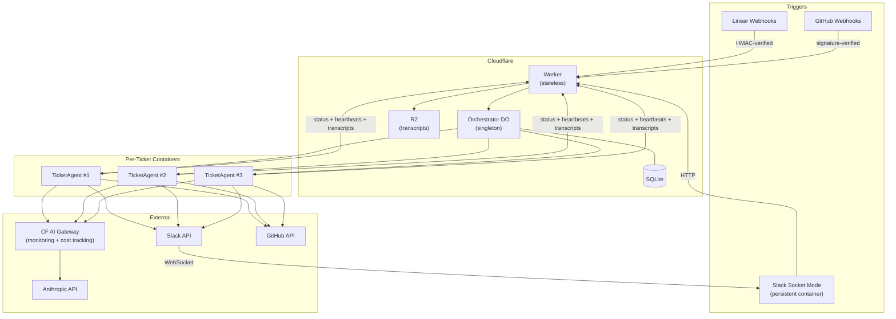

# Product Engineer

Autonomous agent that turns tickets into shipped code.

## Goal

A product engineer agent that turns tickets, feedback, and natural language requests into shipped code — with human involvement only at the moments when it matters.

- **Minutes** from request to delivered value for simple changes
- **< 1 hour** for complex multi-file features
- **Hands-on time** limited to moments requiring human judgment

## Key Outcomes

1. **Accessible to non-technical users** — Linear ticket, Slack message, or feedback widget triggers the agent. No CLI, no git, no infrastructure knowledge required.
2. **Streamlined value delivery** — Full Claude Code power (web search, subagents, skills). Human feedback via Slack threads at exactly the moments it's needed.
3. **Scalable beyond one machine** — Cloudflare Containers run up to 10 agents in parallel by default (configurable for higher concurrency). Each repo has its own agent config (`CLAUDE.md` + skills).
4. **Layered security** — Ephemeral containers destroyed after each task. CI as ratchet. Streaming input for ambiguous requirements.

Built on [Claude Agent SDK](https://docs.anthropic.com/en/docs/agents-sdk) + [Cloudflare Workers & Containers](https://developers.cloudflare.com/containers/).

## How It Works



1. **Triggers** arrive via Linear webhooks, GitHub webhooks, or Slack `@product-engineer` mentions
2. **Orchestrator** (Durable Object) routes each event to a per-ticket agent container
3. **Agent** clones the product repo, loads its `CLAUDE.md` + skill files, implements the task, and creates a PR
4. **Communication** happens in Slack threads — the agent posts progress and asks clarifying questions when needed
5. **All LLM traffic** routes through [Cloudflare AI Gateway](docs/cloudflare-ai-gateway.md) for monitoring, cost tracking, and error visibility
6. **Transcripts** are stored in R2 for debugging and audit

## Design Philosophy

The pitch: this is a small, understandable repo that does something ambitious.

- **Slim core** — ~600-line orchestrator, ~130-line agent entrypoint. That's it.
- **English over code** — agent behavior is defined in `SKILL.md` files, not TypeScript logic. Changing how the agent works means editing markdown.
- **Ride rapidly improving components** — Claude Agent SDK, Cloudflare Containers, and Claude itself are evolving fast. Depend on them instead of reimplementing.
- **No cruft** — every abstraction earns its place. If a component can be deleted without breaking anything, delete it.

## Getting Started

**Prerequisites:** [Cloudflare account](https://dash.cloudflare.com/sign-up), [Anthropic API key](https://console.anthropic.com/), Slack workspace, Linear workspace.

1. Fork/clone the repo
2. Edit `orchestrator/src/registry.json` with your product config (see `registry.template.json` for a clean starting point)
3. Run the interactive setup script — it walks through every external service with direct links and prompts:
   ```bash
   bash scripts/setup.sh
   ```
   Covers: Anthropic, Slack app, Linear, GitHub PATs + webhooks, Sentry, Cloudflare secrets, and CI/CD secrets. Idempotent — safe to re-run.

## Project Structure

| Directory | Purpose |
|-----------|---------|
| `orchestrator/` | Worker + Durable Object — webhook handling, event routing, ticket tracking |
| `agent/` | Agent entrypoint — Agent SDK, tools, prompt construction |
| `containers/` | Dockerfiles and container code (orchestrator Slack Socket Mode, agent server) |
| `.claude/skills/` | English skill files that define agent behavior |
| `docs/` | Architecture docs, deployment guide, process notes |

## Deploy

Merging to `main` triggers automatic deployment via GitHub Actions (`.github/workflows/deploy.yml`).

**One-time setup:** Create the R2 bucket for transcript storage (only needs to be done once):

```bash
npx wrangler r2 bucket create product-engineer-transcripts
```

For manual deployment:

```bash
cd orchestrator && npx wrangler deploy
```

## Development

```bash
# Run orchestrator tests
cd orchestrator && bun test

# Run agent tests
cd agent && bun test
```

End-to-end: create a test Linear ticket or Slack mention and watch the Slack channel.

## Further Reading

- [`CLAUDE.md`](CLAUDE.md) — detailed architecture and conventions
- [`docs/product/security.md`](docs/product/security.md) — security architecture and accepted risks
- [`docs/deploy.md`](docs/deploy.md) — deployment details and debugging

## Future Work

- **Runtime registry** — move product config from a build-time JSON file to a runtime store (Cloudflare KV or D1) so the registry can be updated without redeploying, and personal config doesn't need to live in the repo. `registry.template.json` would become the sole checked-in reference.

## License

[Unlicense](LICENSE) (public domain)
