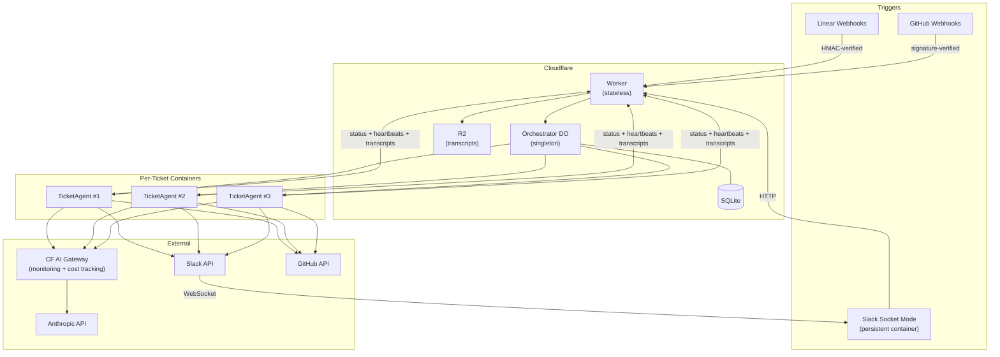

# Product Engineer Prototype

Autonomous agent that turns tickets into shipped code.

## Goals

A product engineer agent that turns tickets, feedback, and natural language requests into shipped code — with human involvement only at the moments when it matters.

The main goals of this are:

* **Faster delivery of value, with less hands-on time**
  * Minutes to deliver simple changes
    * e.g. bug detected on Sentry, small request filed in a feedback widget
  * 1hr or less for more complex, high-value features
  * Discusses feedback with you via Slack, so you can manage progress from anywhere
    (soon this will use only live web-based artifacts that update as you discuss)
* **Uses full powers of Claude Code under the hood (via Claude Agent SDK)**
  * Claude Code is one of the best harnesses at getting things done
  * Later, it could be useful to plug in Codex CLI and other tools
* **Repo is simple enough that you can customize**
  * Each project git repo can customize its own skills, plugins, MCP services
  * Use your own project template for these (defaults to `fryanpan/ai-project-support`)
  * Agent workflow for working on each task is also customizable
* **Scalable**
  * Uses (small) sandboxed containers for each ticket agent to avoid local resource constraints
* **Thoughtful security approach (but there is always more we can do)**
  * Several layers of security in place (see [security.md](docs/product/security.md))

Built on [Claude Agent SDK](https://docs.anthropic.com/en/docs/agents-sdk) + [Cloudflare Workers & Containers](https://developers.cloudflare.com/containers/).

## How It Works



1. **Triggers** arrive via Linear webhooks, GitHub webhooks, or Slack `@product-engineer` mentions
2. **Orchestrator** (Durable Object) routes each event to a per-ticket agent container
3. **Agent** clones the product repo, loads its `CLAUDE.md` + skill files, implements the task, and creates a PR
4. **Communication** happens in Slack threads — the agent posts progress and asks clarifying questions when needed
5. **All LLM traffic** routes through [Cloudflare AI Gateway](docs/cloudflare-ai-gateway.md) for monitoring, cost tracking, and error visibility
6. **Transcripts** are stored in R2 for debugging and audit

## Design Philosophy

The pitch: this is a small, understandable repo that does something ambitious.

- **Slim core** — ~1k-line orchestrator, ~600-line agent server. Everything else is English skills.
- **English over code** — agent behavior is defined in `SKILL.md` files, not TypeScript logic. Changing how the agent works means editing markdown.
- **Ride rapidly improving components** — Claude Agent SDK, Cloudflare Containers, and Claude itself are evolving fast. Depend on them instead of reimplementing.
- **No cruft** — every abstraction earns its place. If a component can be deleted without breaking anything, delete it.

## Getting Started

**Prerequisites:** [Cloudflare account](https://dash.cloudflare.com/sign-up), [Anthropic API key](https://console.anthropic.com/), Slack workspace, Linear workspace.

1. Fork/clone the repo
2. Edit `orchestrator/src/registry.json` with your product config (see `registry.template.json` for a clean starting point)
3. Run the interactive setup script — it walks through every external service with direct links and prompts:
   ```bash
   bash scripts/setup.sh
   ```
   Covers: Anthropic, Slack app, Linear, GitHub PATs + webhooks, Sentry, Cloudflare secrets, and CI/CD secrets. Idempotent — safe to re-run.

## Project Structure

| Directory | Purpose |
|-----------|---------|
| `orchestrator/` | Worker + Durable Object — webhook handling, event routing, ticket tracking |
| `agent/` | Agent entrypoint — Agent SDK, tools, prompt construction |
| `containers/` | Dockerfiles and container code (orchestrator Slack Socket Mode, agent server) |
| `.claude/skills/` | English skill files that define agent behavior |
| `docs/` | Architecture docs, deployment guide, process notes |

## Deploy

Merging to `main` triggers automatic deployment via GitHub Actions (`.github/workflows/deploy.yml`).

**One-time setup:** Create the R2 bucket for transcript storage (only needs to be done once):

```bash
npx wrangler r2 bucket create product-engineer-transcripts
```

For manual deployment:

```bash
cd orchestrator && npx wrangler deploy
```

## Development

```bash
# Run orchestrator tests
cd orchestrator && bun test

# Run agent tests
cd agent && bun test
```

End-to-end: create a test Linear ticket or Slack mention and watch the Slack channel.

## Available Skills

The agent comes with several built-in skills for managing projects and products:

- **`/add-project`** — Add an existing GitHub repo to the Product Engineer registry
- **`/create-project`** — Scaffold a new project from scratch and connect it to Product Engineer (uses `ai-project-support` templates if available)
- **`/setup-product`** — Step-by-step guide for manual product registration
- **`/retro`** — Run a retrospective with transcript analysis and capture learnings
- **`/persist-plan`** — Save internal plans to `docs/product/plans/`
- **`/cross-project-review`** — Periodic review across all products to find patterns and share learnings
- **`/task-retro`** — Per-task retrospective the agent runs after completing each task

See `.claude/skills/` for the full list and details.

## Further Reading

- [`CLAUDE.md`](CLAUDE.md) — detailed architecture and conventions
- [`docs/product/security.md`](docs/product/security.md) — security architecture and accepted risks
- [`docs/deploy.md`](docs/deploy.md) — deployment details and debugging
- [`docs/registry-migration-guide.md`](docs/registry-migration-guide.md) — admin API reference for managing products

## License

[Unlicense](LICENSE) (public domain)
