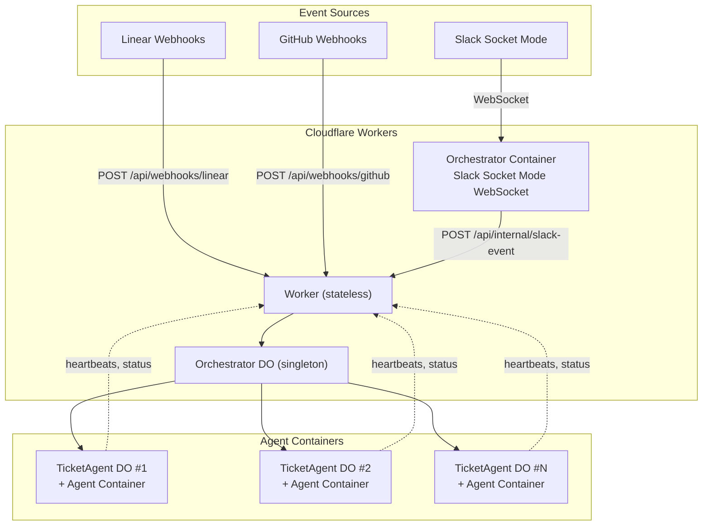
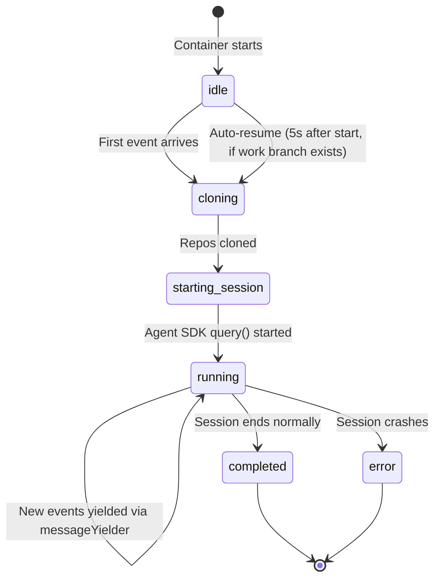
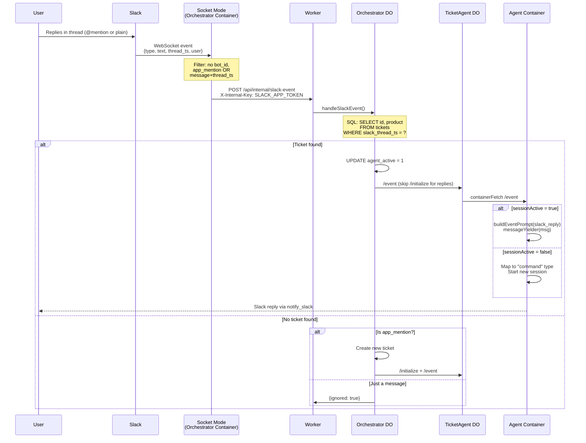
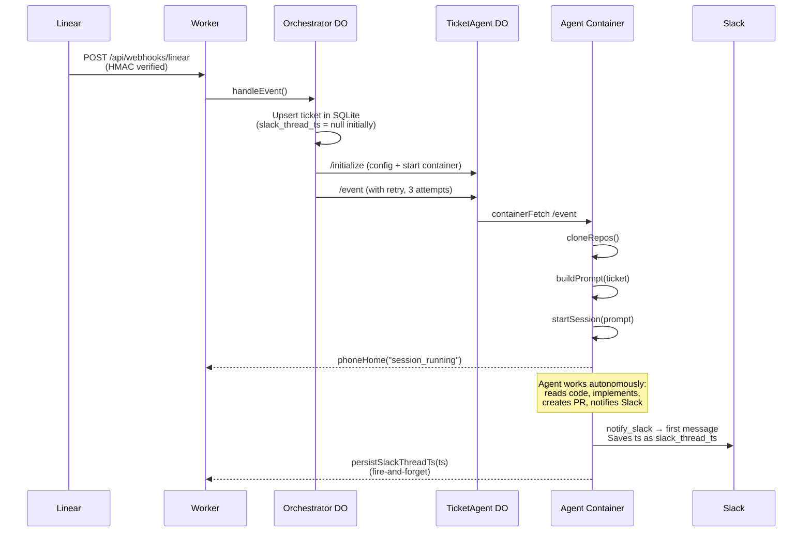
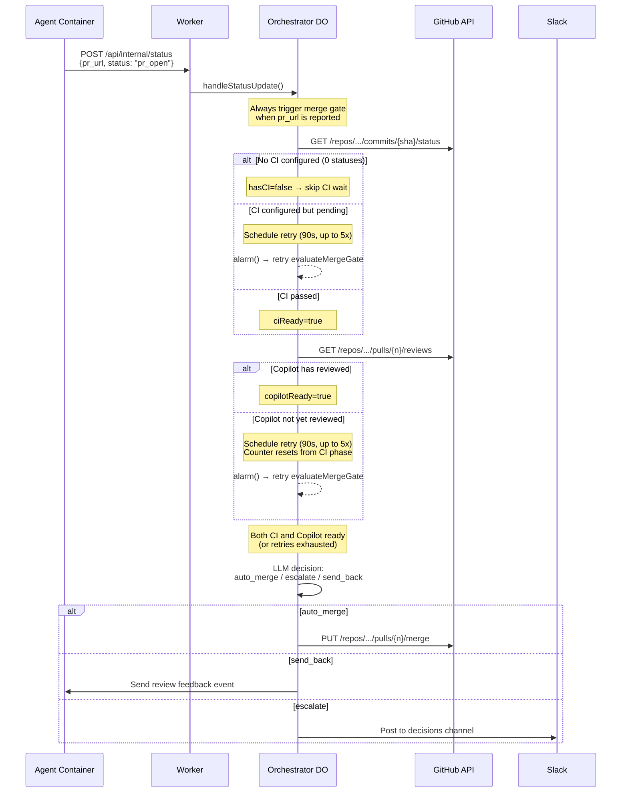
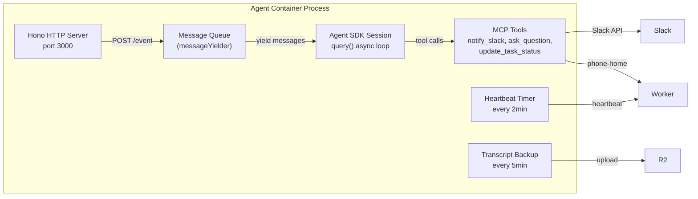

# Product Engineer Architecture

## System Overview

Product Engineer is an autonomous agent that turns Linear tickets, Slack messages, and feedback into shipped code. The system runs on Cloudflare Workers + Containers, scaling to dozens of parallel agents across multiple repos.



## Component Details

### Worker (`orchestrator/src/index.ts`)

Stateless Cloudflare Worker. Receives all inbound traffic and proxies to the Orchestrator DO.

| Route | Auth | Purpose |
|-------|------|---------|
| `POST /api/webhooks/linear` | HMAC signature | Linear issue create/update |
| `POST /api/webhooks/github` | GitHub signature | PR review/merge, check_suite (CI) events |
| `POST /api/internal/slack-event` | `X-Internal-Key: SLACK_APP_TOKEN` | Slack events from Socket Mode container |
| `POST /api/internal/status` | `X-Internal-Key: API_KEY` | Agent status updates (pr_url, branch, formal status) |
| `POST /api/orchestrator/heartbeat` | `X-Internal-Key: API_KEY` | Agent heartbeats (free-form lifecycle messages) |
| `POST /api/dispatch` | `X-API-Key: API_KEY` | Programmatic event trigger |
| `GET /health` | None | Health check (also wakes Orchestrator container) |

### Orchestrator DO (`orchestrator/src/orchestrator.ts`)

Singleton Durable Object. Owns all coordination state in SQLite.

**Tables:**
- `tickets` — id, product, status, slack_thread_ts, agent_active, last_heartbeat, checks_passed, agent_message
- `products` — slug, config (repos, secrets, channels)
- `settings` — key/value (AI gateway config, Linear team ID)
- `token_usage` — per-ticket token consumption
- `merge_gate_retries` — ticket_id, retry_count, next_retry_at, phase (ci/copilot)
- `ticket_metrics` — outcome tracking, pr_count, revision_count, cost
- `decision_log` — LLM decision audit trail

**Key methods:**
- `handleEvent` — Upserts ticket, routes to TicketAgent. `checks_passed` events trigger merge gate.
- `handleSlackEvent` — Thread reply routing (lookup by `slack_thread_ts`) + new mention handling
- `handleStatusUpdate` — Agent reports status, pr_url, branch. Validates status against `TICKET_STATES`. Triggers merge gate when pr_url is reported.
- `handleHeartbeat` — Agent heartbeat with free-form message. Auto-transitions `spawning → active`.
- `evaluateMergeGate` — Phased wait (CI → Copilot review) then LLM decision (auto_merge/escalate/send_back)
- `ensureContainerRunning` — Starts/restarts the Socket Mode companion container

### Orchestrator Container (`containers/orchestrator/`)

Always-on container running a Slack Socket Mode WebSocket client. Forwards filtered events to the Worker.

**Event filtering (`slack-socket.ts`):**
```
Socket Mode event
  ├── Has bot_id? → DROP (ignore bot's own messages)
  ├── type === "app_mention"? → FORWARD
  ├── type === "message" AND has thread_ts AND no subtype? → FORWARD
  └── Otherwise → DROP
```

**Reconnection:** Exponential backoff on WebSocket `close` event. No ping/pong keepalive (potential improvement area).

### TicketAgent DO (`orchestrator/src/ticket-agent.ts`)

One Durable Object per ticket. Manages a Container that runs the Claude Code Agent SDK.

**Endpoints:**
- `/initialize` — Save config to SQLite, start container with `startAndWaitForPorts`
- `/event` — Forward events to container via `containerFetch` (auto-starts if needed)
- `/mark-terminal` — Prevent alarm from restarting completed tickets
- `/status` — Proxy container's session status

**Lifecycle:**
- `sleepAfter: "2h"` — container sleeps after 2 hours of inactivity
- `alarm()` — checks session status, marks terminal if completed/errored
- `isTerminal()` — prevents container restart for finished tickets

### Agent Container (`agent/src/server.ts`)

HTTP server wrapping the Claude Code Agent SDK. One per ticket.

**Session lifecycle:**



**Key design points:**
- `messageYielder` — async generator that queues new messages into the running Agent SDK session
- Auto-resume — on container restart, checks for existing work branch and resumes session
- Phone-home — reports status, heartbeats, token usage back to Orchestrator via Worker
- Transcript backup — periodic upload to R2 every 5 minutes

## Event Flow: Slack Thread Reply

This is the flow that was broken (and fixed). Understanding it is critical for debugging.



## Event Flow: New Ticket (Linear)



## Event Flow: Merge Gate

The merge gate decides whether to auto-merge a PR. It has multiple trigger paths depending on whether the repo has CI configured.



**Alternative trigger path (repos with CI):** The `check_suite` webhook fires when CI completes. This sets `checks_passed=1` on the ticket and immediately calls `evaluateMergeGate`, bypassing the CI wait retry loop.

## Key Lifecycle Boundaries

These boundaries have historically caused bugs. Always consider them when modifying lifecycle code.

| Boundary | What Happens | Watch Out For |
|----------|-------------|---------------|
| **Container restart** | Process killed, new container starts. `sessionActive = false`. Auto-resume checks for work branch after 5s. | Events arriving before auto-resume. `slack_reply` must be handled when `!sessionActive`. |
| **Deploy** | All containers restarted. Orchestrator re-establishes Socket Mode. TicketAgents resume via `alarm()`. | Events lost during Socket Mode reconnection window. No replay mechanism. |
| **Session completed** | `sessionActive = false`, heartbeats stop. Container stays alive (2h sleep). | Thread replies arrive at container with dead session. Must start new session properly. |
| **Terminal state** | `agent_active = 0` in Orchestrator, `terminal = true` in TicketAgent. | `alarm()` must check terminal before restarting. Deployment webhooks must not re-spawn. |
| **Socket Mode disconnect** | WebSocket closes, `scheduleReconnect` fires with exponential backoff. | Events during reconnection gap are permanently lost. No keepalive ping/pong to detect stale connections. |

## Data Flow: `slack_thread_ts`

This field is the key for routing thread replies to the correct agent. Its lifecycle is subtle:

1. **Ticket created (Linear):** `slack_thread_ts = NULL` in SQLite
2. **Agent posts first Slack message:** `notify_slack` → Slack returns `ts`
3. **`persistSlackThreadTs`:** Fire-and-forget `POST /api/internal/status` with `slack_thread_ts = ts`
4. **Orchestrator updates DB:** `UPDATE tickets SET slack_thread_ts = ? WHERE id = ?`
5. **User replies in thread:** Slack sends event with `thread_ts` = step 2's `ts`
6. **Orchestrator matches:** `SELECT ... WHERE slack_thread_ts = ?` finds the ticket

**Failure mode:** If step 3's fire-and-forget fetch fails silently, `slack_thread_ts` stays NULL and thread replies never match. No retry mechanism exists.

## Agent Container Internal Architecture



## Configuration

### Product Registry (SQLite in Orchestrator DO)

Each product defines:
```json
{
  "repos": ["org/repo-name"],
  "slack_channel": "#channel-name",
  "slack_channel_id": "C0AHQK8LB34",
  "secrets": {
    "GITHUB_TOKEN": "PRODUCT_GITHUB_TOKEN",
    "ANTHROPIC_API_KEY": "ANTHROPIC_API_KEY"
  }
}
```

### Secrets

| Secret | Scope | Purpose |
|--------|-------|---------|
| `SLACK_APP_TOKEN` | Global | Socket Mode WebSocket auth |
| `SLACK_BOT_TOKEN` | Global | Slack API calls |
| `API_KEY` | Global | Internal API auth between components |
| `WORKER_URL` | Global | Container → Worker callback URL |
| `ANTHROPIC_API_KEY` | Global | Claude API access |
| `*_GITHUB_TOKEN` | Per-product | GitHub repo access |
| `LINEAR_API_KEY` | Global | Linear ticket updates |

### Model Selection

The Orchestrator analyzes ticket complexity (priority, labels, description length) to select the model:
- **Sonnet** — default, most tasks
- **Opus** — high priority or complex tickets
- **Haiku** — simple/low-priority tasks

## Observability

| Tool | What It Shows |
|------|---------------|
| `wrangler tail` | Worker + DO logs (status updates, heartbeats, errors) |
| Container `console.log` | Agent-side logs (not visible in `wrangler tail`) |
| Cloudflare AI Gateway | API requests, tokens, costs, cache rates |
| R2 Transcripts | Full Agent SDK conversation transcripts (JSONL) |
| Slack threads | Agent's communication trail |
| `/api/orchestrator/tickets` | All tickets with status, timestamps, agent_active |
| `/api/agent/:id/status` | Container session status, message count, errors |
