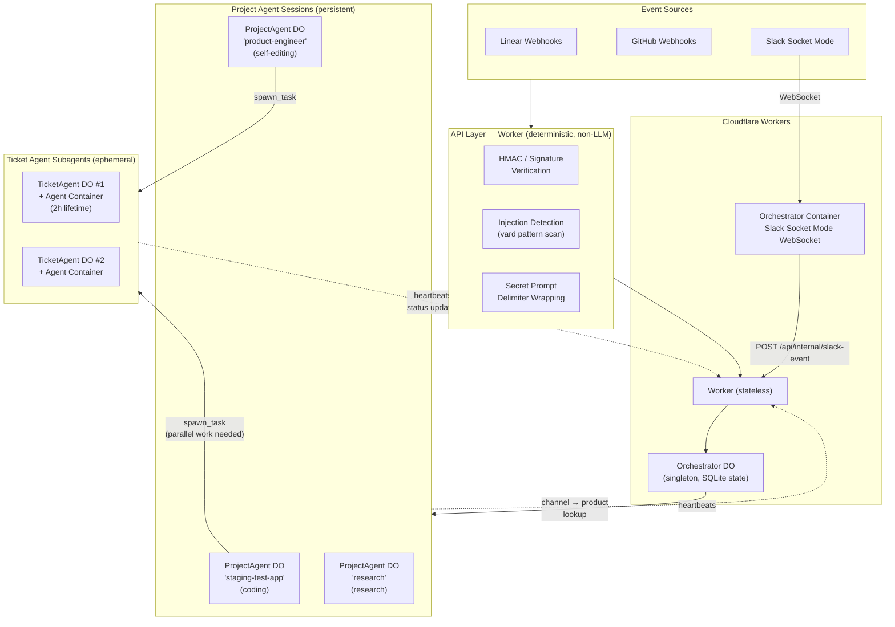
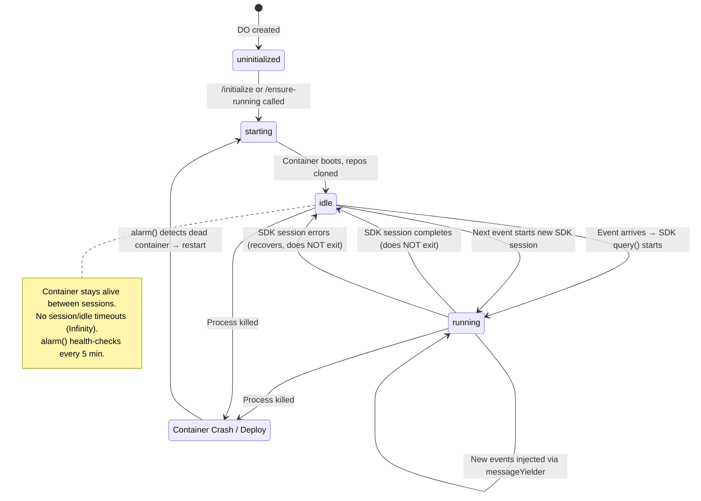
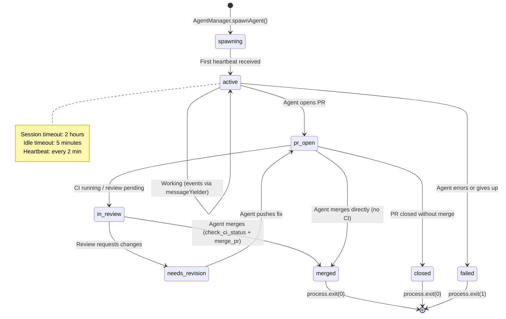
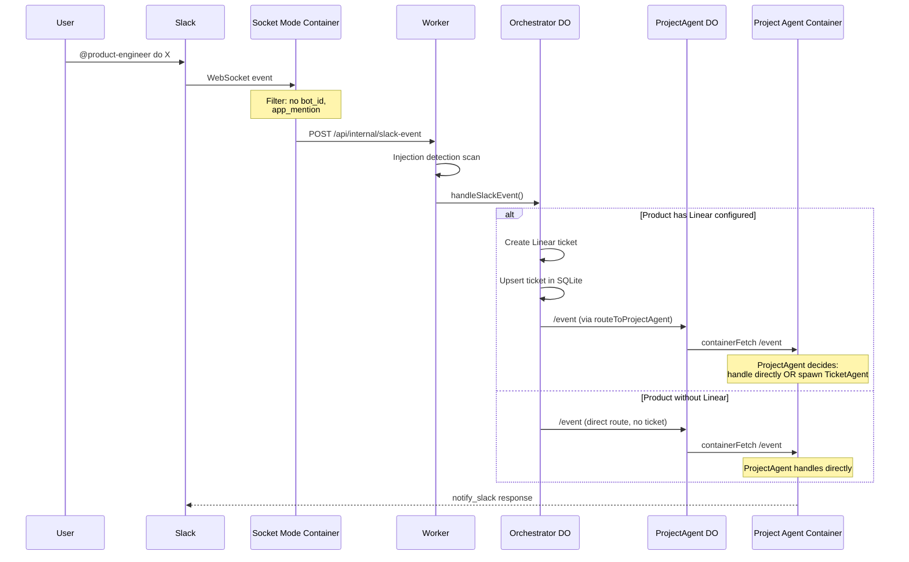
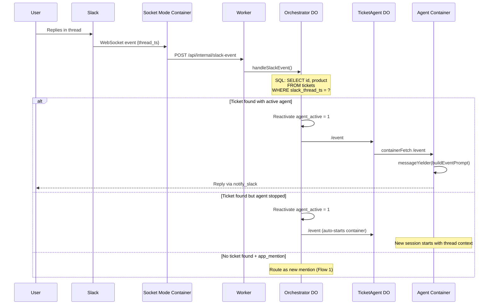
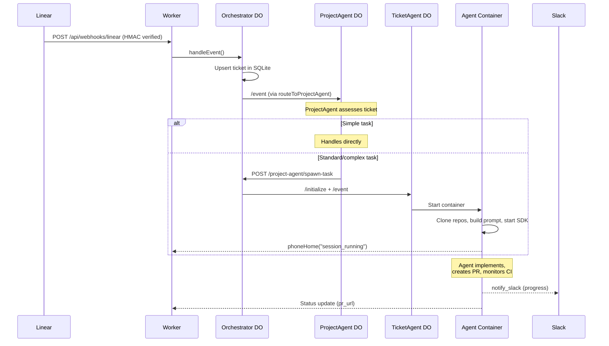
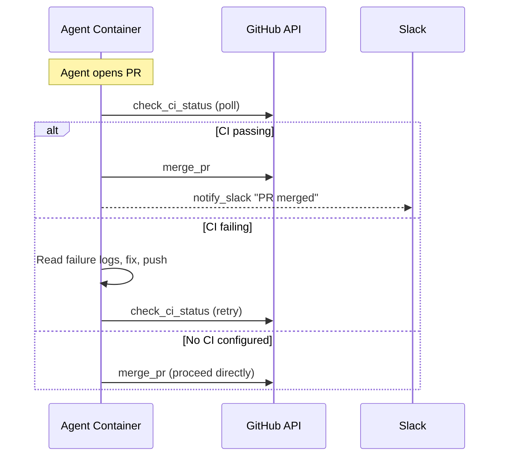

# Product Engineer Architecture

## System Overview

Product Engineer is an autonomous agent system that turns Linear tickets, Slack messages, and feedback into shipped code — or handles research, planning, and coordination tasks. The system runs on Cloudflare Workers + Containers, scaling to dozens of parallel agents across multiple repos.

### v3 Architecture (current)

v3 replaced rule-based TypeScript routing with **persistent Claude agent sessions**. All decision-making lives in English SKILL.md files, not code. The key change: a **ProjectAgent** per registered product accumulates context over time, making decisions about how to handle incoming events.



### What changed from v2

| Aspect | v2 | v3 |
|--------|----|----|
| **Routing** | TypeScript rules in orchestrator | Channel→product DB lookup (deterministic) |
| **Decisions** | DecisionEngine (LLM per event) | ProjectAgent SKILL.md (persistent session) |
| **Context** | Cold start every ticket | ProjectAgent accumulates context over time |
| **Ticket lifecycle** | Orchestrator drives CI/merge gate | Ticket agents self-manage |
| **Research tasks** | Not supported | Same container, different SKILL.md + MCPs |
| **Security** | HMAC only | 4-layer defense: HMAC → injection detection → prompt delimiter → content limits |

---

## Component Details

### Worker (`api/src/index.ts`)

Stateless Cloudflare Worker. Receives all inbound traffic and proxies to the Orchestrator DO. All security validation happens here before events reach any LLM.

| Route | Auth | Purpose |
|-------|------|---------|
| `POST /api/webhooks/linear` | HMAC-SHA256 | Linear issue create/update |
| `POST /api/webhooks/github` | X-Hub-Signature-256 | PR review/merge, check_suite (CI) events |
| `POST /api/internal/slack-event` | `X-Internal-Key: SLACK_APP_TOKEN` | Slack events from Socket Mode container |
| `POST /api/internal/status` | `X-Internal-Key: API_KEY` | Agent status updates (pr_url, branch, formal status) |
| `POST /api/orchestrator/heartbeat` | `X-Internal-Key: API_KEY` | Agent heartbeats (free-form lifecycle messages) |
| `POST /api/dispatch` | `X-API-Key: API_KEY` | Programmatic event trigger |
| `GET/POST /api/products` | `X-API-Key: API_KEY` | Product registry CRUD |
| `ALL /api/project-agent/*` | `X-Internal-Key: API_KEY` | ProjectAgent internal API |
| `GET /health` | None | Health check (also wakes Orchestrator container) |

### Orchestrator DO (`api/src/orchestrator.ts`)

Singleton Durable Object. Thin state store and event router — no decision logic.

**Tables:**
- `tickets` — id, product, status, slack_thread_ts, agent_active, last_heartbeat, checks_passed, agent_message
- `products` — slug, config (repos, secrets, channels, mode, slack_persona)
- `settings` — key/value (AI gateway config, Linear team ID)
- `token_usage` — per-ticket token consumption
- `merge_gate_retries` — ticket_id, retry_count, next_retry_at, phase (legacy, no longer used — agents self-manage merging)
- `ticket_metrics` — outcome tracking, pr_count, revision_count, cost

**Key methods:**
- `handleEvent` — Upserts ticket, routes to ProjectAgent (v3) with TicketAgent fallback
- `handleSlackEvent` — Thread reply routing (lookup by `slack_thread_ts`) + new mention → ProjectAgent
- `handleStatusUpdate` — Agent reports status, pr_url, branch. Validates against `TICKET_STATES`.
- `handleHeartbeat` — Agent heartbeat with free-form message. Auto-transitions `spawning → active`.
- `ensureProjectAgent` — Initializes ProjectAgent DO for a product
- `routeToProjectAgent` — Forwards events to the correct ProjectAgent
- `handleProjectAgentRoute` — Internal API endpoints (spawn-task, list-tasks, etc.)

### Orchestrator Container (`containers/orchestrator/`)

Always-on container running a Slack Socket Mode WebSocket client. Forwards filtered events to the Worker.

**Event filtering (`slack-socket.ts`):**
```
Socket Mode event
  ├── Has bot_id? → DROP (ignore bot's own messages)
  ├── type === "app_mention"? → FORWARD
  ├── type === "message" AND has thread_ts AND no subtype? → FORWARD
  └── Otherwise → DROP
```

### ProjectAgent DO (`api/src/project-agent.ts`) — NEW in v3

One Durable Object per registered product. Runs a persistent Agent SDK session that accumulates context over time.

**Endpoints:**
- `/initialize` / `/ensure-running` — Save config to SQLite, start container
- `/event` — Forward events to container; buffer if container not ready
- `/drain-events` — Container pulls buffered events on session start
- `/status` — Proxy container's session status
- `/health` — DO-level health check

**Key design:**
- No `sleepAfter` — persistent (alive indefinitely)
- `alarm()` every 5 min health-checks the container, restarts if dead
- Config persisted in SQLite — survives deploy
- Event buffer (up to 50 events) handles events during container restart
- Container runs same `agent/src/server.ts` with `AGENT_ROLE=project-lead`

### TicketAgent DO (`api/src/ticket-agent.ts`)

One Durable Object per ticket. Manages an ephemeral Container that runs the Claude Code Agent SDK.

**Endpoints:**
- `/initialize` — Save config to SQLite, start container with `startAndWaitForPorts`
- `/event` — Forward events to container via `containerFetch` (auto-starts if needed)
- `/mark-terminal` — Prevent alarm from restarting completed tickets
- `/status` — Proxy container's session status

**Lifecycle:**
- `sleepAfter: "2h"` — container sleeps after 2 hours of inactivity
- `alarm()` — checks session status, marks terminal if completed/errored
- `isTerminal()` — prevents container restart for finished tickets

### Agent Container (`agent/src/server.ts`)

HTTP server wrapping the Claude Code Agent SDK. Serves both ProjectAgent and TicketAgent containers — behavior is configured via environment variables, not container type.

**Key env vars that control behavior:**
- `AGENT_ROLE` — `"project-lead"` or omitted (ticket agent)
- `MODE` — `"coding"` or `"research"`
- `REPOS` — JSON array of repos to clone
- `MODEL` — `"sonnet"`, `"opus"`, or `"haiku"`


---

## Agent Roles and Lifecycle

### Role Summary

| Role | Container | Lifetime | Timeouts | Max Turns | Purpose |
|------|-----------|----------|----------|-----------|---------|
| **Project Lead** | ProjectAgent DO | Persistent (indefinite) | None (Infinity) | 1000 | Accumulates product context, routes events, manages ticket agents |
| **Ticket Agent (coding)** | TicketAgent DO | Ephemeral (≤2h) | 2h session, 5min idle | 200 | Implements a single ticket: code → PR → merge |
| **Ticket Agent (research)** | TicketAgent DO | Ephemeral (≤4h) | 4h session, 30min idle | 200 | Research, planning, or scheduling task |

### Project Lead Agent Lifecycle



**Start triggers:**
- First event routed to `ensureProjectAgent()` by Orchestrator
- `alarm()` detects dead container after deploy/crash

**Session lifecycle:**
1. Event arrives at `/event` endpoint
2. If idle: creates new `messageYielder`, starts SDK `query()` with event prompt
3. If running: injects event into active session via `messageYielder`
4. When SDK `query()` returns: resets to `idle` — does NOT `process.exit()`
5. On error: logs, resets to `idle` — does NOT `process.exit()`
6. Container stays alive waiting for next event

**Stop conditions:**
- Never stops by design (persistent)
- Only replaced on deploy (Cloudflare replaces container image)

**Recovery after crash/deploy:**
1. Container dies
2. `alarm()` fires within 5 minutes (persisted in DO storage)
3. Health check `/health` fails → `startAndWaitForPorts()` called
4. Constructor restores `envVars` from SQLite-persisted config
5. Events that arrived while dead are in `event_buffer` (buffered by DO's `fetch()`)
6. Agent server calls `drainBufferedEvents()` on next session start

### Ticket Agent (Coding) Lifecycle



**Start triggers:**
- Orchestrator calls `AgentManager.spawnAgent()` after receiving ticket event
- ProjectAgent requests spawn via `/project-agent/spawn-task`

**What the agent does:**
1. Clones repos + loads plugins from target repo's `.claude/settings.json`
2. Builds prompt from ticket event, starts SDK `query()`
3. Reads codebase, implements, writes tests, commits
4. Opens PR, notifies Slack with PR link
5. Monitors CI using `check_ci_status` tool, fixes failures if needed
6. Responds to PR review feedback (events injected via messageYielder)
7. Merges PR using `merge_pr` tool when CI passes + approved

**Stop conditions:**
- `process.exit(0)` — session completes normally (PR merged, task closed)
- `process.exit(1)` — session errors
- `process.exit(0)` — session timeout (2h) or idle timeout (5min)
- Orchestrator calls `stopAgent()` on terminal status

**Communication to Slack:**
- Agent uses `notify_slack` MCP tool to post messages to the product's Slack channel
- First message creates the thread; subsequent messages reply in-thread
- `persistSlackThreadTs()` saves the thread ID back to orchestrator
- All messages are in the thread so the team has visibility

### Ticket Agent (Research) Lifecycle

Same as coding, except:
- Session timeout: **4 hours** (vs 2h)
- Idle timeout: **30 minutes** (vs 5min)
- `MODE=research` changes SKILL.md selection (research-agent vs product-engineer)
- No git operations, no PR workflow
- Terminal state: `closed` (user says done)
- Saves progress to Notion periodically

### Conductor (Cross-Product Assistant) — PLANNED (not yet implemented)

The v3 design includes a **Conductor** role for handling:
- Direct messages not mapped to any product
- Cross-product status queries ("what's everyone working on?")
- System meta-queries ("how is the system performing?")
- Routing ambiguous requests to the right Project Lead

**Current status:** The SKILL.md exists (`.claude/skills/assistant/SKILL.md`) but no Conductor DO has been implemented. Today, unrouted events are dropped. The Conductor would:
- Run as a persistent session like ProjectAgent
- Have `list_tasks`, `list_products`, `get_task_transcript` tools for cross-product visibility
- Use a default persona (e.g., "Product Engineer")
- Route identified requests to the correct Project Lead

### Role Hierarchy

| Role | Scope | Lifetime | Purpose |
|------|-------|----------|---------|
| **Conductor** | Cross-product | Persistent | Routes unmatched events, answers system-wide queries |
| **Project Lead** | Per product | Persistent | Accumulates product context, triages events, spawns ticket agents |
| **Ticket Agent** | Per ticket | Ephemeral (2-4h) | Implements a single ticket end-to-end |

---

## Event Flows

### Flow 1: New Slack Mention → ProjectAgent (v3)



### Flow 2: Slack Thread Reply → Existing Agent



### Flow 3: Linear Ticket → ProjectAgent → TicketAgent



### Flow 4: CI Check + Merge (Agent-Driven)

In v3, ticket agents self-manage CI monitoring and merging using `check_ci_status` and `merge_pr` MCP tools. The orchestrator no longer runs a merge gate.



---

## Security Architecture

Four independent defense layers — see `docs/architecture/security-layers.md` for details.

| Layer | Implementation | What It Catches |
|-------|---------------|-----------------|
| **1. HMAC/Signature** | Per-source verification at Worker | Spoofed webhooks |
| **2. Injection Detection** | `@andersmyrmel/vard` pattern scan on all free-text fields | Prompt injection attempts |
| **3. Prompt Delimiter** | Secret `PROMPT_DELIMITER` env var wraps untrusted input | Delimiter escape attacks |
| **4. Content Limits** | 1MB Worker, 100KB per-field, 50 events per ticket | Resource exhaustion |

---

## Key Lifecycle Boundaries

These boundaries have historically caused bugs. Always consider them when modifying lifecycle code.

| Boundary | What Happens | Watch Out For |
|----------|-------------|---------------|
| **Container restart** | Process killed, new container starts. `sessionActive = false`. | Events arriving before session restarts. Project leads recover to idle; ticket agents may auto-resume from work branch. |
| **Deploy** | All containers replaced with new image. DO storage persists. | ProjectAgent: `alarm()` restarts container from persisted config. TicketAgent: `containerFetch` auto-starts. Socket Mode reconnection gap loses events. |
| **Session completed (ticket)** | `process.exit(0)`, container dies. | Thread replies to dead container — Orchestrator must handle. |
| **Session completed (project lead)** | Reset to `idle`, container stays alive. | Must properly null out `messageYielder` so next event creates a fresh session. |
| **Terminal state** | `agent_active = 0` in Orchestrator, `terminal = true` in TicketAgent. | `alarm()` must check terminal before restarting. Webhook events must not re-spawn. |
| **Socket Mode disconnect** | WebSocket closes, reconnect with exponential backoff. | Events during reconnection gap are permanently lost. |

### Recovery Matrix

| Failure | Project Lead Recovery | Ticket Agent Recovery |
|---------|----------------------|----------------------|
| **Container crash** | `alarm()` (5min) → health check fails → `startAndWaitForPorts()`. Config from SQLite. Buffered events drained. | Supervisor detects stale heartbeat → can re-spawn or mark failed |
| **Deploy** | Same as crash — `alarm()` persisted in DO storage, constructor reads config from SQLite | `containerFetch` auto-starts on next event. Fresh session (doesn't resume mid-SDK-call) |
| **SDK error** | Reset to `idle`, log error. Next event starts fresh session | `process.exit(1)` — container dies. Orchestrator can re-spawn if agent_active still set |
| **Network partition** | Events buffered in DO (up to 50). Drained on reconnect | Events buffered in TicketAgent DO. containerFetch retries |

---

## Data Flow: `slack_thread_ts`

This field routes thread replies to the correct agent. Its lifecycle:

1. **Ticket created:** `slack_thread_ts = NULL` in SQLite
2. **Agent posts first Slack message:** `notify_slack` → Slack returns `ts`
3. **`persistSlackThreadTs`:** Fire-and-forget POST to orchestrator with `slack_thread_ts = ts`
4. **Orchestrator updates DB:** `UPDATE tickets SET slack_thread_ts = ? WHERE id = ?`
5. **User replies in thread:** Slack sends event with `thread_ts` matching step 2's `ts`
6. **Orchestrator matches:** `SELECT ... WHERE slack_thread_ts = ?` finds the ticket

**Failure mode:** If step 3 fails silently, `slack_thread_ts` stays NULL and thread replies never route. No retry mechanism exists.

---

## Configuration

### Product Registry (SQLite via Admin API)

```json
{
  "repos": ["org/repo-name"],
  "slack_channel": "#channel-name",
  "slack_channel_id": "C0AHQK8LB34",
  "slack_persona": {
    "username": "PE Engineer",
    "icon_emoji": ":hammer_and_wrench:"
  },
  "mode": "coding",
  "triggers": {
    "linear": { "enabled": true, "project_name": "My Project" },
    "slack": { "enabled": true }
  },
  "secrets": {
    "GITHUB_TOKEN": "PRODUCT_GITHUB_TOKEN",
    "ANTHROPIC_API_KEY": "ANTHROPIC_API_KEY"
  }
}
```

### Secrets

| Secret | Scope | Purpose |
|--------|-------|---------|
| `SLACK_APP_TOKEN` | Global | Socket Mode WebSocket auth |
| `SLACK_BOT_TOKEN` | Global | Slack API calls |
| `API_KEY` | Global | Internal API auth between components |
| `WORKER_URL` | Global | Container → Worker callback URL |
| `ANTHROPIC_API_KEY` | Global | Claude API access |
| `PROMPT_DELIMITER` | Global | Secret delimiter wrapping untrusted input |
| `*_GITHUB_TOKEN` | Per-product | GitHub repo access |
| `LINEAR_API_KEY` | Global | Linear ticket updates |

### Model Selection

Per-product in registry config:
- **Sonnet** — default, most tasks
- **Opus** — complex repos or high-priority tickets
- **Haiku** — simple/low-priority tasks

---

## Agent Behavior (SKILL.md)

All agent decision-making is defined in English skill files, not TypeScript:

| Skill | Path | Role |
|-------|------|------|
| `coding-project-lead` | `.claude/skills/coding-project-lead/SKILL.md` | ProjectAgent for coding products |
| `research-agent` | `.claude/skills/research-agent/SKILL.md` | ProjectAgent/TicketAgent for research products |
| `ticket-agent-coding` | `.claude/skills/ticket-agent-coding/SKILL.md` | Self-managing ticket agent for coding tasks |
| `product-engineer` | `.claude/skills/product-engineer/SKILL.md` | Legacy ticket agent decision framework |
| `assistant` | `.claude/skills/assistant/SKILL.md` | Cross-product assistant (planned) |

The agent loads skills from this repo via `cwd` (project leads clone the PE repo for skills) and from the target product's repo via `additionalDirectories`.

---

## Observability

| Tool | What It Shows |
|------|---------------|
| `wrangler tail` | Worker + DO logs (status updates, heartbeats, errors) |
| Container `console.log` | Agent-side logs (not visible in `wrangler tail`) |
| Cloudflare AI Gateway | API requests, tokens, costs, cache rates |
| R2 Transcripts | Full Agent SDK conversation transcripts (JSONL) |
| Slack threads | Agent's communication trail |
| `/api/orchestrator/tickets` | All tickets with status, timestamps, agent_active |
| `/api/orchestrator/status` | Active agents summary |
| `/api/agent/:id/status` | Container session status, message count, errors |
| `/api/project-agent/status` | All ProjectAgent statuses |
