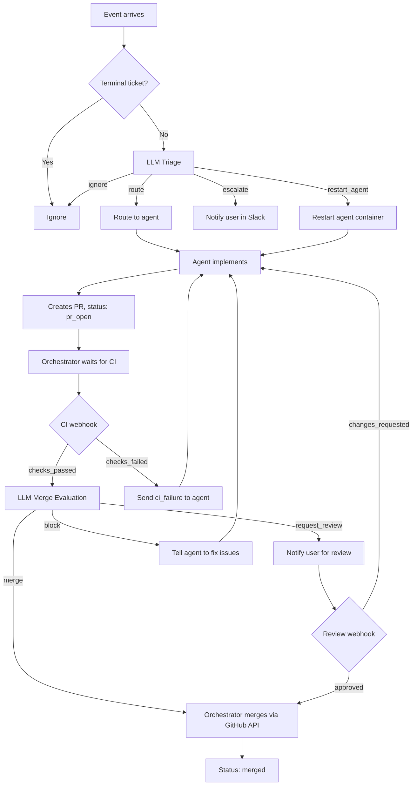
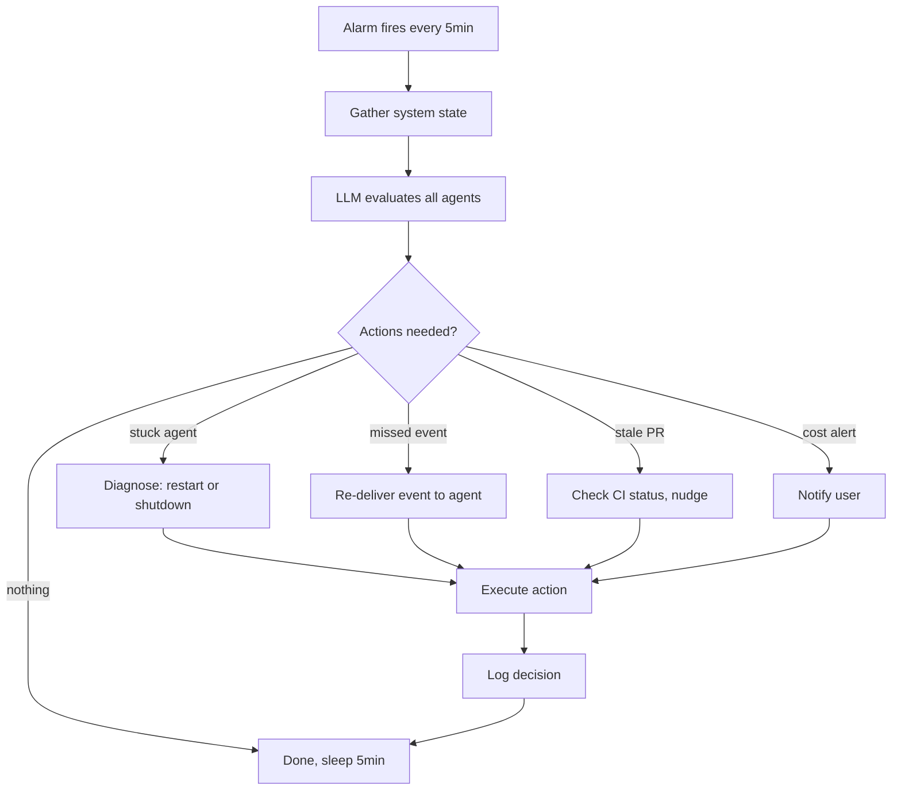
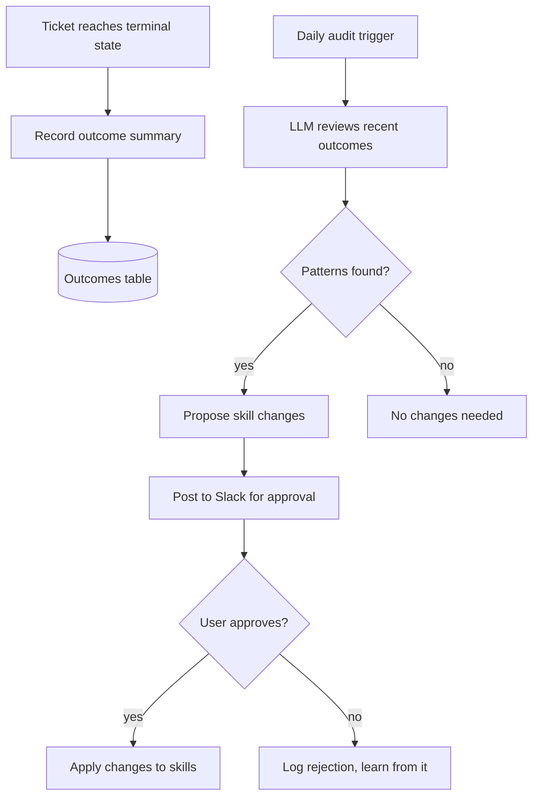
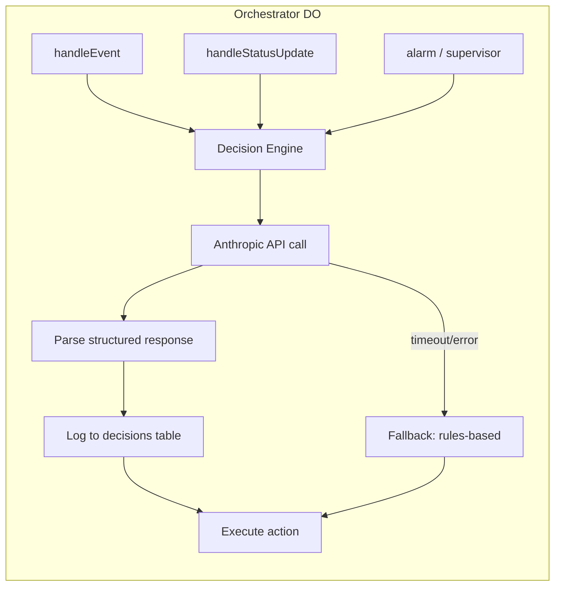

# LLM Orchestrator Implementation Plan

> **For Claude:** REQUIRED SUB-SKILL: Use superpowers:executing-plans to implement this plan task-by-task.

**Goal:** Replace the rules-based orchestrator with an LLM-enhanced orchestrator that makes intelligent decisions at key workflow points — event triage, merge gating, lifecycle management, and self-improvement — reducing human oversight from 1+ hour/day to near-zero.

**Architecture:** The Orchestrator DO gains a Decision Engine that makes Anthropic API calls at 5 key decision points. Decisions are async (non-blocking via `ctx.waitUntil()`), logged to SQLite for auditability, and fall back to current rules-based behavior on failure. The TicketAgent's role narrows to implementation only — merge/deploy decisions move to the orchestrator. A periodic supervisor tick (alarm every 5 minutes) reviews system-wide state and takes corrective actions.

**Tech Stack:** Cloudflare Workers (Hono), Durable Objects, SQLite, Anthropic Messages API (direct fetch, no SDK), GitHub REST API.

---

## Intended Workflows

### Workflow 1: Ticket Lifecycle (New)



### Workflow 2: Periodic Supervisor



### Workflow 3: Self-Improvement Loop



---

## Key Decision Points

### Decision 1: Event Triage

| Aspect | Detail |
|--------|--------|
| **When** | Every incoming event (webhook or Slack) |
| **Current behavior** | If/else: terminal → ignore, else → route to agent |
| **New behavior** | Fast path for obvious cases (terminal, duplicate), LLM for ambiguous cases |
| **LLM input** | Event type, ticket state, agent status, recent events for this ticket |
| **LLM output** | `route` / `ignore` / `escalate` / `restart_agent` + reasoning |
| **Fallback** | If LLM fails or times out (10s), use current rules-based logic |
| **Model** | Haiku (fast, cheap — this is high-volume) |

**Examples of decisions the LLM makes better than rules:**
- "This CI failure is for a check that always fails (flaky). Ignore it."
- "This PR review comment is from Copilot and is nitpicky. Route to agent but mark as low-priority."
- "This is a post-merge webhook (deploy succeeded). The ticket is merged. Ignore."
- "This Slack mention is in a channel not registered to any product, but the user is asking about a specific ticket. Escalate."

### Decision 2: Merge Evaluation

| Aspect | Detail |
|--------|--------|
| **When** | Agent sets status to `pr_open` AND `checks_passed` webhook arrives |
| **Current behavior** | Agent decides autonomously based on change category |
| **New behavior** | Orchestrator evaluates with full context before merging |
| **LLM input** | PR diff summary, CI status, review comments, change categories, deployment context, recent merge outcomes |
| **LLM output** | `merge` / `request_review` / `fix_issues` / `block` + reasoning |
| **Fallback** | If LLM fails, request_review (conservative default) |
| **Model** | Sonnet (needs good judgment) |

**What the LLM checks:**
1. **CI green?** — Fetched via GitHub API, not trusted from agent
2. **Open review comments?** — Any unresolved threads or requested changes
3. **Diff risk** — Not just category (CSS vs API) but actual content analysis
4. **Recent history** — "Last 3 auto-merges from this repo had issues" → be more cautious
5. **Deployment context** — "It's Friday evening" → request review instead of auto-merge

### Decision 3: Agent Lifecycle

| Aspect | Detail |
|--------|--------|
| **When** | Every 5-minute supervisor tick |
| **Current behavior** | Heartbeat detection (report only), no auto-action |
| **New behavior** | LLM evaluates each agent and takes action |
| **LLM input** | Agent status, time since last heartbeat, last tool call, PR state, CI state |
| **LLM output** | Per-agent: `healthy` / `restart` / `shutdown` / `notify_user` / `send_event` |
| **Fallback** | If LLM fails, current report-only behavior |
| **Model** | Haiku (fast, runs every 5min) |

**Examples:**
- "Agent idle for 20 min, PR has 3 unaddressed Copilot comments → send pr_review_comment events"
- "Agent idle for 45 min, no PR, last tool was `git push` 40 min ago → shutdown, mark failed"
- "Agent running for 100 min, 50 tool calls, still implementing → healthy, no action"
- "Agent session ended 5 min ago, PR merged, container still alive → shutdown"

### Decision 4: CI/Review Response

| Aspect | Detail |
|--------|--------|
| **When** | CI failure, review comment, or deploy failure arrives for a ticket whose agent has exited |
| **Current behavior** | Event goes to DO buffer, agent never restarts to drain it |
| **New behavior** | Orchestrator detects "agent is gone" and decides what to do |
| **LLM input** | Event details, ticket state, whether agent is alive, time since last activity |
| **LLM output** | `restart_agent` / `notify_user` / `ignore` |
| **Fallback** | Restart agent (most events need action) |
| **Model** | Haiku |

### Decision 5: Outcome Review (Self-Improvement)

| Aspect | Detail |
|--------|--------|
| **When** | Daily (configurable), or on-demand |
| **Current behavior** | None — no automated review |
| **New behavior** | LLM reviews recent outcomes, proposes improvements |
| **LLM input** | All terminal tickets from last 24h: ticket, outcome, cost, time, any issues |
| **LLM output** | Observations, proposed skill changes, priority recommendations |
| **Fallback** | Skip if LLM fails |
| **Model** | Sonnet (needs deep analysis) |

---

## How Decisions Are Made

### Decision Engine Architecture



### Prompt Structure

Each decision type has a system prompt + structured user message:

```
System: You are the orchestrator for a software engineering agent system.
You make decisions about event routing, merge gating, and agent lifecycle.
Respond with JSON only. Be concise. Default to the safe/conservative option when unsure.

User:
## Decision: {type}

## Context
{structured context: ticket state, agent status, event details}

## Recent History
{last 5 decisions for this ticket}

## Question
{specific question for this decision type}

Respond with:
{"action": "...", "reasoning": "...", "confidence": 0.0-1.0}
```

### Latency Budget

| Decision | Model | Target Latency | Blocking? |
|----------|-------|---------------|-----------|
| Event triage | Haiku | <5s | No (waitUntil) |
| Merge evaluation | Sonnet | <30s | No (async after webhook) |
| Lifecycle check | Haiku | <10s | No (alarm handler) |
| CI/review response | Haiku | <5s | No (waitUntil) |
| Outcome review | Sonnet | <60s | No (scheduled) |

### Cost Estimate

- Haiku calls: ~$0.001/call × ~50 calls/day = ~$0.05/day
- Sonnet calls: ~$0.01/call × ~10 calls/day = ~$0.10/day
- Total: ~$0.15/day (~$4.50/month) — negligible vs current agent costs

---

## Edge Cases

| Scenario | Handling |
|----------|---------|
| LLM API down | Fallback to rules-based behavior, log the failure |
| LLM returns invalid JSON | Parse error → fallback, log with raw response |
| LLM says "merge" but CI is actually failing | Double-check CI via GitHub API AFTER LLM decision, override if mismatch |
| Two events arrive simultaneously | Each gets its own decision call, decisions are idempotent |
| Alarm fires during active decision | Alarm skips tickets with pending decisions |
| Agent reports "merged" but orchestrator didn't approve | Accept it (agent has shell access), but log the discrepancy |
| Deploy webhook arrives after merge | Terminal ticket check prevents re-spawn (existing behavior) |
| Orchestrator deploy during LLM call | waitUntil completes before DO hibernates |
| Self-improvement proposes bad skill change | All changes require human approval via Slack |

---

## Tasks

### Task 1: Decision Engine Core

**Files:**
- Create: `orchestrator/src/decision-engine.ts`
- Modify: `orchestrator/src/orchestrator.ts` (add decisions table, instantiate engine)
- Test: `orchestrator/src/decision-engine.test.ts`

**Step 1: Write the decision engine module**

Create `orchestrator/src/decision-engine.ts` with:

```typescript
/**
 * LLM-powered decision engine for the orchestrator.
 * Makes Anthropic API calls at key decision points.
 * Falls back to rules-based behavior on failure.
 */

export interface DecisionContext {
  ticketId: string;
  ticketState?: { status: string; agent_active: number; pr_url?: string; created_at: string };
  event?: { type: string; source: string; payload: unknown };
  agentHealth?: { lastHeartbeat: string | null; sessionStatus: string; messageCount: number };
  systemState?: { activeAgentCount: number; staleAgentCount: number };
  recentDecisions?: Array<{ action: string; reasoning: string; created_at: string }>;
}

export type TriageAction = "route" | "ignore" | "escalate" | "restart_agent";
export type MergeAction = "merge" | "request_review" | "fix_issues" | "block";
export type LifecycleAction = "healthy" | "restart" | "shutdown" | "notify_user" | "send_event";

export interface Decision<T extends string = string> {
  action: T;
  reasoning: string;
  confidence: number;
}

export class DecisionEngine {
  constructor(
    private apiKey: string,
    private gatewayConfig?: { account_id: string; gateway_id: string } | null,
  ) {}

  async triageEvent(ctx: DecisionContext): Promise<Decision<TriageAction>> {
    // ... implementation
  }

  async evaluateMerge(ctx: DecisionContext & {
    ciStatus: string;
    reviewComments: string[];
    diffSummary: string;
  }): Promise<Decision<MergeAction>> {
    // ... implementation
  }

  async evaluateLifecycle(agents: Array<DecisionContext & {
    minutesSinceHeartbeat: number;
    minutesRunning: number;
  }>): Promise<Array<{ ticketId: string } & Decision<LifecycleAction>>> {
    // ... implementation
  }

  async reviewOutcomes(outcomes: Array<{
    ticketId: string;
    product: string;
    status: string;
    costUsd: number;
    durationMinutes: number;
    issues?: string;
  }>): Promise<{ observations: string[]; proposedChanges: string[]; priority: string }> {
    // ... implementation
  }

  private async callAnthropic(
    model: string,
    system: string,
    userMessage: string,
    maxTokens?: number,
    timeoutMs?: number,
  ): Promise<string> {
    // Direct fetch to Anthropic API (or AI Gateway if configured)
    // With timeout and error handling
  }

  private parseJsonResponse<T>(raw: string, fallback: T): T {
    // Safe JSON parsing with fallback
  }
}
```

Key implementation details:
- `callAnthropic()` uses `fetch()` directly (no SDK — this is a Cloudflare Worker)
- Route through AI Gateway if `gatewayConfig` is set (use the same pattern as `ticket-agent.ts:51`)
- Base URL: `gatewayConfig ? \`https://gateway.ai.cloudflare.com/v1/${account_id}/${gateway_id}/anthropic\` : "https://api.anthropic.com"`
- All methods have a timeout (default 10s for Haiku, 30s for Sonnet)
- All methods return a fallback decision on error (never throw)
- Model IDs: `"claude-haiku-4-5-20251001"` for fast decisions, `"claude-sonnet-4-6-20250514"` for complex ones

**Step 2: Write tests for the decision engine**

Create `orchestrator/src/decision-engine.test.ts`:
- Mock fetch to simulate Anthropic API responses
- Test each decision type with various contexts
- Test timeout/error fallback behavior
- Test JSON parsing edge cases (malformed, missing fields)
- Test that AI Gateway URL is constructed correctly when configured

**Step 3: Add decisions table to orchestrator**

In `orchestrator/src/orchestrator.ts`, add to `initDb()`:

```sql
CREATE TABLE IF NOT EXISTS decisions (
  id INTEGER PRIMARY KEY AUTOINCREMENT,
  ticket_id TEXT,
  decision_type TEXT NOT NULL,
  action TEXT NOT NULL,
  reasoning TEXT,
  confidence REAL,
  model TEXT,
  latency_ms INTEGER,
  input_summary TEXT,
  created_at TEXT DEFAULT (datetime('now'))
);

CREATE INDEX IF NOT EXISTS idx_decisions_ticket ON decisions(ticket_id);
CREATE INDEX IF NOT EXISTS idx_decisions_type ON decisions(decision_type, created_at);
```

**Step 4: Add outcome tracking table**

In `orchestrator/src/orchestrator.ts`, add to `initDb()`:

```sql
CREATE TABLE IF NOT EXISTS outcomes (
  id INTEGER PRIMARY KEY AUTOINCREMENT,
  ticket_id TEXT NOT NULL,
  product TEXT NOT NULL,
  final_status TEXT NOT NULL,
  duration_minutes INTEGER,
  cost_usd REAL,
  issues TEXT,
  summary TEXT,
  created_at TEXT DEFAULT (datetime('now'))
);
```

**Step 5: Instantiate DecisionEngine in Orchestrator**

Add `private decisionEngine: DecisionEngine` field to the Orchestrator class. Initialize in constructor using `this.env.ANTHROPIC_API_KEY` and gateway config loaded from settings.

**Step 6: Add helper to log decisions**

```typescript
private logDecision(
  ticketId: string | null,
  type: string,
  decision: Decision,
  model: string,
  latencyMs: number,
  inputSummary: string,
) {
  this.ctx.storage.sql.exec(
    `INSERT INTO decisions (ticket_id, decision_type, action, reasoning, confidence, model, latency_ms, input_summary)
     VALUES (?, ?, ?, ?, ?, ?, ?, ?)`,
    ticketId, type, decision.action, decision.reasoning, decision.confidence, model, latencyMs, inputSummary,
  );
}
```

**Step 7: Run tests**

Run: `cd orchestrator && bun test`

**Step 8: Commit**

```bash
git add orchestrator/src/decision-engine.ts orchestrator/src/decision-engine.test.ts orchestrator/src/orchestrator.ts
git commit -m "feat: add LLM decision engine core with Anthropic API client"
```

---

### Task 2: LLM Event Triage

**Files:**
- Modify: `orchestrator/src/orchestrator.ts` (handleEvent, routeToAgent)
- Modify: `orchestrator/src/decision-engine.ts` (triageEvent implementation)
- Test: `orchestrator/src/decision-engine.test.ts` (triage-specific tests)

**Step 1: Implement triageEvent in decision engine**

The triage prompt should include:
- Event type and source
- Current ticket state (if exists)
- Whether agent is alive (heartbeat, session status)
- Recent events for this ticket (last 5)
- System context (how many active agents, time of day)

System prompt:
```
You are the orchestrator for a software engineering agent system.
You decide whether incoming events should be routed to agents, ignored, or escalated to the user.

Guidelines:
- Terminal tickets (merged, closed, failed, deferred) → always ignore
- Post-merge webhooks (deploy status, check runs after merge) → ignore
- CI failures for active tickets → route to agent (restart if needed)
- PR reviews/comments → route to agent (restart if needed)
- Slack mentions → route (create new ticket or route to existing)
- Duplicate events (same type within 60s) → ignore
- When unsure → escalate to user via Slack
```

Response format:
```json
{"action": "route|ignore|escalate|restart_agent", "reasoning": "brief explanation", "confidence": 0.0-1.0}
```

**Step 2: Add fast-path bypass in handleEvent**

Before calling the LLM, check for obvious cases that don't need LLM:
- Terminal ticket → ignore (existing behavior, keep it)
- `slack_reply` for known active ticket → route immediately (no triage needed)
- New `ticket_created` event → route immediately (always process new tickets)

Only call LLM triage for:
- GitHub events (CI, reviews, deploys) where the right action isn't obvious
- Events for tickets where the agent is no longer alive
- Events that might be duplicates or noise

**Step 3: Integrate triage into handleEvent**

```typescript
private async handleEvent(request: Request): Promise<Response> {
  const event = await request.json<TicketEvent>();
  event.ticketId = sanitizeTicketId(event.ticketId);

  // Fast path: terminal tickets (existing behavior)
  const existing = this.getTicket(event.ticketId);
  if (existing && TERMINAL_STATUSES.includes(existing.status)) {
    return Response.json({ ok: true, ignored: true, reason: "terminal ticket" });
  }

  // Fast path: new tickets and Slack replies always route
  if (event.type === "ticket_created" || event.type === "slack_mention") {
    return this.routeEvent(event);
  }
  if (event.type === "slack_reply" && existing) {
    return this.routeEvent(event);
  }

  // LLM triage for everything else
  const start = Date.now();
  const decision = await this.decisionEngine.triageEvent({
    ticketId: event.ticketId,
    ticketState: existing,
    event: { type: event.type, source: event.source, payload: event.payload },
    agentHealth: await this.getAgentHealth(event.ticketId),
    recentDecisions: this.getRecentDecisions(event.ticketId, 5),
  });
  this.logDecision(event.ticketId, "triage", decision, "haiku", Date.now() - start, event.type);

  switch (decision.action) {
    case "route":
      return this.routeEvent(event);
    case "restart_agent":
      // Re-activate agent, then route
      this.ctx.storage.sql.exec("UPDATE tickets SET agent_active = 1 WHERE id = ?", event.ticketId);
      return this.routeEvent(event);
    case "escalate":
      await this.escalateToSlack(event, decision.reasoning);
      return Response.json({ ok: true, escalated: true });
    case "ignore":
    default:
      return Response.json({ ok: true, ignored: true, reason: decision.reasoning });
  }
}
```

**Step 4: Add `escalateToSlack` helper**

Posts to the ticket's Slack thread (or the product's default channel) with the event details and the LLM's reasoning for escalation.

**Step 5: Add `getAgentHealth` helper**

Fetches the TicketAgent DO's container status (calls `/status`) and returns heartbeat info. Wraps in try/catch — if container is unreachable, returns `{ alive: false }`.

**Step 6: Write triage tests**

Test cases:
- CI failure for active agent → route
- CI failure for dead agent → restart_agent
- Post-merge deploy webhook → ignore
- Duplicate CI failure within 60s → ignore
- Unknown event type → escalate
- LLM timeout → fallback to route (conservative)

**Step 7: Run tests**

Run: `cd orchestrator && bun test`

**Step 8: Commit**

```bash
git add orchestrator/src/orchestrator.ts orchestrator/src/decision-engine.ts orchestrator/src/decision-engine.test.ts
git commit -m "feat: add LLM event triage to orchestrator"
```

---

### Task 3: Orchestrator-Gated Merge

**Files:**
- Modify: `orchestrator/src/orchestrator.ts` (handleMergeEvaluation, handleCheckSuiteForMerge)
- Modify: `orchestrator/src/decision-engine.ts` (evaluateMerge implementation)
- Modify: `orchestrator/src/webhooks.ts` (route checks_passed to merge evaluation)
- Modify: `.claude/skills/product-engineer/SKILL.md` (remove auto-merge, agent just creates PR)
- Modify: `agent/src/prompt.ts` (update workflow instructions)
- Test: `orchestrator/src/decision-engine.test.ts` (merge-specific tests)

**Step 1: Implement evaluateMerge in decision engine**

The merge evaluation prompt includes:
- PR URL and diff stats (files changed, insertions, deletions)
- CI status (all checks passed? any warnings?)
- Open review comments (unresolved threads)
- Change categories (what types of files changed)
- Recent merge outcomes for this product (last 5: any issues after merge?)
- Time context (weekday? working hours?)

System prompt:
```
You are deciding whether a pull request should be auto-merged, sent for human review, or blocked.

Merge criteria:
- All CI checks must pass (non-negotiable)
- No unresolved review comments
- Low-risk changes (docs, CSS, text, tests, config, simple bug fixes) → merge
- Medium-risk changes (new features, refactors, dependency updates) → merge if CI passes and changes look correct
- High-risk changes (auth, data model, security, infrastructure, API contracts) → request review
- If recent merges from this product had post-merge issues → be more cautious

Always err on the side of caution. When in doubt, request review.
```

**Step 2: Add GitHub API helper to fetch PR context**

Create `orchestrator/src/github.ts`:

```typescript
export async function getPRContext(
  repo: string,
  prNumber: number,
  token: string,
): Promise<{
  ciStatus: "passing" | "failing" | "pending";
  reviewComments: string[];
  diffStats: { filesChanged: number; additions: number; deletions: number };
  changedFiles: string[];
  reviewState: "approved" | "changes_requested" | "none";
}> {
  // Fetch check runs, reviews, and diff stats via GitHub API
}
```

**Step 3: Add merge evaluation handler to orchestrator**

When `checks_passed` event arrives for a ticket with status `pr_open`:
1. Fetch PR context via GitHub API
2. Call `evaluateMerge`
3. If merge: call GitHub API to merge the PR
4. If request_review: notify user in Slack
5. If fix_issues: send event to agent
6. Log decision

```typescript
private async handleMergeEvaluation(ticketId: string, event: TicketEvent): Promise<void> {
  const ticket = this.getTicket(ticketId);
  if (!ticket || ticket.status !== "pr_open" || !ticket.pr_url) return;

  const product = this.getProduct(ticket.product);
  const ghToken = this.resolveGithubToken(product);
  const prContext = await getPRContext(ticket.pr_url, ghToken);

  if (prContext.ciStatus !== "passing") {
    // CI still failing — send failure event to agent
    await this.routeToAgent({ type: "ci_failure", ... });
    return;
  }

  const decision = await this.decisionEngine.evaluateMerge({
    ticketId,
    ticketState: ticket,
    ciStatus: prContext.ciStatus,
    reviewComments: prContext.reviewComments,
    diffSummary: `${prContext.diffStats.filesChanged} files, +${prContext.diffStats.additions}/-${prContext.diffStats.deletions}`,
  });

  this.logDecision(ticketId, "merge", decision, "sonnet", ...);

  switch (decision.action) {
    case "merge":
      await this.mergeViaGitHub(ticket.pr_url, ghToken);
      this.updateTicketStatus(ticketId, "merged");
      await this.notifySlack(ticket, `✅ Auto-merged: ${decision.reasoning}`);
      break;
    case "request_review":
      await this.notifySlack(ticket, `👀 Needs review: ${decision.reasoning}`);
      break;
    case "fix_issues":
      await this.routeToAgent({ type: "merge_blocked", ticketId, payload: { reason: decision.reasoning } });
      break;
    case "block":
      await this.notifySlack(ticket, `🚫 Blocked: ${decision.reasoning}`);
      break;
  }
}
```

**Step 4: Wire checks_passed to merge evaluation**

In `handleEvent()`, add special handling for `checks_passed`:
```typescript
if (event.type === "checks_passed") {
  const ticket = this.getTicket(event.ticketId);
  if (ticket?.status === "pr_open") {
    // Don't route to agent — orchestrator handles merge decision
    this.ctx.waitUntil(this.handleMergeEvaluation(event.ticketId, event));
    return Response.json({ ok: true, merge_evaluation: "pending" });
  }
}
```

**Step 5: Add `mergeViaGitHub` helper**

```typescript
private async mergeViaGitHub(prUrl: string, token: string): Promise<boolean> {
  // Extract owner/repo/number from PR URL
  // PUT /repos/{owner}/{repo}/pulls/{number}/merge with merge_method: "squash"
}
```

**Step 6: Update agent skill — remove auto-merge**

In `.claude/skills/product-engineer/SKILL.md`, change step 8-9:

```markdown
8. After creating PR and updating status to `pr_open`:
   - The orchestrator will evaluate whether to auto-merge or request review
   - You do NOT need to merge — the orchestrator handles this
   - Do a brief retro, commit it to the PR branch
   - If low-risk: the orchestrator will auto-merge after CI passes
   - If the orchestrator requests changes, you'll receive a `merge_blocked` event
9. Stay alive briefly for any feedback events, then exit
```

**Step 7: Update agent prompt**

In `agent/src/prompt.ts`, update the workflow section to remove `gh pr merge --squash` instructions. Replace with:
```
5. Auto-merge is handled by the orchestrator after CI passes. Do NOT call `gh pr merge` yourself.
```

**Step 8: Write merge evaluation tests**

Test cases:
- CI passing + low-risk diff → merge
- CI passing + high-risk diff → request_review
- CI failing → fix_issues (not merge)
- Open review comments → request_review
- Recent merge failures for this product → request_review (extra caution)
- LLM timeout → request_review (conservative fallback)

**Step 9: Run tests**

Run: `cd orchestrator && bun test` and `cd agent && bun test`

**Step 10: Commit**

```bash
git add orchestrator/src/orchestrator.ts orchestrator/src/decision-engine.ts orchestrator/src/github.ts \
  .claude/skills/product-engineer/SKILL.md agent/src/prompt.ts orchestrator/src/decision-engine.test.ts
git commit -m "feat: orchestrator-gated merge with LLM evaluation"
```

---

### Task 4: Active Lifecycle Management

**Files:**
- Modify: `orchestrator/src/orchestrator.ts` (enhance alarm/supervisor tick)
- Modify: `orchestrator/src/decision-engine.ts` (evaluateLifecycle implementation)
- Test: `orchestrator/src/decision-engine.test.ts` (lifecycle tests)

**Step 1: Implement evaluateLifecycle in decision engine**

The lifecycle prompt evaluates ALL active agents in a single call:

System prompt:
```
You are monitoring software engineering agents. Each agent works on one ticket.
Review each agent's state and decide what action to take.

Guidelines:
- Agent running <60min with recent heartbeat → healthy
- Agent idle >30min with no PR → check if stuck (restart or shutdown)
- Agent idle >15min with PR and unaddressed review comments → send the comments as events
- Agent session completed but container alive → shutdown
- Agent running >2h → check if making progress (heartbeat + message count increasing?)
- Multiple agents for same product running simultaneously → check if one is a duplicate

For each agent, respond with: {"ticketId": "...", "action": "...", "reasoning": "..."}
```

**Step 2: Replace report-only health check with active supervisor**

Change the orchestrator's alarm or add a new `supervisorTick()` method:

```typescript
private async supervisorTick(): Promise<void> {
  // Gather state for all active agents
  const activeAgents = this.getActiveAgents(); // from SQLite

  if (activeAgents.length === 0) return;

  const agentContexts = await Promise.all(
    activeAgents.map(async (agent) => {
      const health = await this.getAgentHealth(agent.id);
      return {
        ticketId: agent.id,
        product: agent.product,
        status: agent.status,
        minutesSinceHeartbeat: health.minutesSinceHeartbeat,
        minutesRunning: this.minutesSince(agent.created_at),
        prUrl: agent.pr_url,
        sessionStatus: health.sessionStatus,
        messageCount: health.messageCount,
      };
    })
  );

  const decisions = await this.decisionEngine.evaluateLifecycle(agentContexts);

  for (const decision of decisions) {
    this.logDecision(decision.ticketId, "lifecycle", decision, "haiku", ...);

    switch (decision.action) {
      case "shutdown":
        await this.shutdownAgent(decision.ticketId);
        break;
      case "restart":
        await this.restartAgent(decision.ticketId);
        break;
      case "notify_user":
        await this.notifyUserAboutAgent(decision.ticketId, decision.reasoning);
        break;
      case "send_event":
        // Re-deliver pending events (CI failures, review comments)
        await this.redeliverPendingEvents(decision.ticketId);
        break;
    }
  }
}
```

**Step 3: Schedule supervisor tick**

Modify the orchestrator's alarm handler to call `supervisorTick()` every 5 minutes. The Container base class already fires alarms. Add:

```typescript
// In the Orchestrator class (not TicketAgent)
// Use setInterval or DO alarm scheduling
private async ensureSupervisorScheduled() {
  // Store next tick time in SQLite
  // On alarm: run supervisor, schedule next alarm in 5 min
}
```

Since the Orchestrator is a Container DO (always-on, no sleepAfter), we can use `setInterval` in the companion container's event loop, or schedule DO alarms. The simplest approach: use the existing DO alarm mechanism.

**Step 4: Add `shutdownAgent` and `restartAgent` helpers**

```typescript
private async shutdownAgent(ticketId: string): Promise<void> {
  this.ctx.storage.sql.exec(
    "UPDATE tickets SET agent_active = 0, updated_at = datetime('now') WHERE id = ?",
    ticketId,
  );
  const id = this.env.TICKET_AGENT.idFromName(ticketId);
  const agent = this.env.TICKET_AGENT.get(id);
  await agent.fetch(new Request("http://internal/mark-terminal", { method: "POST" }));
}

private async restartAgent(ticketId: string): Promise<void> {
  // Re-activate and re-initialize the agent
  this.ctx.storage.sql.exec(
    "UPDATE tickets SET agent_active = 1, updated_at = datetime('now') WHERE id = ?",
    ticketId,
  );
  // The agent will auto-resume from its branch
}
```

**Step 5: Write lifecycle tests**

Test cases:
- Active agent with fresh heartbeat → healthy
- Agent idle 45 min, no PR → shutdown
- Agent idle 15 min, PR with review comments → send_event
- Agent session completed, container alive → shutdown
- Agent running 100 min, heartbeat fresh → healthy
- Multiple agents for same product → flag duplicate

**Step 6: Run tests**

Run: `cd orchestrator && bun test`

**Step 7: Commit**

```bash
git add orchestrator/src/orchestrator.ts orchestrator/src/decision-engine.ts orchestrator/src/decision-engine.test.ts
git commit -m "feat: active lifecycle management with LLM supervisor"
```

---

### Task 5: Outcome Recording & Self-Improvement

**Files:**
- Modify: `orchestrator/src/orchestrator.ts` (record outcomes on terminal state, daily audit)
- Modify: `orchestrator/src/decision-engine.ts` (reviewOutcomes implementation)
- Test: `orchestrator/src/decision-engine.test.ts` (outcome review tests)

**Step 1: Record outcome on terminal state**

In `handleStatusUpdate()`, when status is terminal:

```typescript
if (TERMINAL_STATUSES.includes(status)) {
  // Record outcome
  const tokenUsage = this.getTokenUsage(ticketId);
  const ticket = this.getTicket(ticketId);
  const durationMinutes = ticket
    ? Math.floor((Date.now() - new Date(ticket.created_at).getTime()) / 60000)
    : 0;

  this.ctx.storage.sql.exec(
    `INSERT INTO outcomes (ticket_id, product, final_status, duration_minutes, cost_usd, summary)
     VALUES (?, ?, ?, ?, ?, ?)`,
    ticketId, ticket?.product, status, durationMinutes, tokenUsage?.totalCostUsd || 0,
    reason || "No summary provided",
  );
}
```

**Step 2: Implement reviewOutcomes in decision engine**

System prompt:
```
You are reviewing recent agent task outcomes to identify patterns and propose improvements.

For each observation, explain:
1. What pattern you see (e.g., "3/5 tasks took >60 min because agents re-read the same files")
2. What change would fix it (be specific: which skill to edit, what to change)
3. Priority (high/medium/low)

Focus on actionable, specific improvements. Don't suggest vague "improvements."
```

**Step 3: Add daily audit trigger**

In the supervisor tick, check if 24 hours have passed since last audit:

```typescript
private async maybeDailyAudit(): Promise<void> {
  const lastAudit = this.getSetting("last_audit_at");
  const hoursSinceAudit = lastAudit
    ? (Date.now() - new Date(lastAudit).getTime()) / 3600000
    : Infinity;

  if (hoursSinceAudit < 24) return;

  const outcomes = this.getRecentOutcomes(24); // last 24 hours
  if (outcomes.length === 0) return;

  const review = await this.decisionEngine.reviewOutcomes(outcomes);

  // Post to Slack
  const channel = this.getDefaultSlackChannel();
  await this.postToSlack(channel, null, formatAuditReport(review));

  this.setSetting("last_audit_at", new Date().toISOString());
  this.logDecision(null, "audit", { action: "audit_complete", reasoning: review.observations.join("; "), confidence: 1 }, "sonnet", ...);
}
```

**Step 4: Add API endpoint to view decisions and outcomes**

Add to Worker routes:
- `GET /api/decisions?ticketId=&type=&limit=` — query decision log
- `GET /api/outcomes?product=&limit=` — query outcomes

**Step 5: Write tests**

Test cases:
- Outcome recording on merged/failed/closed
- Daily audit triggers after 24h
- Audit skips if no outcomes
- Review generates actionable observations

**Step 6: Run tests**

Run: `cd orchestrator && bun test`

**Step 7: Commit**

```bash
git add orchestrator/src/orchestrator.ts orchestrator/src/decision-engine.ts orchestrator/src/decision-engine.test.ts orchestrator/src/index.ts
git commit -m "feat: outcome recording and daily self-improvement audit"
```

---

### Task 6: Slack Communication Protocol

**Files:**
- Modify: `orchestrator/src/orchestrator.ts` (orchestrator-level Slack messages)
- Modify: `.claude/skills/product-engineer/SKILL.md` (communication conventions)
- Modify: `agent/src/prompt.ts` (agent communication rules)

**Step 1: Define communication ownership**

Add to orchestrator Slack messages:
- **Orchestrator sends:** System status, merge decisions, escalations, audit reports, lifecycle actions
- **Agent sends:** Progress updates, questions, retro summaries
- **Format:** Orchestrator messages use `🤖 Orchestrator:` prefix to distinguish from agent messages

**Step 2: Add orchestrator Slack helper**

```typescript
private async postOrchestratorSlack(
  channel: string,
  threadTs: string | null,
  message: string,
): Promise<void> {
  await fetch("https://slack.com/api/chat.postMessage", {
    method: "POST",
    headers: {
      Authorization: `Bearer ${this.env.SLACK_BOT_TOKEN}`,
      "Content-Type": "application/json",
    },
    body: JSON.stringify({
      channel,
      text: `🤖 *Orchestrator:* ${message}`,
      ...(threadTs && { thread_ts: threadTs }),
    }),
  });
}
```

**Step 3: Update skill with communication conventions**

Add to `product-engineer/SKILL.md`:

```markdown
## Communication Ownership

The **orchestrator** handles:
- Merge decisions (auto-merge notifications, review requests)
- System status and health alerts
- Escalations to the user
- Daily audit reports

The **agent** handles:
- Progress updates (starting, PR created)
- Questions for the user
- Retro summaries

You will see orchestrator messages in the thread prefixed with "🤖 Orchestrator:".
Do NOT duplicate orchestrator messages (e.g., don't announce "PR merged" — the orchestrator does that).
```

**Step 4: Update agent prompt**

In `agent/src/prompt.ts`, add to the workflow section:
```
**Communication split:** The orchestrator handles merge notifications and system alerts.
You handle progress updates and questions. Don't duplicate orchestrator messages.
```

**Step 5: Commit**

```bash
git add orchestrator/src/orchestrator.ts .claude/skills/product-engineer/SKILL.md agent/src/prompt.ts
git commit -m "feat: define Slack communication protocol between orchestrator and agent"
```

---

### Task 7: Integration Testing & Deployment

**Files:**
- Modify: `orchestrator/src/orchestrator.test.ts` (integration tests)
- Modify: `orchestrator/wrangler.jsonc` (if any config changes needed)

**Step 1: Write integration tests**

Test the full flow:
1. Linear webhook → triage → route to agent
2. checks_passed webhook → merge evaluation → auto-merge
3. CI failure → triage → route to agent (restart if needed)
4. PR review → triage → route to agent
5. Supervisor tick → lifecycle evaluation → shutdown stale agent
6. Terminal state → outcome recording
7. Fallback behavior when LLM is unavailable

**Step 2: Run full test suite**

```bash
cd orchestrator && bun test
cd agent && bun test
```

**Step 3: Deploy**

```bash
cd orchestrator && wrangler deploy
```

**Step 4: Validate in production**

- Create a test Linear ticket
- Monitor Slack for orchestrator messages
- Check decision log via API
- Verify merge evaluation works for a real PR

**Step 5: Commit any fixes**

```bash
git add -A && git commit -m "fix: integration test fixes and deployment validation"
```

---

## Summary of Changes by File

| File | Changes |
|------|---------|
| `orchestrator/src/decision-engine.ts` | **NEW** — LLM decision engine with triage, merge, lifecycle, audit |
| `orchestrator/src/decision-engine.test.ts` | **NEW** — Tests for all decision types |
| `orchestrator/src/github.ts` | **NEW** — GitHub API helpers for PR context |
| `orchestrator/src/orchestrator.ts` | Add decisions/outcomes tables, integrate decision engine, supervisor tick, merge evaluation, outcome recording |
| `orchestrator/src/webhooks.ts` | Route checks_passed to merge evaluation |
| `orchestrator/src/index.ts` | Add decisions/outcomes API endpoints |
| `.claude/skills/product-engineer/SKILL.md` | Remove auto-merge, add communication ownership |
| `agent/src/prompt.ts` | Remove merge instructions, add communication split |
| `agent/src/tools.ts` | No changes (agent keeps existing tools) |

## Risk Mitigation

1. **Every LLM call has a fallback.** If the API fails, the system falls back to current rules-based behavior. The system never gets WORSE than today.
2. **Decision logging.** Every LLM decision is recorded with context, reasoning, and latency. Bad decisions can be diagnosed from the log.
3. **Conservative defaults.** When unsure: request review (don't auto-merge), route event (don't ignore), notify user (don't stay silent).
4. **Gradual rollout.** Deploy with triage first. Validate for a day. Then enable merge gating. Then lifecycle management. Then self-improvement.
5. **Kill switch.** The `/shutdown-all` endpoint and dashboard kill button remain. If the LLM orchestrator goes haywire, shut everything down instantly.
