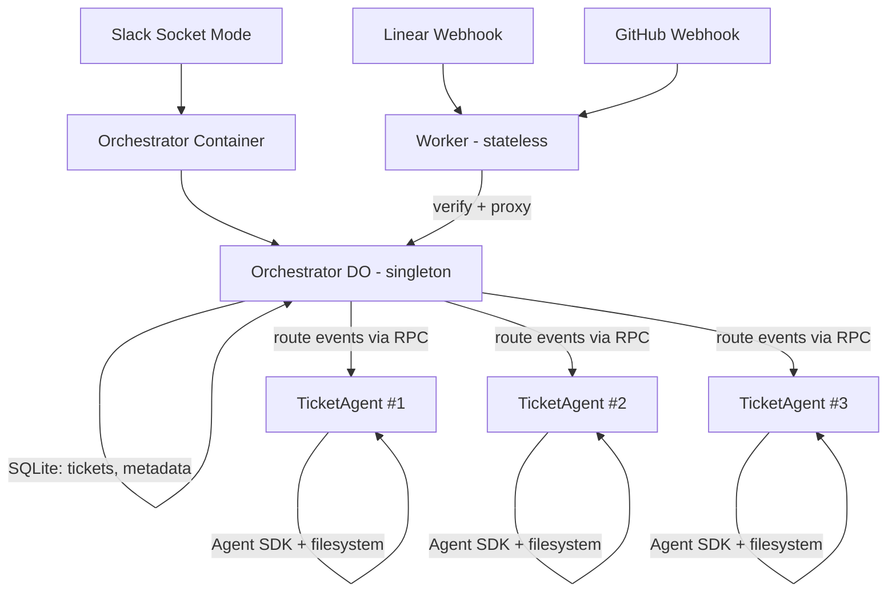

# Unified Persistent Agent — Design

Replaces the phased rollout (Phases 1-3) with a single coherent system. Phase 4 (GitHub Action fallback) is dropped.

## Goal

Linear ticket or Slack mention → persistent agent → implements → PR → responds to reviews → merges. Minimizes human interaction by encoding a decision framework: reversible decisions are autonomous, hard-to-reverse decisions are batched and presented via Slack.

## Architecture



### Components

| Component | Runtime | State | Lifecycle |
|-----------|---------|-------|-----------|
| **Worker** | Stateless fetch handler | None | Per-request |
| **Orchestrator DO** | Singleton, always-on | SQLite (tickets, agent metadata) | Permanent |
| **Orchestrator Container** | Bun process in Orchestrator DO | In-memory (Slack WebSocket) | Always-on (no sleepAfter) |
| **TicketAgent** | Container class (extends DO) per ticket | Local filesystem (git repos, working state) | `sleepAfter = "4d"` |

### Orchestrator DO

Singleton accessed via `env.ORCHESTRATOR.idFromName("main")`. Extends `Container` from `@cloudflare/containers`.

**Responsibilities:**
- Receive webhooks (proxied by Worker)
- Route events to per-ticket TicketAgents via RPC
- Track active tickets in SQLite (id, product, status, slack_thread_ts, pr_url)
- Maintain Slack Socket Mode WebSocket (in container process)

**SQLite schema:**
```sql
CREATE TABLE tickets (
  id TEXT PRIMARY KEY,
  product TEXT NOT NULL,
  status TEXT NOT NULL DEFAULT 'created',
  slack_thread_ts TEXT,
  slack_channel TEXT,
  pr_url TEXT,
  branch_name TEXT,
  created_at TEXT DEFAULT (datetime('now')),
  updated_at TEXT DEFAULT (datetime('now'))
);
```

No event log table — use Sentry for observability across all components.

**Container process:** Bun HTTP server + Slack Socket Mode client.
- Opens WebSocket to Slack via `apps.connections.open`
- On Slack event (app_mention, thread reply): forwards to DO's fetch handler
- Auto-reconnects on disconnect

### TicketAgent

One per ticket, identified by `idFromName(ticketId)`. Extends `Container`.

**Simplified from original design:** No SQLite. Local filesystem only. The Orchestrator is the source of truth for ticket metadata. The agent container has:
- Cloned git repo(s) in `/workspace/`
- Git working state (branches, uncommitted changes)
- Agent SDK session (in-memory, lost on sleep — rebuilt from context on wake)

**Container config:**
- `defaultPort = 3000`
- `sleepAfter = "4d"`
- `envVars` dynamically resolved from Orchestrator's ticket config

**On wake from sleep:** Orchestrator sends ticket context (description, status, PR URL, recent events) to the agent's `/event` endpoint. Agent rebuilds context from this.

**DO class (sketch):**
```typescript
export class TicketAgent extends Container {
  defaultPort = 3000;
  sleepAfter = "4d";

  // Called by Orchestrator via RPC
  async handleEvent(event: TicketEvent) {
    const port = this.ctx.container.getTcpPort(this.defaultPort);
    await port.fetch("http://localhost/event", {
      method: "POST",
      body: JSON.stringify(event),
    });
  }
}
```

### Event Routing

| Source | Event | Orchestrator Action |
|--------|-------|-------------------|
| Linear | Issue created/updated | Find or create TicketAgent, forward event |
| GitHub | PR review submitted | Look up ticket by PR URL, forward to agent |
| GitHub | PR merged | Look up ticket, forward `pr_merged` event |
| GitHub | CI status change | Look up ticket by branch, forward to agent |
| Slack | @product-engineer mention | Identify product from channel, create ticket + agent |
| Slack | Thread reply to agent | Forward to agent owning that thread |

### Ticket Lifecycle

```
created → in_progress → pr_open → in_review → merged → closed
                │                    │    ↑
                │                    v    │
                │              needs_revision
                │
                ├→ deferred → closed
                └→ failed → closed
```

## Decision Framework (product-engineer skill)

Encoded in the skill the TicketAgent follows. This is the core of minimizing human interaction.

### Reversible / non-destructive decisions → autonomous

Agent decides and documents. Criteria:
1. Best satisfies the requirements
2. Simplest approach
3. Technically sound
4. Uses existing work (packages, patterns, conventions) where possible

Examples: file structure, naming, implementation approach, which package to use, test strategy, code organization, error handling approach.

### Hard-to-reverse / destructive decisions → batch and ask

Collect all such decisions, present as a single Slack message with context and options. Wait for reply.

Examples: database schema changes, API contract changes, deleting data, force push, architectural choices expensive to undo, external service integrations with billing/security implications.

### Never ask one question at a time

If multiple decisions need human input, batch them. One Slack message, all questions, wait for one reply.

## Permission Engineering

The TicketAgent runs Agent SDK with `settingSources: ["project"]`, which loads the target product repo's `.claude/settings.json`. This controls what Bash commands, file operations, etc. the agent can perform without blocking.

**Standard template for product repos** (applied by `/setup-product` skill):

```json
{
  "permissions": {
    "allow": [
      "Bash(git *)",
      "Bash(gh *)",
      "Bash(bun *)",
      "Bash(npm *)",
      "Bash(npx *)",
      "Bash(ls *)",
      "Bash(cat *)",
      "Bash(mkdir *)",
      "Bash(cp *)",
      "Bash(mv *)",
      "Bash(rm *)",
      "Bash(curl *)",
      "Bash(cd *)",
      "Read(*)",
      "Write(*)",
      "Edit(*)"
    ]
  }
}
```

This allows the agent to work autonomously without permission prompts for standard development operations. Destructive operations (force push, data deletion) are governed by the decision framework in the skill, not by permission blocks.

## Observability

Sentry integrated across all components:
- **Worker**: Capture webhook processing errors
- **Orchestrator DO**: Capture routing errors, Slack connection issues
- **TicketAgent container**: Capture agent execution errors, tool failures
- **Cloudflare Gateway logging**: Future addition for API-level observability

## What stays the same

- **Registry pattern** (`orchestrator/src/registry.ts`) — products → repos, channels, secrets, triggers
- **Webhook verification** — Linear/GitHub HMAC verification logic
- **Agent tools** — notify_slack, ask_question, update_task_status (backends change, interfaces stay)
- **English skills define behavior** — SKILL.md drives agent decisions

## Files to change

| File | Action |
|------|--------|
| `orchestrator/wrangler.toml` | Rewrite — two containers, two DOs, no queue |
| `orchestrator/package.json` | Swap `@cloudflare/sandbox` → `@cloudflare/containers`, add `@sentry/cloudflare` |
| `orchestrator/src/index.ts` | Rewrite — thin proxy to Orchestrator DO |
| `orchestrator/src/orchestrator.ts` | **New** — Orchestrator DO class |
| `orchestrator/src/ticket-agent.ts` | **New** — TicketAgent Container class (simplified, no SQLite) |
| `orchestrator/src/types.ts` | **New** — shared types |
| `containers/orchestrator/index.ts` | **New** — Slack Socket Mode + HTTP server |
| `containers/orchestrator/slack-socket.ts` | **New** — Socket Mode client |
| `containers/orchestrator/Dockerfile` | **New** |
| `containers/agent/Dockerfile` | **New** |
| `agent/src/server.ts` | **New** — HTTP server wrapping Agent SDK |
| `agent/src/index.ts` | Rewrite — re-export server |
| `agent/src/tools.ts` | Modify — status updates call DO |
| `agent/src/config.ts` | Modify — remove slackAppToken, add ticketId |
| `.claude/skills/product-engineer/SKILL.md` | Rewrite — decision framework |
| `docs/product/implementation-phases.md` | Rewrite — unified system, no Phase 4 |
| **Delete:** `orchestrator/src/dispatch.ts`, `orchestrator/src/sandbox.ts`, `orchestrator/src/slack-commands.ts`, `agent/src/slack-listener.ts`, `Dockerfile` (root) | |
