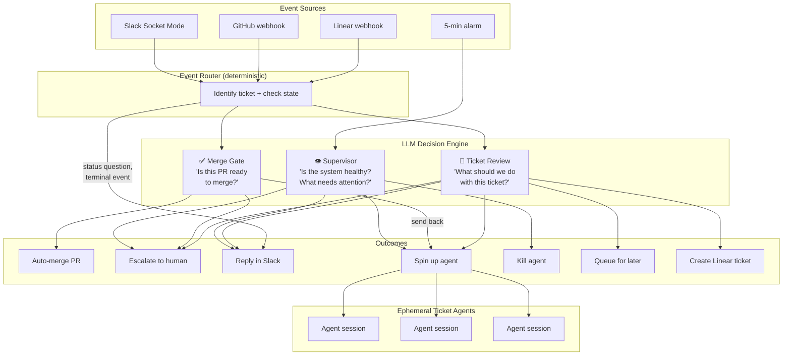
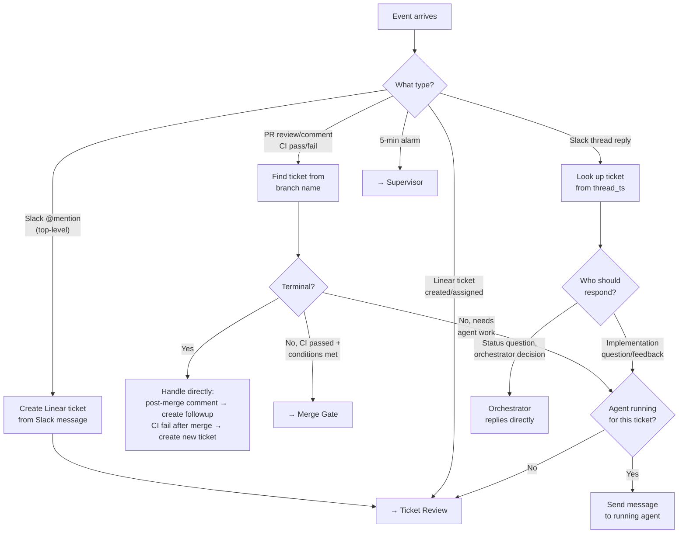
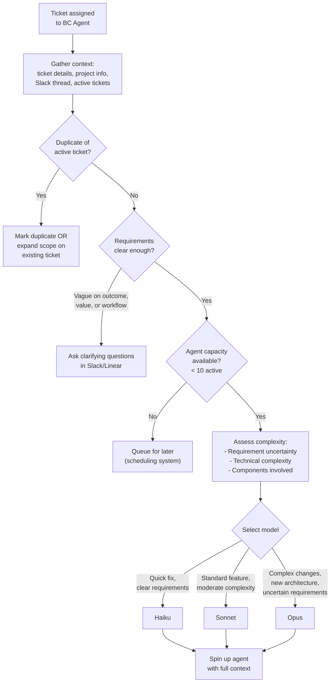
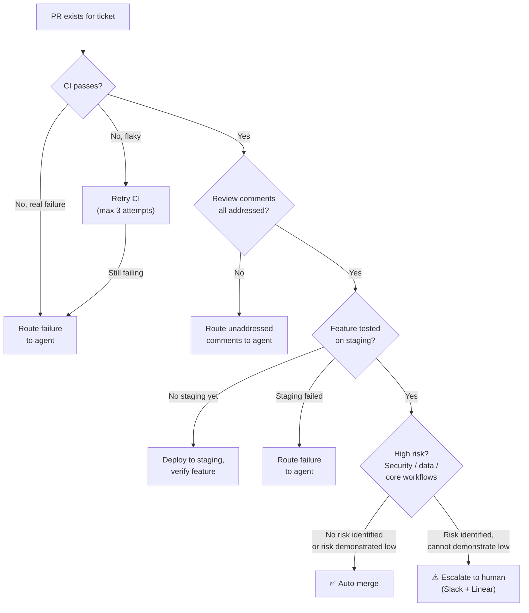
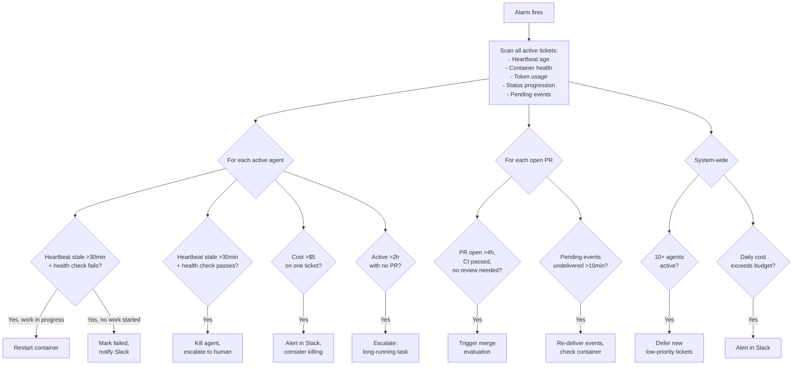

# LLM Orchestrator Design

We got the orchestrator system working about a week ago. This is the next major revision.

## Goals

Move work through the system more smoothly with fewer instances of rework.

- Go from 1+ hour of human oversight to manage agent coordination issues to **less than 5 minutes/day**
- Coordination process makes the right decision at key points **over 80% of the time**:
  - What should I do with this new ticket?
  - How should I implement?
  - Does the plan need human review?
  - Does the work need human review before deploy?
  - Is the work ready to deploy?
  - How do I respond to events during development lifecycle? (Slack messages, deploy failure, CI failure, Copilot review, Linear comments, Sentry events)

**Core insight:** The current system has "Smart + Narrow" (TicketAgent sees one ticket deeply) and "Dumb + Wide" (Orchestrator sees all tickets but uses if/else). Nobody has **both intelligence and system-wide awareness**. The LLM Orchestrator gives the wide-scope component actual reasoning ability.

---

## Architecture Overview



**Three LLM decisions. Everything else is deterministic routing.**

The Event Router identifies which ticket an event belongs to, checks terminal state, checks if an agent is already running, and routes to the appropriate decision. Some events (status questions, terminal transitions) are handled directly without an LLM call.

---

## Event Router (Deterministic)

All events go through the same deterministic pipeline before reaching an LLM decision:



**Key routing rules:**
- Slack @mentions at top level → create a Linear ticket, then normal ticket review flow (no special handling)
- All thread replies go to the ticket's context — no @mention needed to trigger
- Only 0 or 1 agents active per ticket at any time
- If an agent is already running, send it a message rather than spawning a duplicate
- PR reviews route to the ticket's agent — the agent decides whether to address, ignore, or create a followup ticket
- CI pass after merge → handled directly (no agent needed)
- CI fail after merge → create a new ticket to fix main

---

## Decision 1: Ticket Review

**Trigger:** New ticket created/assigned, or ticket needs re-evaluation (e.g., agent not running but work needed)



**Context assembled for this decision:**
- Ticket details (title, description, priority, labels)
- Project info and high-level product goals
- Slack thread history (if ticket originated from Slack)
- List of currently active tickets (for duplicate detection)
- Current agent count and capacity

**Decision output:**

| Action | When |
| --- | --- |
| **Start agent** | Clear requirements, capacity available, not a duplicate |
| **Ask questions** | Vague on outcome, value, or intended workflow |
| **Mark duplicate** | Substantially similar to an active ticket |
| **Expand existing** | Related to active ticket — add scope to existing work |
| **Queue** | 10+ agents running, this can wait |

**Model selection:**

| Complexity | Signals | Model |
| --- | --- | --- |
| Low | Quick fix, clear requirements, single file | Haiku |
| Medium | Standard feature, moderate scope, clear spec | Sonnet |
| High | New architecture, uncertain requirements, multiple components, new technologies | Opus |

---

## Decision 2: Merge Gate

**Trigger:** All merge preconditions are met for a PR. The orchestrator (not the agent) makes this decision.



**Merge preconditions (all must be true to consider merging):**

| # | Condition | Check |
| --- | --- | --- |
| A | CI passes on PR | All required GitHub checks green |
| B | Review comments addressed | No unresolved threads, agent has responded to all feedback |
| C | Feature verified on staging | Deployed to staging, smoke test passed |
| D | Not high risk (or risk demonstrated low) | LLM evaluates diff against three hard gates |

**The three hard gates (require human review if risk can't be demonstrated as low):**

1. **Security / sensitive data** — auth, encryption, API keys, PII handling
2. **Data integrity** — schema migrations, data deletion, backup/restore
3. **Core user workflows** — features users depend on daily (symptom logging, ride tracking)

**Auto-merge is the default.** Human review is only requested when all of A-C are met but D is uncertain. This minimizes human interaction — only ask when the ticket is actually ready for review.

**Merge evaluation inputs:**
- The actual diff (via GitHub API)
- CI results
- Staging verification result
- Ticket context (what was asked, does the diff match)
- Test coverage (did the agent add tests for changed behavior)

**CI failure handling:**

| Failure Type | Signal | Action |
| --- | --- | --- |
| Flaky (timeout, network) | Non-assertion failure, same check passes on other branches | Retry CI (max 3) |
| Real (test, lint, type) | Assertion failure, type error, lint error | Route to agent |
| Post-merge CI failure | Failure on main branch after merge | Create new ticket to fix main |

---

## Decision 3: Supervisor

**Trigger:** 5-minute periodic alarm



**Supervisor action table:**

| Condition | Action |
| --- | --- |
| Stale heartbeat + health check fails | Restart container (if non-terminal), notify |
| Stale heartbeat + health check passes | Agent stuck — kill, escalate |
| Agent active >2h with no PR | Likely stuck — escalate |
| PR conditions met but not merged | Trigger merge evaluation |
| Agent cost >$5 on one ticket | Alert, consider killing |
| 10+ agents active simultaneously | Defer new low-priority tickets |
| Pending events undelivered >10min | Re-deliver, check container health |
| Same failure 3+ times | Stop routing, escalate |

---

## Slack Thread Communication

The orchestrator owns all Slack thread communication routing:

| Message type | Who responds | Why |
| --- | --- | --- |
| Status question ("what's the status?") | Orchestrator directly | Has all status info in SQLite |
| Decision question ("should we merge?") | Orchestrator directly | Owns merge/triage decisions |
| Implementation question ("why did you use X?") | Route to agent | Agent has code context |
| User feedback on implementation | Route to agent | Agent needs to act on it |
| New request in existing thread | Orchestrator evaluates | Related → expand scope. Unrelated → create new ticket |

No @mention needed in ticket threads — all messages are treated as communication to the system. The orchestrator decides who should respond.

---

## Architectural Principles

### Ephemeral Agents, Persistent Orchestrator

Agent containers spin down within **5 minutes** of completing a logical unit of work:
- PR created → exit after status update
- Review feedback addressed → exit after push
- Merge done → exit after retro
- Question asked via Slack → exit, orchestrator spins up new session when reply arrives

The orchestrator is always on and decides when to spin up new agent sessions. This eliminates zombie agents, gives fresh context windows, and reduces cost.

### Orchestrator Owns Key Decisions

The agent is the implementation engine. The orchestrator is the decision-maker:

| Decision | Owner | Why |
| --- | --- | --- |
| What to work on | Orchestrator | Sees all tickets, capacity, priorities |
| How to implement | Agent | Has code context, repo knowledge |
| Whether to merge | Orchestrator | Independent reviewer, sees system-wide risk |
| Whether to escalate | Orchestrator | Knows what the human cares about |
| When to spin up/down agents | Orchestrator | Manages lifecycle, cost, health |

### Retry Budgets

Hard caps on every retry loop:

| Scenario | Max Retries | On Exhaustion |
| --- | --- | --- |
| CI fix attempt | 3 | Escalate to human |
| PR review feedback cycle | 3 rounds | Escalate: "Agent can't resolve feedback" |
| Agent session restart | 2 | Mark failed, notify |
| Clarification questions | 2 | Escalate: "Need clearer requirements" |

### Structured Context Assembly

Before any LLM decision, the orchestrator assembles a structured context packet:
- Ticket metadata + history
- PR diff, CI results, review status (from GitHub API)
- Slack thread messages
- Active tickets and agent status (from SQLite)
- Product config and project goals

This follows Stripe's "70% deterministic / 30% LLM" pattern — most of the value comes from assembling the right context, not from the LLM reasoning itself.

---

## Decision Engine Design

```typescript
interface DecisionRequest {
  type: "ticket_review" | "merge_gate" | "supervisor";
  context: Record<string, unknown>;
}

interface DecisionResponse {
  action: string;
  reason: string;
  confidence: number; // 0-1, for logging
}
```

- **Max 30 seconds** per decision
- **Log every decision** to SQLite (`decision_log` table)
- **On API failure** → fall back to current rules-based behavior
- **Model per decision:** Haiku for triage (speed), Sonnet for merge evaluation (quality)
- **Cost:** ~$0.005-0.05 per decision, ~50 decisions/day = $0.25-2.50/day

---

## Implementation Priority

| Priority | What | Why First | Value |
| --- | --- | --- | --- |
| **P0** | Supervisor + ephemeral agents | Eliminates zombie management, the #1 overhead source | Saves ~45 min/day |
| **P1** | Merge gate + staging | Enables auto-merge for almost everything | Saves ~10 min/day |
| **P2** | Ticket review (triage) | Stops wasting agent time on unclear/duplicate tasks | Saves ~5 min/day |
| **P3** | Failure triage + retry budgets | Prevents infinite loops, distinguishes flaky from real | Saves ~5 min/day |
| **P4** | Outcome logging + self-improvement | Compound value once P0-P3 stable | Long-term |

---

## What Changes in the Codebase

| Component | Change |
| --- | --- |
| `orchestrator/src/decision-engine.ts` | **New.** Anthropic API client, prompt templates, decision logging |
| `orchestrator/src/context-assembler.ts` | **New.** Structured context packets (GitHub diff, CI, reviews, ticket history) |
| `orchestrator/src/orchestrator.ts` | Ticket review in `handleEvent()`. Merge gate endpoint. Actionable supervisor tick. Direct handling of `pr_merged`, status questions, post-merge events. |
| `orchestrator/src/ticket-agent.ts` | 5-min exit after logical completion. Reduced `sleepAfter`. |
| `.claude/skills/product-engineer/SKILL.md` | Remove merge logic. Agent creates PR and stops. Orchestrator handles merge. |
| `agent/src/prompt.ts` | Remove merge instructions. Add structured JSON progress updates. |
| `agent/src/server.ts` | Reduce idle timeout to 5min. Exit immediately after session completion. |
| `orchestrator/src/model-selection.ts` | Delete — replaced by LLM ticket review. |
| SQLite schema | Add `decision_log`, `outcomes` tables. `ticket_state` JSON column. |

---

## Edge Case Matrix

| Scenario | Correct Behavior |
| --- | --- |
| Container restart for terminal ticket | Skip restart (existing, verified) |
| Deploy while agent waiting for review | Don't restart — buffer events, restart on review arrival |
| Agent fails, then new event arrives | LLM re-evaluates: "Should I retry based on this event?" |
| Two events for same ticket simultaneously | Event buffer in TicketAgent DO (existing) |
| PR open, agent dead, CI passed | Supervisor triggers merge evaluation directly |
| Vague Slack @mention | Creates Linear ticket → ticket review asks clarifying questions |
| Status question in ticket thread | Orchestrator answers directly from DB |
| 10+ agents running, new ticket | Queue — scheduling system triggers when capacity frees |
| Flaky CI failure | Retry CI (max 3), not agent |
| Same review feedback 3 times | Escalate: "Agent can't resolve this" |
| CI fails after merge on main | Create new ticket to fix main, assign to agent |
| Post-merge comment on PR | Acknowledge, create followup ticket if actionable |
