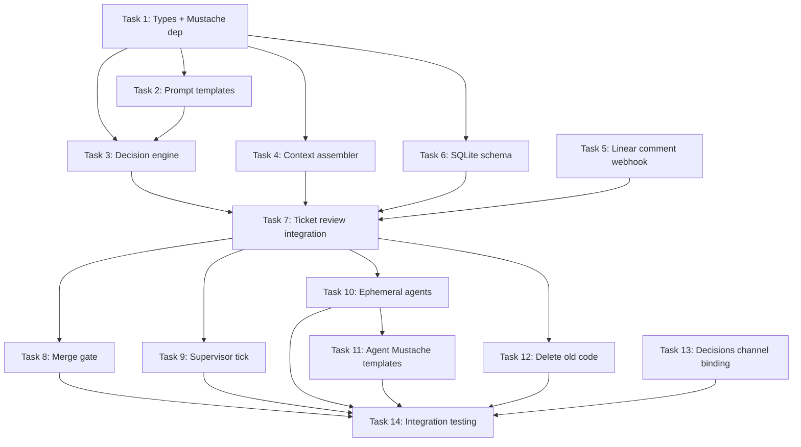

# LLM Orchestrator Implementation Plan

> **For Claude:** REQUIRED SUB-SKILL: Use superpowers:executing-plans to implement this plan task-by-task.

**Goal:** Replace the rules-based orchestrator with an LLM-enhanced orchestrator that makes intelligent decisions at three key points (ticket review, merge gate, supervisor), with ephemeral agents, structured context assembly, Mustache prompt templates, and decision logging to 4 destinations.

**Architecture:** Three LLM decision points (ticket review, merge gate, supervisor) plugged into the existing event router. A context assembler gathers structured data before each decision. A decision engine renders Mustache templates, calls the Anthropic API, parses JSON responses, and logs decisions. Agents become ephemeral (5-min exit). Linear comments are treated as events just like Slack replies.

**Tech Stack:** TypeScript, Cloudflare Workers/DOs/Containers, Mustache templates, Anthropic API (direct), Bun test runner

**Design doc:** `docs/product/plans/2026-03-09-llm-orchestrator-design.md`

---

## Task 1: Install Mustache + Add Decision Types

**Files:**
- Modify: `orchestrator/package.json`
- Modify: `orchestrator/src/types.ts`

**Step 1: Install mustache dependency**

```bash
cd orchestrator && bun add mustache && bun add -d @types/mustache
```

**Step 2: Add decision types to `types.ts`**

Add after the existing `TicketAgentConfig` interface:

```typescript
// Decision engine types
export interface DecisionRequest {
  type: "ticket_review" | "merge_gate" | "supervisor";
  context: Record<string, unknown>;
}

export interface DecisionResponse {
  action: string;
  reason: string;
  confidence: number;
  model?: string; // For ticket_review: which model to assign
}

export interface DecisionLog {
  id: string;
  timestamp: string;
  type: "ticket_review" | "merge_gate" | "supervisor";
  ticket_id: string | null;
  context_summary: string;
  action: string;
  reason: string;
  confidence: number;
}
```

Also add `"linear_comment"` to the `TicketEvent.type` comment string.

**Step 3: Run typecheck**

```bash
cd orchestrator && bunx tsc --noEmit
```

**Step 4: Commit**

```bash
git add orchestrator/package.json orchestrator/bun.lockb orchestrator/src/types.ts
git commit -m "feat: install mustache, add decision engine types"
```

---

## Task 2: Create Mustache Prompt Templates

**Files:**
- Create: `orchestrator/src/prompts/ticket-review.mustache`
- Create: `orchestrator/src/prompts/merge-gate.mustache`
- Create: `orchestrator/src/prompts/supervisor.mustache`
- Create: `orchestrator/src/prompts/thread-classify.mustache`

**Step 1: Create prompt directory and templates**

`orchestrator/src/prompts/ticket-review.mustache`:
```mustache
You are the Product Engineer orchestrator reviewing a new ticket.

## Ticket
**{{identifier}}:** {{title}}
{{#description}}
**Description:**
<user_input>
{{description}}
</user_input>
{{/description}}
**Priority:** {{priority}}
{{#labels}}**Labels:** {{labels}}{{/labels}}

{{#linearComments.length}}
## Linear Comment History
{{#linearComments}}
- **{{author}}** ({{createdAt}}): {{body}}
{{/linearComments}}
{{/linearComments.length}}

{{#slackThread.length}}
## Slack Thread
{{#slackThread}}
- **{{user}}**: {{text}}
{{/slackThread}}
{{/slackThread.length}}

## Active Tickets ({{activeCount}} total, cap at 10 before queueing)
{{#activeTickets}}
- {{id}}: {{status}} ({{product}}) {{#pr_url}}PR: {{pr_url}}{{/pr_url}}
{{/activeTickets}}
{{^activeTickets}}
No active tickets.
{{/activeTickets}}

## Product
**{{productName}}** — repos: {{repos}}

## Decision Required

Evaluate this ticket and respond with JSON:

```json
{
  "action": "start_agent" | "ask_questions" | "mark_duplicate" | "expand_existing" | "queue",
  "model": "haiku" | "sonnet" | "opus",
  "reason": "one sentence explaining why",
  "questions": ["only if action is ask_questions"],
  "duplicate_of": "only if action is mark_duplicate — the ticket ID",
  "expand_ticket": "only if action is expand_existing — the ticket ID to expand"
}
```

**Model selection guide:**
- **haiku**: Quick fix, clear requirements, single file, typo/text/CSS changes
- **sonnet**: Standard feature, moderate scope, clear spec, bug fix with investigation
- **opus**: New architecture, uncertain requirements, multiple components, major refactor

**Decision guide:**
- **start_agent**: Requirements are clear enough to begin. Pick the right model.
- **ask_questions**: The ticket is vague on outcome, value, or intended workflow. Ask up to 2 specific questions.
- **mark_duplicate**: Substantially overlaps an active ticket listed above.
- **expand_existing**: Related to an active ticket — add scope to existing work instead of starting a new agent.
- **queue**: 10+ agents running and this ticket can wait.
```

`orchestrator/src/prompts/merge-gate.mustache`:
```mustache
You are the Product Engineer orchestrator evaluating whether a PR is ready to merge.

## Ticket
**{{identifier}}:** {{title}}

## PR
**{{pr_url}}** — {{pr_title}}
**Branch:** {{branch}}
**Changed files:** {{changedFiles}}
**Additions:** +{{additions}} / Deletions: -{{deletions}}

## CI Status
{{#ciPassed}}All checks passed.{{/ciPassed}}
{{^ciPassed}}CI FAILED: {{ciFailureDetails}}{{/ciPassed}}

## Review Status
{{#reviewComments.length}}
### Review Comments
{{#reviewComments}}
- **{{reviewer}}** ({{state}}): {{body}}
{{/reviewComments}}
{{/reviewComments.length}}
{{^reviewComments.length}}
No review comments.
{{/reviewComments.length}}

## Diff Summary
```
{{diffSummary}}
```

{{#linearComments.length}}
## Linear Comment History
{{#linearComments}}
- **{{author}}** ({{createdAt}}): {{body}}
{{/linearComments}}
{{/linearComments.length}}

## Three Hard Gates
Evaluate the diff against these gates. If ANY gate is uncertain, escalate.

1. **Security / sensitive data** — auth, encryption, API keys, PII handling
2. **Data integrity** — schema migrations, data deletion, backup/restore
3. **Core user workflows** — features users depend on daily

## Decision Required

Respond with JSON:

```json
{
  "action": "auto_merge" | "escalate" | "send_back",
  "reason": "one sentence",
  "hard_gate_triggered": "security" | "data_integrity" | "core_workflow" | null,
  "missing": "only if send_back — what needs to be fixed"
}
```

**Decision guide:**
- **auto_merge**: CI green, no unresolved review comments, no hard gates triggered. This is the default.
- **escalate**: A hard gate was triggered and risk cannot be demonstrated as low.
- **send_back**: CI failed, unresolved review comments, or obvious issues in the diff.
```

`orchestrator/src/prompts/supervisor.mustache`:
```mustache
You are the Product Engineer orchestrator running a periodic health check.

## Active Agents ({{agentCount}} total)
{{#agents}}
### {{ticketId}} ({{product}})
- **Status:** {{status}}
- **Last heartbeat:** {{lastHeartbeat}} ({{heartbeatAge}} ago)
- **Health check:** {{healthStatus}}
- **Duration:** {{duration}}
- **PR:** {{#pr_url}}{{pr_url}}{{/pr_url}}{{^pr_url}}none{{/pr_url}}
- **Cost:** ${{cost}}
{{/agents}}
{{^agents}}
No active agents.
{{/agents}}

## Open PRs Without Active Agents
{{#stalePRs}}
- {{ticketId}}: {{pr_url}} — CI: {{ciStatus}}, open for {{age}}
{{/stalePRs}}
{{^stalePRs}}
None.
{{/stalePRs}}

## Queued Tickets
{{#queuedTickets}}
- {{id}}: {{title}} (priority {{priority}})
{{/queuedTickets}}
{{^queuedTickets}}
None.
{{/queuedTickets}}

## System Stats
- **Daily cost:** ${{dailyCost}}
- **Pending undelivered events:** {{pendingEvents}}

## Decision Required

For each agent or issue that needs action, respond with a JSON array:

```json
[
  {
    "target": "ticket_id or 'system'",
    "action": "restart" | "kill" | "escalate" | "trigger_merge_eval" | "redeliver_events" | "defer_new_tickets" | "start_queued" | "none",
    "reason": "one sentence"
  }
]
```

**Action guide:**
- **restart**: Heartbeat stale >30min AND health check fails AND ticket not terminal. Max 2 restarts per ticket.
- **kill**: Heartbeat stale >30min AND health check passes (agent stuck). Or cost >$5.
- **escalate**: Agent active >2h with no PR, or same failure 3+ times.
- **trigger_merge_eval**: PR open >4h with CI passed and no pending reviews.
- **redeliver_events**: Pending events undelivered >10min.
- **defer_new_tickets**: 10+ agents active — hold low-priority new tickets.
- **start_queued**: Agent count dropped below 10, start highest-priority queued ticket.
- **none**: Agent is healthy and progressing.

Return `[]` if everything looks healthy.
```

`orchestrator/src/prompts/thread-classify.mustache`:
```mustache
You are classifying a Slack thread message to determine who should respond.

## Message
**From:** {{user}}
**Text:** {{text}}

## Ticket Context
**{{identifier}}:** {{title}}
**Status:** {{status}}
**Agent running:** {{agentRunning}}

## Classification Required

Respond with JSON:

```json
{
  "handler": "orchestrator" | "agent",
  "reason": "one sentence"
}
```

**Routing guide:**
- **orchestrator**: Status questions, decision questions, new unrelated requests
- **agent**: Implementation questions, feedback on implementation, clarifications about the code/approach
```

**Step 2: Verify templates exist**

```bash
ls orchestrator/src/prompts/
```

**Step 3: Commit**

```bash
git add orchestrator/src/prompts/
git commit -m "feat: add Mustache prompt templates for all LLM decisions"
```

---

## Task 3: Create Decision Engine

**Files:**
- Create: `orchestrator/src/decision-engine.ts`
- Create: `orchestrator/src/decision-engine.test.ts`

**Step 1: Write tests for decision engine**

`orchestrator/src/decision-engine.test.ts`:
```typescript
import { describe, it, expect, mock, beforeEach } from "bun:test";
import { DecisionEngine } from "./decision-engine";

// Mock fetch for Anthropic API
const mockFetch = mock(() => Promise.resolve(new Response(
  JSON.stringify({
    content: [{ type: "text", text: '{"action":"start_agent","model":"sonnet","reason":"clear requirements","confidence":0.9}' }],
    usage: { input_tokens: 100, output_tokens: 50 },
  }),
  { headers: { "Content-Type": "application/json" } }
)));

describe("DecisionEngine", () => {
  let engine: DecisionEngine;

  beforeEach(() => {
    engine = new DecisionEngine({
      anthropicApiKey: "test-key",
      anthropicBaseUrl: undefined,
      slackBotToken: "xoxb-test",
      decisionsChannel: "#product-engineer-decisions",
      linearApiKey: "lin_test",
    });
  });

  it("renders ticket-review template", () => {
    const rendered = engine.renderTemplate("ticket-review", {
      identifier: "PE-42",
      title: "Fix button color",
      description: "The submit button is blue, should be green",
      priority: "Normal",
      activeCount: 3,
      activeTickets: [{ id: "PE-40", status: "in_progress", product: "health-tool" }],
      productName: "health-tool",
      repos: "bryanchan/health-tool",
      linearComments: [],
      slackThread: [],
    });
    expect(rendered).toContain("PE-42");
    expect(rendered).toContain("Fix button color");
    expect(rendered).toContain("PE-40");
  });

  it("renders merge-gate template", () => {
    const rendered = engine.renderTemplate("merge-gate", {
      identifier: "PE-42",
      title: "Fix button",
      pr_url: "https://github.com/org/repo/pull/1",
      pr_title: "Fix button color",
      branch: "ticket/PE-42",
      changedFiles: 2,
      additions: 10,
      deletions: 5,
      ciPassed: true,
      diffSummary: "Changed button color from blue to green",
      reviewComments: [],
      linearComments: [],
    });
    expect(rendered).toContain("PE-42");
    expect(rendered).toContain("auto_merge");
  });

  it("renders supervisor template", () => {
    const rendered = engine.renderTemplate("supervisor", {
      agentCount: 1,
      agents: [{
        ticketId: "PE-40",
        product: "health-tool",
        status: "in_progress",
        lastHeartbeat: "2026-03-09T10:00:00Z",
        heartbeatAge: "5m",
        healthStatus: "healthy",
        duration: "30m",
        pr_url: null,
        cost: "0.50",
      }],
      stalePRs: [],
      queuedTickets: [],
      dailyCost: "1.50",
      pendingEvents: 0,
    });
    expect(rendered).toContain("PE-40");
    expect(rendered).toContain("health-tool");
  });

  it("parses JSON from LLM response with markdown fences", () => {
    const result = engine.parseDecisionResponse('```json\n{"action":"start_agent","model":"sonnet","reason":"clear"}\n```');
    expect(result.action).toBe("start_agent");
    expect(result.model).toBe("sonnet");
  });

  it("parses JSON from LLM response without fences", () => {
    const result = engine.parseDecisionResponse('{"action":"auto_merge","reason":"all green"}');
    expect(result.action).toBe("auto_merge");
  });
});
```

**Step 2: Run tests to verify they fail**

```bash
cd orchestrator && bun test src/decision-engine.test.ts
```
Expected: FAIL — module not found

**Step 3: Implement decision engine**

`orchestrator/src/decision-engine.ts`:
```typescript
/**
 * Decision Engine — renders Mustache templates, calls Anthropic API,
 * parses JSON responses, logs decisions to 4 destinations.
 */

import Mustache from "mustache";
import type { DecisionResponse, DecisionLog } from "./types";

// Import templates as strings (bundled by wrangler)
import ticketReviewTemplate from "./prompts/ticket-review.mustache";
import mergeGateTemplate from "./prompts/merge-gate.mustache";
import supervisorTemplate from "./prompts/supervisor.mustache";
import threadClassifyTemplate from "./prompts/thread-classify.mustache";

const TEMPLATES: Record<string, string> = {
  "ticket-review": ticketReviewTemplate,
  "merge-gate": mergeGateTemplate,
  "supervisor": supervisorTemplate,
  "thread-classify": threadClassifyTemplate,
};

// Decision model: Haiku for speed on triage/classify, Sonnet for merge quality
const DECISION_MODELS: Record<string, string> = {
  "ticket-review": "claude-haiku-4-5-20251001",
  "merge-gate": "claude-sonnet-4-6-20250514",
  "supervisor": "claude-haiku-4-5-20251001",
  "thread-classify": "claude-haiku-4-5-20251001",
};

export interface DecisionEngineConfig {
  anthropicApiKey: string;
  anthropicBaseUrl?: string; // For AI Gateway
  slackBotToken: string;
  decisionsChannel: string; // e.g., "#product-engineer-decisions"
  linearApiKey: string;
}

export class DecisionEngine {
  private config: DecisionEngineConfig;

  constructor(config: DecisionEngineConfig) {
    this.config = config;
  }

  /** Render a Mustache template with the given data */
  renderTemplate(name: string, data: Record<string, unknown>): string {
    const template = TEMPLATES[name];
    if (!template) throw new Error(`Unknown template: ${name}`);
    return Mustache.render(template, data);
  }

  /** Parse JSON from LLM response, handling markdown code fences */
  parseDecisionResponse(text: string): DecisionResponse {
    // Strip markdown code fences if present
    let jsonStr = text.trim();
    const fenceMatch = jsonStr.match(/```(?:json)?\s*\n?([\s\S]*?)\n?```/);
    if (fenceMatch) {
      jsonStr = fenceMatch[1].trim();
    }
    return JSON.parse(jsonStr);
  }

  /** Call Anthropic API with a rendered prompt and parse the JSON response */
  async makeDecision(
    templateName: string,
    context: Record<string, unknown>,
  ): Promise<DecisionResponse> {
    const prompt = this.renderTemplate(templateName, context);
    const model = DECISION_MODELS[templateName] || "claude-haiku-4-5-20251001";
    const baseUrl = this.config.anthropicBaseUrl || "https://api.anthropic.com";

    const response = await fetch(`${baseUrl}/v1/messages`, {
      method: "POST",
      headers: {
        "Content-Type": "application/json",
        "x-api-key": this.config.anthropicApiKey,
        "anthropic-version": "2023-06-01",
      },
      body: JSON.stringify({
        model,
        max_tokens: 1024,
        messages: [{ role: "user", content: prompt }],
      }),
    });

    if (!response.ok) {
      const errorText = await response.text();
      throw new Error(`Anthropic API error ${response.status}: ${errorText}`);
    }

    const data = await response.json() as {
      content: Array<{ type: string; text: string }>;
    };

    const textBlock = data.content.find(b => b.type === "text");
    if (!textBlock) throw new Error("No text in Anthropic response");

    return this.parseDecisionResponse(textBlock.text);
  }

  /** Log a decision to all 4 destinations */
  async logDecision(
    log: DecisionLog,
    opts: {
      sqlExec: (sql: string, ...params: unknown[]) => void;
      slackChannel?: string;
      slackThreadTs?: string;
      linearIssueId?: string;
    },
  ): Promise<void> {
    // 1. SQLite
    opts.sqlExec(
      `INSERT INTO decision_log (id, timestamp, type, ticket_id, context_summary, action, reason, confidence)
       VALUES (?, ?, ?, ?, ?, ?, ?, ?)`,
      log.id, log.timestamp, log.type, log.ticket_id,
      log.context_summary, log.action, log.reason, log.confidence,
    );

    // Format for Slack
    const emoji = log.type === "ticket_review" ? "🎫" : log.type === "merge_gate" ? "✅" : "👁️";
    const typeLabel = log.type.replace(/_/g, " ").replace(/\b\w/g, c => c.toUpperCase());
    const slackText = `${emoji} *${typeLabel}*${log.ticket_id ? ` — \`${log.ticket_id}\`` : ""}\n*Action:* ${log.action}\n*Reason:* ${log.reason}`;

    // 2. #product-engineer-decisions channel
    await this.postSlack(this.config.decisionsChannel, slackText).catch(
      err => console.error("[DecisionEngine] Failed to post to decisions channel:", err),
    );

    // 3. Ticket Slack thread
    if (opts.slackChannel && opts.slackThreadTs) {
      await this.postSlack(opts.slackChannel, slackText, opts.slackThreadTs).catch(
        err => console.error("[DecisionEngine] Failed to post to ticket thread:", err),
      );
    }

    // 4. Linear comment
    if (opts.linearIssueId && this.config.linearApiKey) {
      await this.postLinearComment(opts.linearIssueId, `${emoji} **${typeLabel}**\n**Action:** ${log.action}\n**Reason:** ${log.reason}`).catch(
        err => console.error("[DecisionEngine] Failed to post Linear comment:", err),
      );
    }
  }

  private async postSlack(channel: string, text: string, threadTs?: string) {
    await fetch("https://slack.com/api/chat.postMessage", {
      method: "POST",
      headers: {
        Authorization: `Bearer ${this.config.slackBotToken}`,
        "Content-Type": "application/json",
      },
      body: JSON.stringify({
        channel,
        text,
        ...(threadTs && { thread_ts: threadTs }),
      }),
    });
  }

  private async postLinearComment(issueId: string, body: string) {
    await fetch("https://api.linear.app/graphql", {
      method: "POST",
      headers: {
        "Content-Type": "application/json",
        Authorization: this.config.linearApiKey,
      },
      body: JSON.stringify({
        query: `mutation($issueId: String!, $body: String!) { commentCreate(input: { issueId: $issueId, body: $body }) { success } }`,
        variables: { issueId, body },
      }),
    });
  }
}
```

**Step 4: Run tests**

```bash
cd orchestrator && bun test src/decision-engine.test.ts
```
Expected: Template rendering tests PASS. API call tests may need mocking adjustments.

**Step 5: Commit**

```bash
git add orchestrator/src/decision-engine.ts orchestrator/src/decision-engine.test.ts
git commit -m "feat: decision engine with Mustache templates, Anthropic API, 4-way logging"
```

---

## Task 4: Create Context Assembler

**Files:**
- Create: `orchestrator/src/context-assembler.ts`
- Create: `orchestrator/src/context-assembler.test.ts`

**Step 1: Write tests**

`orchestrator/src/context-assembler.test.ts`:
```typescript
import { describe, it, expect } from "bun:test";
import { ContextAssembler } from "./context-assembler";

describe("ContextAssembler", () => {
  const mockSqlExec = (sql: string) => {
    if (sql.includes("SELECT")) {
      return { toArray: () => [] };
    }
    return { toArray: () => [] };
  };

  it("assembles ticket review context", async () => {
    const assembler = new ContextAssembler({
      sqlExec: mockSqlExec as any,
      slackBotToken: "xoxb-test",
      linearApiKey: "lin_test",
      githubTokens: {},
    });

    const ctx = await assembler.forTicketReview({
      ticketId: "abc-123",
      identifier: "PE-42",
      title: "Fix button",
      description: "Make it green",
      priority: 3,
      labels: [],
      product: "health-tool",
      repos: ["bryanchan/health-tool"],
      slackThreadTs: null,
      slackChannel: null,
    });

    expect(ctx.identifier).toBe("PE-42");
    expect(ctx.title).toBe("Fix button");
    expect(ctx.activeTickets).toBeArray();
  });

  it("assembles merge gate context", async () => {
    const assembler = new ContextAssembler({
      sqlExec: mockSqlExec as any,
      slackBotToken: "xoxb-test",
      linearApiKey: "lin_test",
      githubTokens: { "health-tool": "ghp_test" },
    });

    const ctx = await assembler.forMergeGate({
      ticketId: "abc-123",
      identifier: "PE-42",
      title: "Fix button",
      product: "health-tool",
      pr_url: "https://github.com/org/repo/pull/1",
      branch: "ticket/abc-123",
      repo: "bryanchan/health-tool",
    });

    expect(ctx.identifier).toBe("PE-42");
    expect(ctx.pr_url).toBe("https://github.com/org/repo/pull/1");
  });
});
```

**Step 2: Run tests to verify failure**

```bash
cd orchestrator && bun test src/context-assembler.test.ts
```

**Step 3: Implement context assembler**

`orchestrator/src/context-assembler.ts`:
```typescript
/**
 * Context Assembler — gathers structured context from GitHub, Slack,
 * Linear, and SQLite before LLM decisions.
 */

export interface ContextAssemblerConfig {
  sqlExec: (sql: string, ...params: unknown[]) => { toArray: () => unknown[] };
  slackBotToken: string;
  linearApiKey: string;
  githubTokens: Record<string, string>; // product → GitHub token
}

export class ContextAssembler {
  private config: ContextAssemblerConfig;

  constructor(config: ContextAssemblerConfig) {
    this.config = config;
  }

  /** Assemble context for ticket review decision */
  async forTicketReview(ticket: {
    ticketId: string;
    identifier: string | null;
    title: string;
    description: string;
    priority: number;
    labels: string[];
    product: string;
    repos: string[];
    slackThreadTs: string | null;
    slackChannel: string | null;
  }): Promise<Record<string, unknown>> {
    // Get active tickets from SQLite
    const activeTickets = this.config.sqlExec(
      "SELECT id, status, product, pr_url FROM tickets WHERE status NOT IN ('merged', 'closed', 'deferred', 'failed')"
    ).toArray();

    // Fetch Linear comments in parallel with Slack thread
    const [linearComments, slackThread] = await Promise.all([
      this.fetchLinearComments(ticket.ticketId).catch(() => []),
      ticket.slackThreadTs && ticket.slackChannel
        ? this.fetchSlackThread(ticket.slackChannel, ticket.slackThreadTs).catch(() => [])
        : Promise.resolve([]),
    ]);

    return {
      identifier: ticket.identifier || ticket.ticketId,
      title: ticket.title,
      description: ticket.description,
      priority: this.priorityLabel(ticket.priority),
      labels: ticket.labels.join(", "),
      activeCount: activeTickets.length,
      activeTickets,
      productName: ticket.product,
      repos: ticket.repos.join(", "),
      linearComments,
      slackThread,
    };
  }

  /** Assemble context for merge gate decision */
  async forMergeGate(ticket: {
    ticketId: string;
    identifier: string | null;
    title: string;
    product: string;
    pr_url: string;
    branch: string;
    repo: string;
  }): Promise<Record<string, unknown>> {
    const ghToken = this.config.githubTokens[ticket.product];

    // Parse PR number from URL
    const prMatch = ticket.pr_url.match(/\/pull\/(\d+)/);
    const prNumber = prMatch?.[1];
    const repoPath = ticket.repo;

    // Fetch PR details, reviews, and diff in parallel
    const [prDetails, reviews, diff, linearComments] = await Promise.all([
      prNumber && ghToken ? this.fetchPRDetails(repoPath, prNumber, ghToken) : null,
      prNumber && ghToken ? this.fetchPRReviews(repoPath, prNumber, ghToken) : [],
      prNumber && ghToken ? this.fetchPRDiff(repoPath, prNumber, ghToken) : "",
      this.fetchLinearComments(ticket.ticketId).catch(() => []),
    ]);

    // Check CI status
    const ciStatus = prNumber && ghToken
      ? await this.fetchCIStatus(repoPath, prDetails?.head?.sha, ghToken)
      : { passed: false, details: "No CI data" };

    return {
      identifier: ticket.identifier || ticket.ticketId,
      title: ticket.title,
      pr_url: ticket.pr_url,
      pr_title: prDetails?.title || "",
      branch: ticket.branch,
      changedFiles: prDetails?.changed_files || 0,
      additions: prDetails?.additions || 0,
      deletions: prDetails?.deletions || 0,
      ciPassed: ciStatus.passed,
      ciFailureDetails: ciStatus.details,
      diffSummary: (diff as string).slice(0, 5000), // Cap diff size for prompt
      reviewComments: reviews,
      linearComments,
    };
  }

  /** Assemble context for supervisor tick */
  async forSupervisor(): Promise<Record<string, unknown>> {
    const activeTickets = this.config.sqlExec(
      `SELECT id, product, status, pr_url, slack_thread_ts, slack_channel,
              updated_at, created_at
       FROM tickets WHERE status NOT IN ('merged', 'closed', 'deferred', 'failed')`
    ).toArray() as Array<Record<string, unknown>>;

    const now = Date.now();
    const agents = activeTickets.map(t => {
      const createdMs = new Date(t.created_at as string).getTime();
      const updatedMs = new Date(t.updated_at as string).getTime();
      const durationMin = Math.floor((now - createdMs) / 60000);
      const heartbeatAgeMin = Math.floor((now - updatedMs) / 60000);

      return {
        ticketId: t.id,
        product: t.product,
        status: t.status,
        lastHeartbeat: t.updated_at,
        heartbeatAge: `${heartbeatAgeMin}m`,
        healthStatus: heartbeatAgeMin < 30 ? "healthy" : "stale",
        duration: `${durationMin}m`,
        pr_url: t.pr_url,
        cost: "0.00", // TODO: track per-ticket cost
      };
    });

    // Find open PRs without active agents
    const stalePRs = this.config.sqlExec(
      `SELECT id, pr_url, updated_at FROM tickets
       WHERE pr_url IS NOT NULL AND status = 'pr_open'
       AND datetime(updated_at) < datetime('now', '-4 hours')`
    ).toArray();

    // Find queued tickets
    const queuedTickets = this.config.sqlExec(
      "SELECT id, product, status FROM tickets WHERE status = 'queued' ORDER BY created_at ASC"
    ).toArray();

    return {
      agentCount: agents.length,
      agents,
      stalePRs,
      queuedTickets,
      dailyCost: "0.00", // TODO: aggregate from decision_log
      pendingEvents: 0, // TODO: check event buffers
    };
  }

  /** Assemble context for thread classification */
  async forThreadClassify(message: {
    user: string;
    text: string;
    ticketId: string;
    identifier: string | null;
    title: string;
    status: string;
    agentRunning: boolean;
  }): Promise<Record<string, unknown>> {
    return {
      user: message.user,
      text: message.text,
      identifier: message.identifier || message.ticketId,
      title: message.title,
      status: message.status,
      agentRunning: message.agentRunning ? "yes" : "no",
    };
  }

  // --- Private helpers ---

  private priorityLabel(priority: number): string {
    const labels: Record<number, string> = {
      0: "None", 1: "Urgent", 2: "High", 3: "Normal", 4: "Low",
    };
    return labels[priority] || "Unknown";
  }

  /** Fetch Linear comment history for a ticket via GraphQL */
  async fetchLinearComments(issueId: string): Promise<Array<{ author: string; body: string; createdAt: string }>> {
    const res = await fetch("https://api.linear.app/graphql", {
      method: "POST",
      headers: {
        "Content-Type": "application/json",
        Authorization: this.config.linearApiKey,
      },
      body: JSON.stringify({
        query: `query($id: String!) {
          issue(id: $id) {
            comments { nodes { body createdAt user { name } } }
          }
        }`,
        variables: { id: issueId },
      }),
    });

    if (!res.ok) return [];

    const data = await res.json() as {
      data?: { issue?: { comments?: { nodes?: Array<{ body: string; createdAt: string; user?: { name: string } }> } } }
    };

    return (data.data?.issue?.comments?.nodes || []).map(c => ({
      author: c.user?.name || "Unknown",
      body: c.body.slice(0, 500), // Cap comment size
      createdAt: c.createdAt,
    }));
  }

  private async fetchSlackThread(channel: string, threadTs: string): Promise<Array<{ user: string; text: string }>> {
    const res = await fetch(`https://slack.com/api/conversations.replies?channel=${channel}&ts=${threadTs}&limit=20`, {
      headers: { Authorization: `Bearer ${this.config.slackBotToken}` },
    });

    if (!res.ok) return [];

    const data = await res.json() as { ok: boolean; messages?: Array<{ user: string; text: string }> };
    return (data.messages || []).map(m => ({ user: m.user, text: m.text?.slice(0, 300) || "" }));
  }

  private async fetchPRDetails(repo: string, prNumber: string, token: string) {
    const res = await fetch(`https://api.github.com/repos/${repo}/pulls/${prNumber}`, {
      headers: { Authorization: `Bearer ${token}`, Accept: "application/vnd.github.v3+json" },
    });
    return res.ok ? await res.json() as Record<string, unknown> : null;
  }

  private async fetchPRReviews(repo: string, prNumber: string, token: string) {
    const res = await fetch(`https://api.github.com/repos/${repo}/pulls/${prNumber}/reviews`, {
      headers: { Authorization: `Bearer ${token}`, Accept: "application/vnd.github.v3+json" },
    });
    if (!res.ok) return [];
    const reviews = await res.json() as Array<{ user: { login: string }; state: string; body: string }>;
    return reviews.map(r => ({ reviewer: r.user.login, state: r.state, body: r.body?.slice(0, 500) || "" }));
  }

  private async fetchPRDiff(repo: string, prNumber: string, token: string): Promise<string> {
    const res = await fetch(`https://api.github.com/repos/${repo}/pulls/${prNumber}`, {
      headers: { Authorization: `Bearer ${token}`, Accept: "application/vnd.github.v3.diff" },
    });
    return res.ok ? await res.text() : "";
  }

  private async fetchCIStatus(repo: string, sha: string | undefined, token: string) {
    if (!sha) return { passed: false, details: "No commit SHA" };
    const res = await fetch(`https://api.github.com/repos/${repo}/commits/${sha}/check-runs`, {
      headers: { Authorization: `Bearer ${token}`, Accept: "application/vnd.github.v3+json" },
    });
    if (!res.ok) return { passed: false, details: `GitHub API error: ${res.status}` };
    const data = await res.json() as { check_runs: Array<{ name: string; conclusion: string | null; status: string }> };
    const failed = data.check_runs.filter(c => c.conclusion && c.conclusion !== "success" && c.conclusion !== "neutral");
    const pending = data.check_runs.filter(c => c.status !== "completed");
    if (pending.length > 0) return { passed: false, details: `${pending.length} checks still running` };
    if (failed.length > 0) return { passed: false, details: failed.map(f => `${f.name}: ${f.conclusion}`).join(", ") };
    return { passed: true, details: "All checks passed" };
  }
}
```

**Step 4: Run tests**

```bash
cd orchestrator && bun test src/context-assembler.test.ts
```

**Step 5: Commit**

```bash
git add orchestrator/src/context-assembler.ts orchestrator/src/context-assembler.test.ts
git commit -m "feat: context assembler for structured LLM decision inputs"
```

---

## Task 5: Add Linear Comment Webhook Handler

**Files:**
- Modify: `orchestrator/src/webhooks.ts`
- Modify: `orchestrator/src/linear-webhook.test.ts`

**Step 1: Add Linear Comment handling to `webhooks.ts`**

In the `linearWebhook.post("/", ...)` handler, after the existing `if (payload.type !== "Issue")` check on line 176, add handling for Comment type:

```typescript
// Handle Linear comments on tracked tickets
if (payload.type === "Comment" && payload.action === "create") {
  const commentPayload = payload as unknown as {
    type: string;
    action: string;
    data: {
      id: string;
      body: string;
      issue: { id: string; identifier: string; title: string };
      user: { name: string; email?: string };
    };
  };

  // Don't re-process our own comments (posted by the orchestrator)
  const agent = await getAgentIdentity(orchestrator);
  if (commentPayload.data.user.email === agent.linear_email) {
    return c.json({ ok: true, ignored: true, reason: "our own comment" });
  }

  const issueId = commentPayload.data.issue.id;

  // Look up ticket in orchestrator to see if we're tracking it
  const statusRes = await orchestrator.fetch(
    new Request(`http://internal/ticket-status/${encodeURIComponent(issueId)}`)
  );

  if (!statusRes.ok) {
    return c.json({ ok: true, ignored: true, reason: "ticket not tracked" });
  }

  const ticketStatus = await statusRes.json<{ status: string; product: string }>();

  await forwardToOrchestrator(c.env, {
    type: "linear_comment",
    source: "linear",
    ticketId: issueId,
    product: ticketStatus.product,
    payload: {
      comment_id: commentPayload.data.id,
      body: commentPayload.data.body,
      author: commentPayload.data.user.name,
      issue_identifier: commentPayload.data.issue.identifier,
      issue_title: commentPayload.data.issue.title,
    },
  });

  return c.json({ ok: true, ticketId: issueId });
}
```

Move the existing `if (payload.type !== "Issue")` check to be after the Comment handling, so it becomes:

```typescript
if (payload.type !== "Issue" && payload.type !== "Comment") {
  return c.json({ ok: true, ignored: true });
}
```

**Step 2: Add test for Linear comment webhook**

Add to `orchestrator/src/linear-webhook.test.ts`:

```typescript
it("forwards Linear comments on tracked tickets", async () => {
  // ... test that Comment type with action "create" is forwarded
});

it("ignores Linear comments from the agent itself", async () => {
  // ... test that our own comments are ignored
});

it("ignores Linear comments on untracked tickets", async () => {
  // ... test that comments on unknown tickets return ignored
});
```

**Step 3: Run tests**

```bash
cd orchestrator && bun test src/linear-webhook.test.ts
```

**Step 4: Commit**

```bash
git add orchestrator/src/webhooks.ts orchestrator/src/linear-webhook.test.ts
git commit -m "feat: handle Linear comments as events, route to agents like Slack replies"
```

---

## Task 6: Add Decision Log Schema + SQLite Migration

**Files:**
- Modify: `orchestrator/src/orchestrator.ts` (the `initDb` method)

**Step 1: Add decision_log and outcomes tables**

In `orchestrator.ts`, find the `initDb()` method and add new table creation:

```sql
CREATE TABLE IF NOT EXISTS decision_log (
  id TEXT PRIMARY KEY,
  timestamp TEXT NOT NULL,
  type TEXT NOT NULL,
  ticket_id TEXT,
  context_summary TEXT,
  action TEXT NOT NULL,
  reason TEXT,
  confidence REAL DEFAULT 0
);

CREATE TABLE IF NOT EXISTS ticket_queue (
  id TEXT PRIMARY KEY,
  ticket_id TEXT NOT NULL,
  product TEXT NOT NULL,
  priority INTEGER DEFAULT 3,
  payload TEXT NOT NULL,
  created_at TEXT DEFAULT (datetime('now'))
);
```

**Step 2: Run existing tests to make sure nothing broke**

```bash
cd orchestrator && bun test
```

**Step 3: Commit**

```bash
git add orchestrator/src/orchestrator.ts
git commit -m "feat: add decision_log and ticket_queue tables to SQLite schema"
```

---

## Task 7: Integrate Decision Engine into Orchestrator — Ticket Review

**Files:**
- Modify: `orchestrator/src/orchestrator.ts`

This is the biggest task. Modify `handleEvent()` to use the decision engine for ticket review instead of directly routing to an agent.

**Step 1: Add decision engine initialization**

In the Orchestrator class constructor or lazy init, create a `DecisionEngine` instance:

```typescript
private getDecisionEngine(): DecisionEngine {
  if (!this._decisionEngine) {
    this._decisionEngine = new DecisionEngine({
      anthropicApiKey: this.env.ANTHROPIC_API_KEY as string,
      anthropicBaseUrl: this.getAIGatewayBaseUrl(),
      slackBotToken: this.env.SLACK_BOT_TOKEN as string,
      decisionsChannel: "#product-engineer-decisions",
      linearApiKey: this.env.LINEAR_API_KEY as string,
    });
  }
  return this._decisionEngine;
}
```

**Step 2: Add context assembler initialization**

```typescript
private getContextAssembler(): ContextAssembler {
  if (!this._contextAssembler) {
    this._contextAssembler = new ContextAssembler({
      sqlExec: (sql, ...params) => this.ctx.storage.sql.exec(sql, ...params),
      slackBotToken: this.env.SLACK_BOT_TOKEN as string,
      linearApiKey: this.env.LINEAR_API_KEY as string,
      githubTokens: this.getGithubTokens(),
    });
  }
  return this._contextAssembler;
}
```

**Step 3: Replace ticket routing with LLM decision**

In `handleEvent()`, after the terminal state check and ticket upsert, replace the direct `routeToAgent()` call with:

```typescript
// For new tickets or re-evaluations, use LLM ticket review
if (event.type === "ticket_created" || event.type === "ticket_updated") {
  const assembler = this.getContextAssembler();
  const engine = this.getDecisionEngine();

  const payload = event.payload as Record<string, unknown>;
  const context = await assembler.forTicketReview({
    ticketId: event.ticketId,
    identifier: (payload.identifier as string) || null,
    title: (payload.title as string) || "",
    description: (payload.description as string) || "",
    priority: (payload.priority as number) || 3,
    labels: (payload.labels as string[]) || [],
    product: event.product,
    repos: productConfig.repos,
    slackThreadTs: event.slackThreadTs || null,
    slackChannel: event.slackChannel || null,
  });

  const decision = await engine.makeDecision("ticket-review", context);

  // Log the decision
  await engine.logDecision({
    id: crypto.randomUUID(),
    timestamp: new Date().toISOString(),
    type: "ticket_review",
    ticket_id: event.ticketId,
    context_summary: `${payload.identifier}: ${(payload.title as string)?.slice(0, 100)}`,
    action: decision.action,
    reason: decision.reason,
    confidence: decision.confidence || 0,
  }, {
    sqlExec: (sql, ...params) => this.ctx.storage.sql.exec(sql, ...params),
    slackChannel: event.slackChannel || ticketRecord?.slack_channel || undefined,
    slackThreadTs: event.slackThreadTs || ticketRecord?.slack_thread_ts || undefined,
    linearIssueId: event.ticketId,
  });

  // Act on the decision
  switch (decision.action) {
    case "start_agent":
      await this.routeToAgent(event, productConfig, decision.model || "sonnet");
      break;
    case "ask_questions":
      // Post questions to Slack and/or Linear
      // Update status to "needs_info"
      break;
    case "mark_duplicate":
      // Update status to "duplicate"
      break;
    case "queue":
      // Insert into ticket_queue
      break;
    case "expand_existing":
      // Route to the existing ticket's agent
      break;
  }
}
```

**Step 4: Handle `linear_comment` events**

Add handling for `linear_comment` events in `handleEvent()` — route to the running agent like a Slack reply:

```typescript
if (event.type === "linear_comment") {
  // Route to agent if running, otherwise re-evaluate
  const agentActive = ticketRecord?.agent_active;
  if (agentActive) {
    // Forward to agent like a Slack reply
    await this.sendEventToAgent(event);
  } else {
    // No agent running — treat as a re-evaluation trigger
    // The ticket review will see the comment in Linear comment history
    await this.handleTicketReview(event, productConfig, ticketRecord);
  }
}
```

**Step 5: Modify `routeToAgent()` to accept model parameter**

Change the signature of `routeToAgent()` to accept an explicit model instead of calling `selectModelForTicket()`:

```typescript
private async routeToAgent(
  event: TicketEvent,
  productConfig: ProductConfig,
  model: string, // "haiku", "sonnet", or "opus"
) {
  // ... existing logic but use the provided model instead of selectModelForTicket()
}
```

**Step 6: Remove import of `selectModelForTicket`**

Remove the import of `selectModelForTicket` from `model-selection.ts` at the top of `orchestrator.ts`.

**Step 7: Run tests**

```bash
cd orchestrator && bun test
```

**Step 8: Commit**

```bash
git add orchestrator/src/orchestrator.ts
git commit -m "feat: integrate LLM ticket review into orchestrator event handling"
```

---

## Task 8: Integrate Merge Gate

**Files:**
- Modify: `orchestrator/src/orchestrator.ts`
- Modify: `orchestrator/src/webhooks.ts`

**Step 1: Add merge gate evaluation to orchestrator**

Add a new method `evaluateMergeGate()`:

```typescript
private async evaluateMergeGate(
  ticketId: string,
  ticketRecord: TicketRecord,
  productConfig: ProductConfig,
): Promise<void> {
  if (!ticketRecord.pr_url) return;

  const assembler = this.getContextAssembler();
  const engine = this.getDecisionEngine();

  const context = await assembler.forMergeGate({
    ticketId,
    identifier: null, // lookup from ticket
    title: "", // lookup from ticket
    product: ticketRecord.product,
    pr_url: ticketRecord.pr_url,
    branch: ticketRecord.branch_name || "",
    repo: productConfig.repos[0],
  });

  const decision = await engine.makeDecision("merge-gate", context);

  await engine.logDecision({
    id: crypto.randomUUID(),
    timestamp: new Date().toISOString(),
    type: "merge_gate",
    ticket_id: ticketId,
    context_summary: `PR: ${ticketRecord.pr_url}`,
    action: decision.action,
    reason: decision.reason,
    confidence: decision.confidence || 0,
  }, {
    sqlExec: (sql, ...params) => this.ctx.storage.sql.exec(sql, ...params),
    slackChannel: ticketRecord.slack_channel || undefined,
    slackThreadTs: ticketRecord.slack_thread_ts || undefined,
    linearIssueId: ticketId,
  });

  switch (decision.action) {
    case "auto_merge":
      await this.autoMergePR(ticketRecord, productConfig);
      break;
    case "escalate":
      await this.escalateToHuman(ticketId, ticketRecord, decision.reason);
      break;
    case "send_back":
      // Route back to agent with the missing items
      break;
  }
}
```

**Step 2: Route CI success + PR conditions to merge gate**

In `handleEvent()`, when a `checks_passed` event arrives and the ticket has a PR, trigger the merge gate evaluation instead of routing to the agent:

```typescript
if (event.type === "checks_passed" && ticketRecord?.pr_url) {
  await this.evaluateMergeGate(event.ticketId, ticketRecord, productConfig);
  return;
}
```

**Step 3: Add `autoMergePR()` helper**

```typescript
private async autoMergePR(ticket: TicketRecord, productConfig: ProductConfig) {
  const ghToken = this.getGithubToken(ticket.product);
  if (!ghToken || !ticket.pr_url) return;

  const prMatch = ticket.pr_url.match(/\/pull\/(\d+)/);
  if (!prMatch) return;

  const repo = productConfig.repos[0];
  const prNumber = prMatch[1];

  await fetch(`https://api.github.com/repos/${repo}/pulls/${prNumber}/merge`, {
    method: "PUT",
    headers: {
      Authorization: `Bearer ${ghToken}`,
      Accept: "application/vnd.github.v3+json",
    },
    body: JSON.stringify({ merge_method: "squash" }),
  });

  await this.handleStatusUpdate(ticket.id, "merged", { pr_url: ticket.pr_url });
}
```

**Step 4: Run tests**

```bash
cd orchestrator && bun test
```

**Step 5: Commit**

```bash
git add orchestrator/src/orchestrator.ts orchestrator/src/webhooks.ts
git commit -m "feat: integrate LLM merge gate — auto-merge or escalate based on hard gates"
```

---

## Task 9: Integrate Supervisor Tick

**Files:**
- Modify: `orchestrator/src/orchestrator.ts`

**Step 1: Replace `checkAgentHealth()` with LLM supervisor**

Replace the existing `checkAgentHealth()` method (report-only) with an actionable supervisor:

```typescript
private async runSupervisorTick(): Promise<void> {
  const assembler = this.getContextAssembler();
  const engine = this.getDecisionEngine();

  const context = await assembler.forSupervisor();

  // Skip LLM call if nothing needs attention
  if ((context.agentCount as number) === 0 &&
      (context.stalePRs as unknown[]).length === 0 &&
      (context.queuedTickets as unknown[]).length === 0) {
    return;
  }

  const decision = await engine.makeDecision("supervisor", context);
  // Supervisor returns an array of actions
  const actions = Array.isArray(decision) ? decision : [decision];

  for (const action of actions) {
    await engine.logDecision({
      id: crypto.randomUUID(),
      timestamp: new Date().toISOString(),
      type: "supervisor",
      ticket_id: action.target || null,
      context_summary: `Supervisor tick: ${actions.length} actions`,
      action: action.action,
      reason: action.reason,
      confidence: 0,
    }, {
      sqlExec: (sql, ...params) => this.ctx.storage.sql.exec(sql, ...params),
    });

    // Execute action
    switch (action.action) {
      case "restart": /* restart container */ break;
      case "kill": /* kill agent, mark failed */ break;
      case "escalate": /* post to Slack */ break;
      case "trigger_merge_eval": /* call evaluateMergeGate */ break;
      case "start_queued": /* pop from queue, run ticket review */ break;
      case "none": break;
    }
  }
}
```

**Step 2: Wire into the alarm handler**

Replace the `checkAgentHealth()` call in the alarm handler with `runSupervisorTick()`. Change the alarm interval from the current value to 5 minutes (300000ms).

**Step 3: Run tests**

```bash
cd orchestrator && bun test
```

**Step 4: Commit**

```bash
git add orchestrator/src/orchestrator.ts
git commit -m "feat: replace report-only health check with actionable LLM supervisor"
```

---

## Task 10: Make Agents Ephemeral (5-min exit)

**Files:**
- Modify: `orchestrator/src/ticket-agent.ts:59` — change `sleepAfter`
- Modify: `agent/src/server.ts:269-270` — change timeouts
- Modify: `agent/src/prompt.ts:104` — remove auto-merge instruction
- Modify: `.claude/skills/product-engineer/SKILL.md:58-65` — remove merge logic

**Step 1: Reduce `sleepAfter` in ticket-agent.ts**

Change line 59:
```typescript
sleepAfter = "1h"; // Safety net — agent should exit within 5min of completion
```

**Step 2: Reduce idle timeout in server.ts**

Change lines 269-270:
```typescript
const SESSION_TIMEOUT_MS = 2 * 60 * 60 * 1000; // 2 hours wall-clock (unchanged — safety net)
const IDLE_TIMEOUT_MS = 5 * 60 * 1000; // 5 minutes without messages
```

**Step 3: Remove auto-merge from agent prompt**

In `agent/src/prompt.ts`, remove the auto-merge section from the workflow (line 104):
```
5. Auto-merge low-risk (CSS, text, docs) or request review for high-risk (auth, data, APIs)
```
Replace with:
```
5. After creating the PR, update status to "pr_open" and exit. The orchestrator handles merge decisions.
```

**Step 4: Remove merge logic from SKILL.md**

In `.claude/skills/product-engineer/SKILL.md`, modify the workflow section:
- Remove steps 8-9 (risk assessment + auto-merge logic)
- Replace with: "After PR creation, exit. The orchestrator decides whether to merge."
- Remove "If requesting review, stay alive" — agents always exit after PR creation

**Step 5: Add `linear_comment` event handling in agent prompt**

In `agent/src/prompt.ts`, add a new case in `buildEventPrompt()`:
```typescript
case "linear_comment":
  return `A comment was posted on your Linear ticket:\n\n**Author:** ${payload.author}\n**Comment:**\n<user_input>\n${payload.body || "(no comment)"}\n</user_input>\n\nProcess this information and continue your work.`;
```

**Step 6: Run all tests**

```bash
cd orchestrator && bun test && cd ../agent && bun test
```

**Step 7: Commit**

```bash
git add orchestrator/src/ticket-agent.ts agent/src/server.ts agent/src/prompt.ts .claude/skills/product-engineer/SKILL.md
git commit -m "feat: ephemeral agents — 5-min idle exit, orchestrator owns merge decisions"
```

---

## Task 11: Convert Agent Prompts to Mustache Templates

**Files:**
- Create: `agent/src/prompts/task-initial.mustache`
- Create: `agent/src/prompts/task-event.mustache`
- Create: `agent/src/prompts/task-resume.mustache`
- Modify: `agent/src/prompt.ts`
- Modify: `agent/package.json`

**Step 1: Install mustache in agent package**

```bash
cd agent && bun add mustache && bun add -d @types/mustache
```

**Step 2: Create agent prompt templates**

Extract the inline strings from `prompt.ts` into `.mustache` files. The templates should contain the full prompt text currently in `buildPrompt()`, `buildEventPrompt()`, and `buildResumePrompt()`.

**Step 3: Refactor `prompt.ts` to use Mustache rendering**

Replace inline string concatenation with `Mustache.render(template, data)`.

**Step 4: Run agent tests**

```bash
cd agent && bun test
```

**Step 5: Commit**

```bash
git add agent/src/prompts/ agent/src/prompt.ts agent/package.json agent/bun.lockb
git commit -m "refactor: convert agent prompts to Mustache templates"
```

---

## Task 12: Delete Superseded Code

**Files:**
- Delete: `orchestrator/src/model-selection.ts`
- Delete: `orchestrator/src/model-selection.test.ts`

**Step 1: Verify no remaining imports**

```bash
cd orchestrator && grep -r "model-selection" src/ --include="*.ts" | grep -v ".test.ts" | grep -v "model-selection.ts"
```
Expected: No results (import was removed in Task 7)

**Step 2: Delete files**

```bash
rm orchestrator/src/model-selection.ts orchestrator/src/model-selection.test.ts
```

**Step 3: Run all tests**

```bash
cd orchestrator && bun test
```

**Step 4: Commit**

```bash
git add -u orchestrator/src/model-selection.ts orchestrator/src/model-selection.test.ts
git commit -m "chore: delete rules-based model selection (replaced by LLM ticket review)"
```

---

## Task 13: Add `DECISIONS_CHANNEL` Binding

**Files:**
- Modify: `orchestrator/wrangler.toml` or `wrangler.jsonc`

**Step 1: Add decisions channel config**

Add to the worker vars section:
```toml
DECISIONS_CHANNEL = "#product-engineer-decisions"
```

**Step 2: Add to Bindings type**

In `types.ts`, add:
```typescript
DECISIONS_CHANNEL: string;
```

**Step 3: Commit**

```bash
git add orchestrator/wrangler.* orchestrator/src/types.ts
git commit -m "feat: add DECISIONS_CHANNEL binding for decision logging"
```

---

## Task 14: Integration Testing + Final Verification

**Step 1: Run all orchestrator tests**

```bash
cd orchestrator && bun test
```

**Step 2: Run all agent tests**

```bash
cd agent && bun test
```

**Step 3: Typecheck both packages**

```bash
cd orchestrator && bunx tsc --noEmit && cd ../agent && bunx tsc --noEmit
```

**Step 4: Verify Mustache templates are importable**

Check that wrangler config includes `.mustache` in the module rules or that the build process handles them. May need to add:
```jsonc
// wrangler.jsonc
"rules": [
  { "type": "Text", "globs": ["**/*.mustache"] }
]
```

**Step 5: Commit any fixes**

```bash
git add -A && git commit -m "fix: integration test fixes and build config"
```

---

## Task Dependency Graph



**Parallelizable groups:**
- **Group A** (no dependencies): Tasks 1-6 can all be done independently
- **Group B** (depends on Group A): Tasks 7-9 can be parallelized after Group A
- **Group C** (depends on Group B): Tasks 10-13 can be parallelized after the core integration
- **Final**: Task 14 after everything
