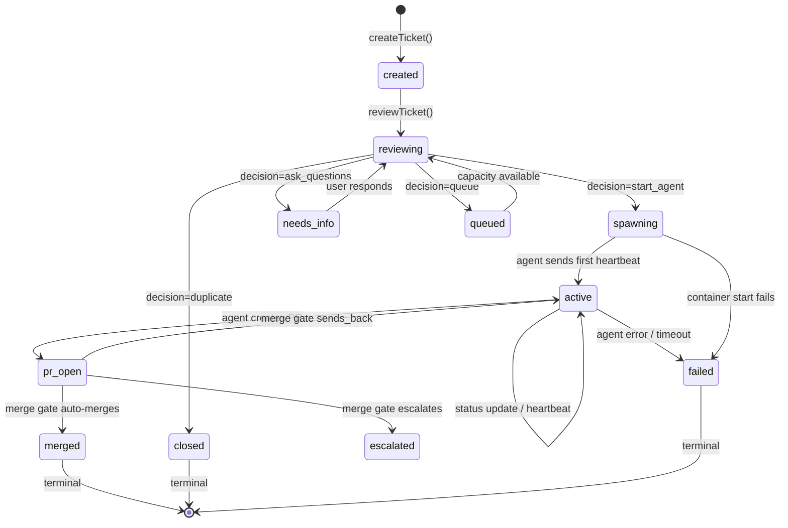
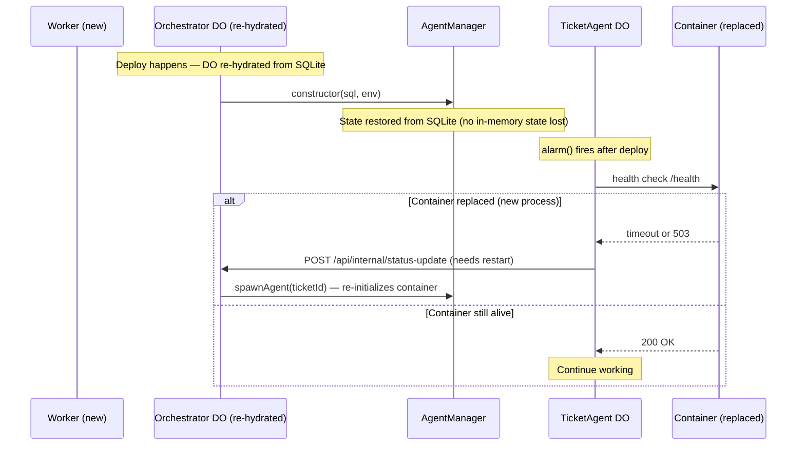

# AgentManager Refactor — Clean Agent Lifecycle Interface

> **For Claude:** REQUIRED SUB-SKILL: Use superpowers:executing-plans to implement this plan task-by-task.

**Goal:** Replace the 15+ scattered agent lifecycle touchpoints in the orchestrator with a single `AgentManager` class that owns all ticket state transitions and agent container interactions.

**Architecture:** Extract all ticket DB operations and TicketAgent DO interactions into an `AgentManager` class. The orchestrator becomes a thin event router — it receives webhooks/events, decides what to do (via DecisionEngine), then calls AgentManager methods. AgentManager owns the invariant: at most 1 agent per ticket, no silent failures, clean state machine transitions.

**Tech Stack:** TypeScript, Cloudflare Durable Objects, SQLite (via DO storage)

---

## Problem Statement

Agent lifecycle management is diffused across `orchestrator.ts` (~2,800 lines) with:

- **15+ places** that directly INSERT/UPDATE the `tickets` table
- **9 places** that interact with the TicketAgent DO via `agent.fetch()`
- **16+ places** that check or set `agent_active`
- **12+ ways** an agent can be stopped/terminated
- **Silent failures** at every integration point (OAuth assignments, webhook filters, event delivery, bot_id filters)

This diffusion caused 4 distinct bugs in a single E2E test session:
1. `bot_id` filter in SlackSocket silently dropping all events from app OAuth tokens
2. Linear OAuth app user can't be assigned to issues — webhook filter silently skips
3. `agent_active=1` guard in `handleTicketReview` conflicts with the upsert in `handleEvent`
4. Thread ts mismatch (ACK message ts ≠ original message ts) breaks E2E test lookup

## Design

### State Machine



### AgentManager Interface

```typescript
class AgentManager {
  // --- Lifecycle ---
  createTicket(params: CreateTicketParams): Promise<TicketRecord>
  spawnAgent(ticketId: string, model?: string): Promise<void>
  stopAgent(ticketId: string, reason: string): Promise<void>

  // --- Messaging ---
  sendEvent(ticketId: string, event: TicketEvent): Promise<void>

  // --- State ---
  updateStatus(ticketId: string, update: StatusUpdate): Promise<void>
  recordHeartbeat(ticketId: string): Promise<void>
  getTicket(ticketId: string): TicketRecord | null
  getActiveAgents(): TicketRecord[]
  isTerminal(ticketId: string): boolean

  // --- Bulk ---
  stopAllAgents(reason: string): Promise<void>
  cleanupInactive(): Promise<void>
}
```

### Key Invariants (enforced in AgentManager)

1. **At most 1 agent per ticket** — `spawnAgent` checks if agent is already active
2. **No silent failures** — all methods throw on failure or return explicit error status
3. **State machine enforced** — `updateStatus` validates transitions
4. **Terminal is permanent** — once terminal, no method can reactivate
5. **Spawn is atomic** — either the agent starts and sends first heartbeat, or the ticket is marked failed

### What the Orchestrator Becomes

```
handleSlackEvent:
  ticket = agentManager.createTicket(...)
  decision = decisionEngine.review(ticket)
  if decision == start_agent:
    agentManager.spawnAgent(ticket.id)

handleEvent:
  if agentManager.isTerminal(ticketId): return
  agentManager.sendEvent(ticketId, event)

handleStatusUpdate:
  agentManager.updateStatus(ticketId, update)
  if isTerminal(update.status):
    agentManager.stopAgent(ticketId, "terminal status")

handleSlackReply:
  agentManager.sendEvent(ticketId, event)
```

---

## Tasks

### Task 1: Define AgentManager types and state machine

**Files:**
- Create: `orchestrator/src/agent-manager.ts`
- Modify: `orchestrator/src/types.ts`
- Test: `orchestrator/src/agent-manager.test.ts`

**Step 1: Write the state machine types**

Add to `types.ts`:

```typescript
/** Valid ticket states — forms a state machine. */
export const TICKET_STATES = [
  "created",       // ticket exists, not yet reviewed
  "reviewing",     // LLM is deciding what to do
  "needs_info",    // waiting for user response
  "queued",        // waiting for agent capacity
  "spawning",      // agent container starting
  "active",        // agent is working (has sent heartbeat)
  "pr_open",       // agent created a PR
  "escalated",     // merge gate escalated to human
  "merged",        // PR merged (terminal)
  "closed",        // ticket closed/duplicate (terminal)
  "deferred",      // deferred to later (terminal)
  "failed",        // agent failed (terminal)
] as const;
export type TicketState = typeof TICKET_STATES[number];

/** Valid state transitions. Key = from state, value = allowed to states. */
export const VALID_TRANSITIONS: Record<TicketState, readonly TicketState[]> = {
  created:     ["reviewing", "failed"],
  reviewing:   ["spawning", "needs_info", "queued", "closed", "failed"],
  needs_info:  ["reviewing", "closed", "failed"],
  queued:      ["reviewing", "spawning", "closed", "failed"],
  spawning:    ["active", "failed"],
  active:      ["active", "pr_open", "failed"],
  pr_open:     ["active", "merged", "escalated", "failed"],
  escalated:   ["active", "merged", "closed", "failed"],
  merged:      [],  // terminal
  closed:      [],  // terminal
  deferred:    [],  // terminal
  failed:      [],  // terminal
};
```

**Step 2: Write failing tests for state machine validation**

Create `orchestrator/src/agent-manager.test.ts`:

```typescript
import { describe, it, expect } from "bun:test";
import { VALID_TRANSITIONS, TERMINAL_STATUSES } from "./types";

describe("state machine", () => {
  it("terminal states have no outgoing transitions", () => {
    for (const status of TERMINAL_STATUSES) {
      expect(VALID_TRANSITIONS[status]).toEqual([]);
    }
  });

  it("all transition targets are valid states", () => {
    for (const [from, targets] of Object.entries(VALID_TRANSITIONS)) {
      for (const target of targets) {
        expect(VALID_TRANSITIONS).toHaveProperty(target);
      }
    }
  });

  it("every non-terminal state can reach a terminal state", () => {
    const canReachTerminal = (state: string, visited = new Set<string>()): boolean => {
      if (TERMINAL_STATUSES.includes(state as any)) return true;
      if (visited.has(state)) return false;
      visited.add(state);
      return (VALID_TRANSITIONS[state as keyof typeof VALID_TRANSITIONS] || [])
        .some(next => canReachTerminal(next, visited));
    };
    for (const state of Object.keys(VALID_TRANSITIONS)) {
      expect(canReachTerminal(state)).toBe(true);
    }
  });
});
```

**Step 3: Run tests**

Run: `cd orchestrator && bun test src/agent-manager.test.ts`
Expected: PASS

**Step 4: Commit**

```
feat: add ticket state machine types and validation tests
```

---

### Task 2: Create AgentManager class with ticket CRUD

**Files:**
- Modify: `orchestrator/src/agent-manager.ts`
- Test: `orchestrator/src/agent-manager.test.ts`

**Step 1: Write failing tests for createTicket and getTicket**

```typescript
import { AgentManager } from "./agent-manager";

// Use a mock SQL helper (similar pattern to existing test-helpers.ts)
function createMockSql() {
  const db = new Map<string, Record<string, unknown>>();
  return {
    exec: (sql: string, ...params: unknown[]) => {
      // Simple in-memory SQL mock for testing
      // ... (implement INSERT/SELECT/UPDATE for tickets table)
    },
    db, // expose for assertions
  };
}

describe("AgentManager", () => {
  describe("createTicket", () => {
    it("creates a ticket in 'created' state", () => {
      const sql = createMockSql();
      const mgr = new AgentManager(sql, mockEnv);
      const ticket = mgr.createTicket({
        id: "ticket-1",
        product: "test-app",
        slackThreadTs: "123.456",
        slackChannel: "C123",
        identifier: "PES-1",
        title: "Test ticket",
      });
      expect(ticket.status).toBe("created");
      expect(ticket.agent_active).toBe(0); // not active until agent spawns
    });

    it("throws if ticket already exists in non-terminal state", () => {
      const mgr = new AgentManager(sql, mockEnv);
      mgr.createTicket({ id: "ticket-1", product: "test-app", ... });
      expect(() => mgr.createTicket({ id: "ticket-1", ... })).toThrow("already exists");
    });

    it("allows re-creating a ticket in terminal state (re-trigger)", () => {
      const mgr = new AgentManager(sql, mockEnv);
      mgr.createTicket({ id: "ticket-1", product: "test-app", ... });
      mgr.updateStatus("ticket-1", { status: "failed" });
      // Should not throw — creates fresh ticket
      const ticket = mgr.createTicket({ id: "ticket-1", product: "test-app", ... });
      expect(ticket.status).toBe("created");
    });
  });

  describe("getTicket", () => {
    it("returns null for non-existent ticket", () => {
      expect(mgr.getTicket("nonexistent")).toBeNull();
    });
  });
});
```

**Step 2: Implement AgentManager with createTicket and getTicket**

```typescript
import { VALID_TRANSITIONS, TERMINAL_STATUSES, type TicketState, type TicketEvent } from "./types";

export interface CreateTicketParams {
  id: string;
  product: string;
  slackThreadTs?: string;
  slackChannel?: string;
  identifier?: string;
  title?: string;
}

export interface StatusUpdate {
  status?: TicketState;
  pr_url?: string;
  branch_name?: string;
  slack_thread_ts?: string;
  transcript_r2_key?: string;
}

export class AgentManager {
  constructor(
    private sql: { exec: (sql: string, ...params: unknown[]) => SqlStorageResult },
    private env: Record<string, unknown>,
  ) {}

  createTicket(params: CreateTicketParams): TicketRecord {
    const existing = this.getTicket(params.id);
    if (existing && !this.isTerminal(params.id)) {
      throw new Error(`Ticket ${params.id} already exists (status: ${existing.status})`);
    }

    // If re-creating after terminal, reset everything
    if (existing) {
      this.sql.exec(
        "DELETE FROM tickets WHERE id = ?", params.id,
      );
    }

    this.sql.exec(
      `INSERT INTO tickets (id, product, status, slack_thread_ts, slack_channel, identifier, title, agent_active)
       VALUES (?, ?, 'created', ?, ?, ?, ?, 0)`,
      params.id, params.product,
      params.slackThreadTs || null, params.slackChannel || null,
      params.identifier || null, params.title || null,
    );

    return this.getTicket(params.id)!;
  }

  getTicket(ticketId: string): TicketRecord | null {
    const row = this.sql.exec(
      "SELECT * FROM tickets WHERE id = ?", ticketId,
    ).toArray()[0] as TicketRecord | undefined;
    return row || null;
  }

  isTerminal(ticketId: string): boolean {
    const ticket = this.getTicket(ticketId);
    if (!ticket) return false;
    return (TERMINAL_STATUSES as readonly string[]).includes(ticket.status);
  }
}
```

**Step 3: Run tests**

Run: `cd orchestrator && bun test src/agent-manager.test.ts`
Expected: PASS

**Step 4: Commit**

```
feat: add AgentManager with ticket CRUD and state validation
```

---

### Task 3: Add updateStatus with state machine validation

**Files:**
- Modify: `orchestrator/src/agent-manager.ts`
- Test: `orchestrator/src/agent-manager.test.ts`

**Step 1: Write failing tests for updateStatus**

```typescript
describe("updateStatus", () => {
  it("allows valid transitions", () => {
    const mgr = new AgentManager(sql, mockEnv);
    mgr.createTicket({ id: "t1", product: "app" });
    mgr.updateStatus("t1", { status: "reviewing" });
    expect(mgr.getTicket("t1")!.status).toBe("reviewing");
  });

  it("rejects invalid transitions", () => {
    const mgr = new AgentManager(sql, mockEnv);
    mgr.createTicket({ id: "t1", product: "app" });
    // created → merged is not valid (skips spawning/active/pr_open)
    expect(() => mgr.updateStatus("t1", { status: "merged" })).toThrow("Invalid transition");
  });

  it("sets agent_active=0 on terminal transitions", () => {
    const mgr = new AgentManager(sql, mockEnv);
    mgr.createTicket({ id: "t1", product: "app" });
    mgr.updateStatus("t1", { status: "failed" }); // created → failed is valid
    expect(mgr.getTicket("t1")!.agent_active).toBe(0);
  });

  it("updates metadata fields without changing status", () => {
    const mgr = new AgentManager(sql, mockEnv);
    mgr.createTicket({ id: "t1", product: "app" });
    mgr.updateStatus("t1", { pr_url: "https://github.com/..." });
    const t = mgr.getTicket("t1")!;
    expect(t.status).toBe("created");
    expect(t.pr_url).toBe("https://github.com/...");
  });

  it("throws for non-existent ticket", () => {
    expect(() => mgr.updateStatus("nope", { status: "active" })).toThrow("not found");
  });
});
```

**Step 2: Implement updateStatus**

```typescript
updateStatus(ticketId: string, update: StatusUpdate): TicketRecord {
  const ticket = this.getTicket(ticketId);
  if (!ticket) throw new Error(`Ticket ${ticketId} not found`);

  if (this.isTerminal(ticketId)) {
    console.log(`[AgentManager] Ignoring update for terminal ticket ${ticketId}`);
    return ticket;
  }

  // Validate state transition if status is changing
  if (update.status && update.status !== ticket.status) {
    const currentState = ticket.status as TicketState;
    const allowed = VALID_TRANSITIONS[currentState] || [];
    if (!allowed.includes(update.status)) {
      throw new Error(
        `Invalid transition: ${currentState} → ${update.status} (allowed: ${allowed.join(", ")})`
      );
    }
  }

  const sets: string[] = ["updated_at = datetime('now')"];
  const values: unknown[] = [];

  if (update.status) {
    sets.push("status = ?");
    values.push(update.status);

    // Auto-set agent_active=0 on terminal
    if ((TERMINAL_STATUSES as readonly string[]).includes(update.status)) {
      sets.push("agent_active = 0");
      console.log(`[AgentManager] Terminal state ${update.status} for ${ticketId}`);
    }
  }
  if (update.pr_url) { sets.push("pr_url = ?"); values.push(update.pr_url); }
  if (update.branch_name) { sets.push("branch_name = ?"); values.push(update.branch_name); }
  if (update.slack_thread_ts) { sets.push("slack_thread_ts = ?"); values.push(update.slack_thread_ts); }
  if (update.transcript_r2_key) { sets.push("transcript_r2_key = ?"); values.push(update.transcript_r2_key); }

  values.push(ticketId);
  this.sql.exec(`UPDATE tickets SET ${sets.join(", ")} WHERE id = ?`, ...values);

  return this.getTicket(ticketId)!;
}
```

**Step 3: Run tests**

Run: `cd orchestrator && bun test src/agent-manager.test.ts`
Expected: PASS

**Step 4: Commit**

```
feat: add updateStatus with state machine validation
```

---

### Task 4: Add spawnAgent and stopAgent

**Files:**
- Modify: `orchestrator/src/agent-manager.ts`
- Test: `orchestrator/src/agent-manager.test.ts`

**Step 1: Write failing tests**

```typescript
describe("spawnAgent", () => {
  it("transitions to spawning and sets agent_active=1", async () => {
    const mgr = new AgentManager(sql, mockEnv);
    mgr.createTicket({ id: "t1", product: "staging-test-app" });
    mgr.updateStatus("t1", { status: "reviewing" });
    await mgr.spawnAgent("t1", { /* config */ });
    const t = mgr.getTicket("t1")!;
    expect(t.status).toBe("spawning");
    expect(t.agent_active).toBe(1);
  });

  it("throws if already spawning or active", async () => {
    // ... set up ticket in "active" state
    await expect(mgr.spawnAgent("t1", {})).rejects.toThrow("already active");
  });
});

describe("stopAgent", () => {
  it("marks terminal and sends /mark-terminal to TicketAgent DO", async () => {
    // ... set up active agent
    await mgr.stopAgent("t1", "test shutdown");
    expect(mgr.getTicket("t1")!.agent_active).toBe(0);
  });
});
```

**Step 2: Implement spawnAgent and stopAgent**

The `spawnAgent` method encapsulates the current `routeToAgent` logic:
1. Validate state — must be in `reviewing`, `queued`, OR `spawning`/`active` (for deploy re-spawn)
2. If already `spawning` or `active`: skip transition, just re-initialize container (deploy recovery)
3. Otherwise: transition to `spawning`, set `agent_active=1`
4. Get TicketAgent DO stub
5. POST `/initialize` with config
6. POST `/event` with retry
7. On any failure: transition to `failed`, set `agent_active=0`

**Deploy re-spawn safety:** When `alarm()` fires after a deploy and the container is dead, it calls `spawnAgent()` for a ticket already in `active` state. The method must accept this without throwing — it re-initializes the container and keeps the ticket in its current state.

The `stopAgent` method encapsulates the current terminal-state logic:
1. Set `agent_active=0` in DB
2. Get TicketAgent DO stub
3. POST `/mark-terminal`
4. Handle timeout gracefully (5s max)

**Step 3: Run tests**

Run: `cd orchestrator && bun test src/agent-manager.test.ts`

**Step 4: Commit**

```
feat: add spawnAgent and stopAgent to AgentManager
```

---

### Task 5: Add sendEvent for routing messages to running agents

**Files:**
- Modify: `orchestrator/src/agent-manager.ts`
- Test: `orchestrator/src/agent-manager.test.ts`

**Step 1: Implement sendEvent**

```typescript
async sendEvent(ticketId: string, event: TicketEvent): Promise<void> {
  const ticket = this.getTicket(ticketId);
  if (!ticket) throw new Error(`Ticket ${ticketId} not found`);
  if (this.isTerminal(ticketId)) {
    console.log(`[AgentManager] Ignoring event for terminal ticket ${ticketId}`);
    return;
  }
  if (ticket.agent_active !== 1) {
    console.log(`[AgentManager] No active agent for ${ticketId}, buffering event`);
    return; // Could buffer or throw depending on requirements
  }

  const id = (this.env.TICKET_AGENT as DurableObjectNamespace).idFromName(ticketId);
  const agent = (this.env.TICKET_AGENT as DurableObjectNamespace).get(id);

  // Retry with backoff (same pattern as current routeToAgent)
  for (let attempt = 0; attempt < 3; attempt++) {
    const res = await agent.fetch(new Request("http://internal/event", {
      method: "POST",
      body: JSON.stringify(event),
    }));

    if (res.ok) return;
    if (res.status !== 503) {
      throw new Error(`Event delivery failed: ${res.status}`);
    }

    await new Promise(r => setTimeout(r, 2000 * (attempt + 1)));
  }

  // After 3 failures, mark agent as failed
  this.updateStatus(ticketId, { status: "failed" });
  throw new Error(`Event delivery failed after 3 retries for ${ticketId}`);
}
```

**Step 2: Write tests and run**

**Step 3: Commit**

```
feat: add sendEvent to AgentManager with retry logic
```

---

### Task 6: Add bulk operations and query helpers

**Files:**
- Modify: `orchestrator/src/agent-manager.ts`
- Test: `orchestrator/src/agent-manager.test.ts`

**Step 1: Implement remaining methods**

```typescript
recordHeartbeat(ticketId: string): void {
  this.sql.exec(
    "UPDATE tickets SET last_heartbeat = datetime('now'), updated_at = datetime('now') WHERE id = ? AND agent_active = 1",
    ticketId,
  );
}

getActiveAgents(): TicketRecord[] {
  return this.sql.exec(
    "SELECT * FROM tickets WHERE agent_active = 1 ORDER BY updated_at DESC",
  ).toArray() as TicketRecord[];
}

async stopAllAgents(reason: string): Promise<void> {
  const agents = this.getActiveAgents();
  for (const agent of agents) {
    await this.stopAgent(agent.id, reason).catch(err =>
      console.error(`[AgentManager] Failed to stop ${agent.id}:`, err)
    );
  }
}

async cleanupInactive(): Promise<void> {
  const inactive = this.sql.exec(
    "SELECT id FROM tickets WHERE agent_active = 0 AND status NOT IN ('merged', 'closed', 'deferred', 'failed')",
  ).toArray() as { id: string }[];

  for (const { id } of inactive) {
    await this.stopAgent(id, "cleanup inactive").catch(() => {});
  }
}
```

**Step 2: Run all AgentManager tests**

**Step 3: Commit**

```
feat: add bulk operations and query helpers to AgentManager
```

---

### Task 7: Wire AgentManager into orchestrator — handleSlackEvent

**Files:**
- Modify: `orchestrator/src/orchestrator.ts`

This is the first integration task. Replace the direct DB manipulation in `handleSlackEvent` with AgentManager calls.

**Before (current code):**
```typescript
// 20+ lines of direct SQL, slack_thread_map, handleTicketReview dispatch
```

**After:**
```typescript
// In handleSlackEvent, after creating Linear issue:
const ticket = this.agentManager.createTicket({
  id: issue.id,
  product,
  slackThreadTs: threadTsToStore || undefined,
  slackChannel: slackEvent.channel || undefined,
  identifier: issue.identifier,
  title,
});

// Dispatch ticket review (async, don't block Slack response)
this.handleTicketReview({
  type: "ticket_created",
  source: "slack",
  ticketId: issue.id,
  product,
  payload: { id: issue.id, identifier: issue.identifier, title, description: rawText, priority: 3, labels: [] },
  slackThreadTs: threadTsToStore || undefined,
  slackChannel: slackEvent.channel || undefined,
}).catch(err => console.error("[Orchestrator] Ticket review failed:", err));
```

**Step 1: Initialize AgentManager in the Orchestrator constructor**

```typescript
private agentManager: AgentManager;

constructor(ctx: DurableObjectState, env: Record<string, unknown>) {
  super(ctx, env);
  this.agentManager = new AgentManager(
    { exec: (sql, ...p) => ctx.storage.sql.exec(sql, ...p) },
    env,
  );
}
```

**Step 2: Replace handleSlackEvent DB ops with AgentManager calls**

**Step 3: Run existing orchestrator tests to verify no regressions**

Run: `cd orchestrator && bun test`

**Step 4: Commit**

```
refactor: wire AgentManager into handleSlackEvent
```

---

### Task 8: Wire AgentManager into handleEvent and handleStatusUpdate

**Files:**
- Modify: `orchestrator/src/orchestrator.ts`

Replace the upsert in `handleEvent` (lines 816-832) and status update logic (lines 1546-1671).

**Key changes:**
- `handleEvent`: Use `agentManager.createTicket()` or `agentManager.getTicket()` instead of raw upsert
- `handleStatusUpdate`: Use `agentManager.updateStatus()` and `agentManager.recordHeartbeat()`
- `routeToAgent`: Replace with `agentManager.spawnAgent()` + `agentManager.sendEvent()`

**Step 1: Replace handleEvent upsert**
**Step 2: Replace routeToAgent with AgentManager calls**
**Step 3: Replace handleStatusUpdate with AgentManager calls**
**Step 4: Run all tests**

Run: `cd orchestrator && bun test`

**Step 5: Commit**

```
refactor: wire AgentManager into handleEvent and handleStatusUpdate
```

---

### Task 9: Wire AgentManager into supervisor, cleanup, and shutdown

**Files:**
- Modify: `orchestrator/src/orchestrator.ts`

Replace remaining direct DB operations:
- `runSupervisorTick`: Use `agentManager.stopAgent()` for kill decisions
- `cleanupInactiveAgents`: Use `agentManager.cleanupInactive()`
- `handleShutdownAll`: Use `agentManager.stopAllAgents()`
- Dashboard queries: Use `agentManager.getActiveAgents()`

**Step 1: Replace supervisor kill logic**
**Step 2: Replace cleanup and shutdown endpoints**
**Step 3: Run all tests**
**Step 4: Deploy to staging and run E2E test**
**Step 5: Commit**

```
refactor: wire AgentManager into supervisor, cleanup, and shutdown
```

---

### Task 10: Remove dead code and update learnings

**Files:**
- Modify: `orchestrator/src/orchestrator.ts` — delete `routeToAgent`, `sendEventToAgent`, and other methods now delegated to AgentManager
- Modify: `docs/process/learnings.md` — add entry about the refactor
- Modify: `CLAUDE.md` — update architecture section

**Step 1: Delete unused methods from orchestrator**
**Step 2: Update documentation**
**Step 3: Final test run**

Run: `cd orchestrator && bun test`

**Step 4: Commit**

```
refactor: remove dead code after AgentManager migration
```

---

## Deploy Resilience

Frequent deploys are the norm — parallel agent teams ship updates continuously. Every deploy restarts the Worker and Durable Object, and may replace running TicketAgent containers. AgentManager must handle this gracefully.

### Deploy Scenarios



### Design Principles for Deploy Safety

1. **No in-memory state in AgentManager** — all state lives in SQLite. On DO re-hydration after deploy, `new AgentManager(sql, env)` restores full state from the DB. No warm-up, no recovery, no state reconstruction.

2. **Idempotent operations** — every AgentManager method is safe to call twice:
   - `createTicket()` — throws if non-terminal exists (caller handles gracefully)
   - `spawnAgent()` — checks if already active, no-ops or throws
   - `sendEvent()` — retries delivery, marks failed after exhaustion
   - `updateStatus()` — validates transition, ignores terminal tickets
   - `stopAgent()` — safe to call on already-stopped agents

3. **TicketAgent.alarm() is the heartbeat** — after deploy, alarm fires for every active TicketAgent DO. The alarm:
   - Health-checks the container (may be a new process after deploy)
   - If container is dead: calls `spawnAgent()` on orchestrator to re-initialize
   - If ticket is terminal in orchestrator: calls `process.exit(0)` to free resources
   - This means deploys are self-healing — no manual intervention needed

4. **Webhook replay tolerance** — deploys may cause webhook delivery retries (Cloudflare replays on 503). AgentManager handles this:
   - `createTicket()` deduplicates by ticket ID
   - `handleEvent()` checks terminal state before routing
   - `sendEvent()` is idempotent (agent ignores duplicate events)

5. **Graceful degradation during deploy window** — the ~2s window where the Worker is restarting:
   - Slack Socket Mode: container reconnects automatically (SlackSocket.scheduleReconnect)
   - Linear webhooks: Cloudflare retries on 503
   - GitHub webhooks: GitHub retries on 5xx
   - Agent phone-home: TicketAgent buffers events and retries

### AgentManager Deploy Contract

```typescript
// AgentManager MUST satisfy these deploy invariants:
// 1. constructor() takes only (sql, env) — no async init, no warm-up
// 2. All state comes from SQLite — zero in-memory caches
// 3. Every public method works correctly when called on a fresh instance
// 4. Terminal state is permanent — no method path can reactivate a terminal ticket
// 5. spawnAgent() is re-entrant: safe to call for a ticket that's already spawning
```

### Deploy-Specific Test Cases (Task 4 additions)

```typescript
describe("deploy resilience", () => {
  it("fresh AgentManager instance sees pre-deploy tickets", () => {
    const mgr1 = new AgentManager(sql, env);
    mgr1.createTicket({ id: "t1", product: "app" });
    // Simulate deploy — new instance, same SQL
    const mgr2 = new AgentManager(sql, env);
    expect(mgr2.getTicket("t1")).not.toBeNull();
  });

  it("spawnAgent is safe to re-call after deploy", async () => {
    const mgr = new AgentManager(sql, env);
    mgr.createTicket({ id: "t1", product: "app" });
    mgr.updateStatus("t1", { status: "reviewing" });
    await mgr.spawnAgent("t1");
    // Simulate deploy — ticket is in "spawning" state
    const mgr2 = new AgentManager(sql, env);
    // Re-spawn should succeed (re-initialize container)
    await mgr2.spawnAgent("t1"); // should not throw
  });

  it("stopAgent is idempotent", async () => {
    const mgr = new AgentManager(sql, env);
    mgr.createTicket({ id: "t1", product: "app" });
    await mgr.stopAgent("t1", "first stop");
    // Should not throw on second call
    await mgr.stopAgent("t1", "second stop");
  });
});
```

## Edge Cases Matrix

| Scenario | Expected Behavior | Enforced By |
|----------|-------------------|-------------|
| Duplicate webhook (Linear sends create + update) | Second call sees existing ticket, skips | `createTicket` throws if non-terminal exists |
| Agent container fails to start | `spawnAgent` catches init failure → marks `failed` | spawnAgent try/catch |
| Event delivery to dead container | 3 retries → mark `failed` | sendEvent retry logic |
| Deploy restarts container mid-work | TicketAgent.alarm() health-checks, re-spawns if needed | alarm() + spawnAgent() idempotency |
| Deploy replays webhooks (503 retry) | createTicket deduplicates, sendEvent is idempotent | createTicket throws on duplicate, agent ignores dupes |
| DO re-hydrated after deploy | AgentManager reconstructed from SQLite, zero state loss | No in-memory state, SQL-only |
| Multiple rapid deploys | Each alarm() re-checks, no stale in-memory flags | SQLite truth + container health probe |
| Slack reply to completed ticket | `sendEvent` sees terminal → ignores | isTerminal check |
| Re-trigger of closed ticket | `createTicket` allows re-create after terminal | Terminal reset in createTicket |
| OAuth app user can't be assigned | Direct dispatch from handleSlackEvent bypasses webhook | handleSlackEvent calls handleTicketReview directly |
| Container liveness false positive | alarm() health-checks container before trusting flags | ticket-agent.ts alarm() |

## Testing Strategy

- Unit tests for AgentManager (Tasks 1-6): state machine, CRUD, transitions
- Integration tests via existing orchestrator test suite (Tasks 7-9): verify no regressions
- E2E staging test after Task 9: full Slack → Linear → Agent → PR flow
- Specific regression test: duplicate webhook handling, terminal state protection
