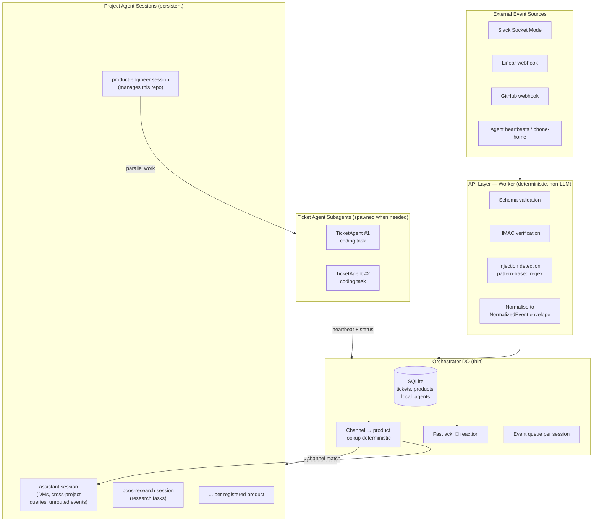

# Orchestrator v3 Design

> **For Claude:** REQUIRED SUB-SKILL: Use superpowers:executing-plans to implement this plan task-by-task.

**Goal:** Replace rule-based orchestrator routing with persistent Claude agent sessions. Give task agents autonomy over their own lifecycle. Add a structured non-LLM security layer at the API boundary. Support a flexible range of task types (coding, research, planning, scheduling) through configuration rather than separate container types.

**Architecture:** API layer validates and normalises all inbound events before they reach an LLM. The Durable Object is a thin state store and event queue. All routing and decision-making moves to persistent agent sessions — one per registered product, plus an `assistant` session for cross-product queries. Each project agent can do work directly or spawn ticket-agent subagents when parallelism is warranted. Behavior is driven by SKILL.md and MCP configuration, not container type.

**Tech Stack:** Cloudflare Workers + Durable Objects + Containers, Agent SDK (`@anthropic-ai/claude-agent-sdk`), Bun, Hono, SQLite (D1), R2, Tailscale Funnel (Mac Mini backend), Notion/Google Calendar/Asana MCP.

---

## Why this design

### The problem with v2

The v2 orchestrator has a structural flaw: the component with broad visibility (Orchestrator DO) uses TypeScript rules for decisions, while the component with deep knowledge (TicketAgent) starts cold on every task. Nobody has *both* intelligence and system-wide awareness.

Concretely:
- 4 major async bug classes in production, all from state checked at the wrong lifecycle boundary
- Changing agent behaviour requires a code deploy (rules are TypeScript, not English)
- Ticket agents for complex repos (like this one) perform poorly because they have no accumulated context — every session starts from only the CLAUDE.md

### What v3 does differently

**Persistent project agents** accumulate context over time. A project agent for `product-engineer` builds up months of architectural knowledge, learnings, and decision history in its session — the same advantage a human engineer has from working on a codebase long-term.

**English over TypeScript for decisions.** Routing, supervision, and escalation logic moves to SKILL.md files. Changing how the agent behaves means editing markdown, not deploying code.

**Configuration over container types.** A coding project and a research project use the same container. The SKILL.md and MCP set determine behaviour.

### Key use cases

1. **Coding tasks** — Linear tickets and Slack mentions → PR → CI → merge (current workflow, now with self-managing agents)
2. **Research tasks (BC-179)** — Slack-only threads for research, planning, scheduling. No git, no PRs. Notion as memory.
3. **Meta-management** — User interacts with a project agent to get status summaries, manage running tasks, and review agent transcripts. The user can either dive into an agent's Slack thread for direct conversation, or ask the project agent / assistant to review the agent's work on their behalf.
4. **Self-editing** — product-engineer is registered as a product; its project agent has accumulated context that makes it effective at editing its own repo.

---

## Task taxonomy

### By type

| Type | Output | MCPs needed | Agent mode |
|---|---|---|---|
| Software development | Shipped code (PR → merge) | Git, GitHub | coding |
| Research / planning | Document or decision | Notion, web | research |
| Content creation | Publishable artifact | Notion, web | research |
| Scheduling / coordination | Booked event or plan | Google Calendar, Notion | research |
| Monitoring / alerting | Proactive Slack notification | Domain-specific | scheduled |

### By cadence

| Cadence | Trigger | Handling |
|---|---|---|
| One-off | Single @mention or webhook | Spawn task, close on completion |
| Series | Same topic, multiple sessions | Cross-session memory via Notion; project agent recognises continuation |
| Scheduled | Cron or time-triggered | DO alarm or scheduled-tasks MCP; agent wakes, works, reports |

### By autonomy level

| Level | Behaviour | Default for |
|---|---|---|
| Autonomous | Executes and reports done | Coding (well-defined scope) |
| Human-in-loop | Surfaces key decision points before proceeding | Research/planning first pass; irreversible actions |
| Proactive | Monitors a domain, initiates alerts | Scheduled/monitoring tasks |

---

## Architecture



---

## Layer 1: API Security (Worker)

The Worker is the only entry point for external events. All checks are deterministic and non-LLM — security and structure validation happen before any event reaches an LLM.

### Checks applied to every event

| Check | Implementation |
|---|---|
| **Schema validation** | JSON Schema per event type. Reject if required fields missing or wrong types. |
| **HMAC signature verification** | All webhook sources. Already implemented for Linear + GitHub; extend to all sources. |
| **Prompt injection detection** | Pattern-based regex blocklist on all free-text fields. See below. |
| **Content length limits** | Reject text fields > 10KB (tunable per field). |
| **Character encoding** | Reject null bytes, unusual Unicode control characters. |
| **Rate limiting** | Per-product, per-source. Cloudflare Workers rate limiting. |

### Injection detection patterns

Applied to: Slack message text, Linear issue title/description, GitHub PR body/review comments, any free-text field in any event.

```typescript
// orchestrator/src/security/injection-detector.ts
const INJECTION_PATTERNS = [
  /ignore (all |previous |prior )?instructions/i,
  /you are now/i,
  /new (system |persona |role|identity)/i,
  /\[SYSTEM\]/i,
  /\[INST\]/i,
  /###\s*(system|instruction)/i,
  /<\|im_start\|>/i,
  /forget (everything|all|prior)/i,
  /disregard (your|all|previous)/i,
  /your (real |true |actual )?(name|purpose|goal|task) is/i,
];
```

Detected attempts: return 400 to source, write to `injection_attempts` table (audit), do not forward to agent.

### NormalizedEvent envelope

After validation, every event is wrapped before forwarding to the DO:

```typescript
interface NormalizedEvent {
  id: string;          // UUID, generated at API layer
  source: "slack" | "linear" | "github" | "heartbeat" | "internal";
  type: string;        // e.g. "slack.app_mention", "github.pr.closed"
  product?: string;    // resolved from channel/repo mapping
  timestamp: string;   // ISO 8601
  actor?: { id: string; name: string };
  payload: unknown;    // validated, schema-conformant
  raw_hash: string;    // SHA-256 of original payload
}
```

Agents never see raw webhooks.

---

## Layer 2: Orchestrator DO (thin state store)

The DO's responsibilities after v3:

1. Receive `NormalizedEvent` from Worker
2. **Fast ack to Slack** — add `👀` reaction to Slack messages within 200ms
3. **Deterministic channel → product routing** — look up `product` from channel ID in SQLite; no LLM involved
4. **Yield event to correct project agent session** via `messageYielder`
5. **Store and serve state** — tickets, products, local_agents (read/write via agent tool calls)
6. **Detect dead agents** — if no heartbeat in N minutes, flag for project agent review

The DO contains **no routing logic, no decision logic, no retry logic**. All of that is in the agent sessions.

### SQLite schema changes

```sql
-- Immutable event log for audit
CREATE TABLE events (
  id TEXT PRIMARY KEY,
  source TEXT NOT NULL,
  type TEXT NOT NULL,
  product TEXT,
  timestamp TEXT NOT NULL,
  actor_id TEXT,
  actor_name TEXT,
  payload TEXT NOT NULL,   -- JSON
  raw_hash TEXT NOT NULL
);

-- Per-product agent sessions
CREATE TABLE agent_sessions (
  product TEXT PRIMARY KEY,
  session_id TEXT,          -- Agent SDK session ID (for resume)
  r2_key TEXT,              -- R2 path to JSONL transcript
  last_active TEXT,
  context_tokens INTEGER    -- approximate, for monitoring
);

-- Local agent backends (Mac Mini)
CREATE TABLE local_agents (
  id TEXT PRIMARY KEY,
  url TEXT NOT NULL,
  last_seen TEXT,
  max_concurrent INTEGER DEFAULT 2,
  heartbeat_timeout_minutes INTEGER DEFAULT 30,
  capabilities TEXT DEFAULT '[]'  -- JSON: ["browser", "keychain"]
);

-- Injection attempt audit
CREATE TABLE injection_attempts (
  id TEXT PRIMARY KEY,
  timestamp TEXT NOT NULL,
  source TEXT NOT NULL,
  product TEXT,
  field TEXT NOT NULL,
  pattern TEXT NOT NULL,
  truncated_content TEXT
);
```

---

## Layer 3: Project Agent Sessions

### One session per product, plus `assistant`

Each registered product has a persistent Agent SDK session running in the orchestrator container. The `assistant` session handles events that don't match any product (DMs, cross-product queries, onboarding new products).

Routing in the DO:
```
channel_id → product lookup → route to that product's session
no match / DM → route to assistant session
```

The `assistant` session has `list_tasks` and `get_task_detail` tools that query across all products. It can answer "what's running on all projects?" without needing to be the hub for every event.

### Slack persona per agent

Each product has a `slack_persona` in its registry config:

```typescript
interface SlackPersona {
  username: string;      // display name, e.g. "PE Research"
  icon_emoji?: string;   // e.g. ":mag:" — mutually exclusive with icon_url
  icon_url?: string;     // custom avatar URL
}
```

Every `chat.postMessage` call includes the product's persona fields, using the `chat:write.customize` scope. This gives each project agent a distinct visual identity in Slack without requiring separate Slack apps.

The assistant session uses a default persona (e.g., "Product Engineer" with a 🤖 emoji). Ticket agent subagents inherit their parent project agent's persona but can append a suffix (e.g., "PE Research — Task #3").

**Requirement:** Add `chat:write.customize` to the Slack app's bot token scopes and re-install.

### Session resumption across container restarts

Each session's JSONL is synced to R2 every 30 seconds (or every 10 messages). On container restart:

```
startup → for each product → check R2 for existing JSONL
                           → if found: restore to container → resume: sessionId
                           → if not found: fresh session
```

### Context compaction

The Agent SDK handles compaction automatically when the context window fills. It summarises older messages in place rather than truncating blindly.

To preserve critical context after compaction, use a `SessionStart` hook with a `compact` matcher to re-inject essential project state:

```typescript
hooks: {
  SessionStart: [
    {
      matcher: "compact",
      hooks: [
        {
          type: "command",
          command: `echo 'Product: ${product}. Active tasks: ${taskSummary}. Key conventions: ${conventions}.'`
        }
      ]
    }
  ]
}
```

Both project agent sessions and ticket agent sessions use this pattern. Project agent sessions include a richer re-injection (active tasks, recent decisions, product config) since they live longer and lose more context on compaction.

### Slack interaction pattern

```
User posts @mention
  → DO adds 👀 reaction (< 200ms, synchronous)
  → Event queued, yielded to project agent session
  → Agent responds (1–3s), removes 👀, posts substantive reply
```

When the user posts while the agent is mid-execution:
- DO adds `👀` reaction immediately (no message, no clutter)
- Agent processes the queued message at the next yield point and responds substantively

Note: Slack does not expose a "bot is typing" API — `👀` reaction is the closest equivalent.

### Project agent tools

| Tool | Purpose |
|---|---|
| `list_tasks(filter?)` | All running/recent tasks; supports filter by status, product, backend |
| `get_task_detail(uuid)` | Full context: heartbeat history, last agent message, PR URL |
| `get_task_transcript(uuid)` | Fetch and summarise R2 JSONL for deep status review |
| `spawn_task(product, description, backend?)` | Create and start a ticket-agent subagent |
| `send_message_to_task(uuid, message)` | Inject event into a running subagent |
| `stop_task(uuid, reason)` | Terminate a subagent gracefully |
| `post_slack(channel, thread_ts, message)` | Post response to a Slack thread |
| `get_slack_thread(channel, thread_ts)` | Read conversation history |
| `update_task_status(uuid, status, message?)` | Update ticket status + optional Slack message |
| `list_products()` | Registry: all products and their configs |
| `register_local_agent(id, url, capabilities)` | Register a Mac Mini backend |

### SKILL.md structure

Each product has its own SKILL.md that the project agent loads. It covers:

- **Task intake**: how to assess new requests for this product; when to act vs ask
- **Task routing**: which backend (CF container vs Mac Mini); when to handle directly vs spawn subagent
- **Supervision**: what "healthy" looks like for this product's tasks; when to escalate
- **Communication style**: how to respond to users in this channel
- **Product-specific workflows**: coding flow (PR → CI → merge), research flow (define → explore → synthesise → document), etc.

The global decision logic (routing rules, state machine, merge gate) moves from TypeScript into these files. Changing behaviour means editing markdown.

### Assistant SKILL.md

The `assistant` project agent has a cross-product SKILL.md:

```markdown
# Assistant — Cross-Product Agent

You are the global coordinator for all registered products. You handle:
- Direct messages from users (not in any product channel)
- Cross-product status queries ("what's everyone working on?")
- New product onboarding guidance
- Routing ambiguous requests to the right product agent

## Tools
- Use `list_tasks()` to get status across all products
- Use `list_products()` to see what's registered and where
- Use `get_task_transcript(uuid)` when the user wants a deep review of a specific task
- Use `post_slack()` to respond in the appropriate channel

## Communication
- Keep responses concise. Users reaching the assistant are typically seeking quick status or routing help.
- If a request clearly belongs to a specific product, tell the user which channel to use.
- For cross-product summaries, group by product and highlight anything that needs attention.
```

---

## Layer 4: Project Agent — flexible scope

### The key design choice: delegate vs do directly

A project agent is not just an orchestrator — it can also be the implementer. This eliminates the forced overhead of spawning a subagent for every task.

**Do directly when:**
- Single focused task, estimated < 30 min
- Conversational / research / planning (no parallelism needed)
- No concurrent messages expected during execution

**Spawn a ticket-agent subagent when:**
- Long-running implementation while new requests are likely to arrive (keeps project agent responsive)
- Multiple parallel tasks that can run simultaneously
- Work that benefits from a fresh, isolated context (e.g., risky refactors)

The heuristic lives in the product's SKILL.md — different products have different thresholds.

### Self-managing lifecycle (ticket-agent subagents)

When a ticket-agent subagent is running, it owns its own lifecycle. The project agent monitors heartbeats and handles escalations — it does not drive CI polling, merge gates, or retry loops.

**Ticket agent is responsible for:**
- CI monitoring for its own PR
- PR review checking + responding to review feedback
- Managing its own merge timing
- Reporting status via heartbeat (proactive, not reactive)
- Escalating to project agent when genuinely stuck via `needs_attention: true` in heartbeat

**Project agent is responsible for:**
- Detecting truly dead subagents (heartbeat timeout)
- Cross-task coordination (don't merge A while B is deploying)
- User-facing status and communication
- Reviewing agent transcripts on behalf of the user

Heartbeat payload expands:

```typescript
interface HeartbeatPayload {
  ticketUUID: string;
  message: string;
  status?: TicketStatus;
  pr_url?: string;
  ci_status?: "pending" | "passing" | "failing" | "none";
  ready_to_merge?: boolean;
  needs_attention?: boolean;
  needs_attention_reason?: string;
}
```

### Subagent quality: agent checking agent

For coding tasks, the ticket-agent spawns a code-reviewer subagent before declaring done (the existing `superpowers:code-reviewer` pattern). The reviewer has full codebase context and produces substantive review — better than any orchestrator-level check could.

For research tasks, the project agent handles multi-phase work internally (define → explore → synthesise → document) or uses parallel sub-queries.

---

## Layer 5: Task backends

### Cloudflare container (default)

All tasks use the same container type. Configuration drives behaviour:

| Config | Coding mode | Research mode |
|---|---|---|
| `repos` | Required | `[]` |
| `sleepAfter` | `"1h"` | `"4h"` |
| Session timeout | 2h | 4h |
| Idle timeout | 5 min | 30 min |
| MCPs | Git, GitHub | Notion, Google Calendar, Asana, Slack |
| Terminal state | `merged` or `closed` | `closed` (user says done) |
| Resume prompt | Git state + branch | Slack thread history |
| `settingSources` | `["project"]` | Not applicable (no repo) |

**There is no separate ResearchAgent container type.** The same container runs with different SKILL.md and MCPs.

### Mac Mini local agent

For tasks needing logged-in browser sessions, Keychain access, or local Mac resources.

**Connection:** Mac Mini runs a local variant of `agent/src/server.ts` on port 3001. Tailscale Funnel exposes it as a stable HTTPS URL the Cloudflare Worker can reach.

**Protocol:** Identical to CF container agents — `POST /initialize`, `POST /event`, `GET /health`, `POST /shutdown` — with `X-Internal-Key` auth.

**Registration:** Mac Mini registers on startup and every 10 minutes:

```http
POST /api/local-agent/register
{ "id": "macmini-bryan", "url": "https://macmini.ts.net:3001",
  "max_concurrent": 2, "capabilities": ["browser", "keychain"] }
```

**Routing:** Product config sets `preferred_backend: "local:macmini-bryan"`. Project agent selects backend based on task description, product config, and Mac Mini availability.

**Browser tools:** `mcp__Claude_in_Chrome__*` (already running on Mac, connects to the local MCP server).

**Process management:** launchd `KeepAlive: true` — auto-restarts on crash and wake from sleep.

**Event buffering for sleep/wake:** Events for sleeping Mac agents are buffered in the DO. On re-registration, Mac agent drains via `GET /api/local-agent/:id/drain-events`.

**Key difference from container:** The local agent server manages multiple concurrent sessions (Map keyed by `ticketUUID`). Session end does not exit the process.

---

## Conversation history and resumability

Three stores, each serving a different access pattern:

| Store | What | Access pattern |
|---|---|---|
| **R2** | Full JSONL session (every tool call, reasoning chain) | Resume after container restart; deep audit; orchestrator transcript review |
| **Slack thread** | Key milestone events + interactive chat | Primary UX; real-time user view |
| **SQLite** | Ticket metadata only (status, PR URL, last heartbeat timestamp, session r2_key) | Fast queries; routing; state machine |

### Incremental JSONL sync to R2

The agent syncs its JSONL to R2 every 30 seconds (or every 10 new messages). On container restart:

```
start() → check R2 for existing JSONL → if found, download → resume: sessionId
                                       → if not found, fresh session
```

This is the core resumability fix. The Agent SDK's `{ resume: sessionId }` already handles the mechanics — the missing piece is persisting the JSONL somewhere durable before the container dies.

### What appears in the Slack thread (per task)

~5 events maximum to keep signal-to-noise high:

1. **Agent starts working** — brief statement of what it understood the task to be
2. **Significant step done** (no more than 3 during execution) — e.g. "tests passing", "implemented X"
3. **PR opened** — with link
4. **Agent sleeping** — with reason and what it's waiting for
5. **Merged / deployed**

Plus on-demand:
- User asks `@bot status` → agent responds with current state
- Project agent can query `get_task_transcript(uuid)` to give a detailed summary on behalf of the user

### User message handling

When the user posts while the agent is busy or sleeping:
- DO adds `👀` reaction immediately (< 200ms, no text message)
- Agent processes at the next yield point and responds substantively
- No separate "got it" messages — the reaction is sufficient

---

## Meta-capability: product-engineer managing itself

The `product-engineer` product is registered with its own project agent session. This agent:

- Has an accumulating session with architectural knowledge, learnings, and decision history for this codebase
- When @mentioned in the product-engineer channel, has context about what's currently running and what changes have been made
- For small changes (< 30 min): handles directly, no subagent needed
- For complex implementation: spawns ticket-agent subagents that benefit from the project agent's codebase context passed in the spawn payload
- For architecture discussions: engages directly in the thread

This is why agents have struggled to edit this repo: they start cold. The project agent's persistent session solves this by accumulating the same contextual knowledge a long-tenured human contributor would have.

---

## ProductConfig registry changes

```typescript
export interface ProductConfig {
  repos: string[];                    // empty for research mode
  slack_channel: string;
  slack_channel_id?: string;
  slack_persona?: SlackPersona;       // NEW: per-agent visual identity
  mode?: "coding" | "research" | "flexible";  // NEW: drives defaults
  preferred_backend?: string;         // NEW: e.g. "local:macmini-bryan"
  triggers: {
    feedback?: { enabled: boolean; callback_url?: string };
    linear?: { enabled: boolean; project_name: string };
    slack?: { enabled: boolean };
  };
  secrets: Record<string, string>;
}

interface SlackPersona {
  username: string;       // e.g. "Boos Research"
  icon_emoji?: string;    // e.g. ":mag:"
  icon_url?: string;      // custom avatar URL
}
```

---

## What gets deleted

| Component | Lines | Replacement |
|---|---|---|
| `decision-engine.ts` | ~700 | SKILL.md files |
| `context-assembler.ts` | ~500 | Eliminated |
| TypeScript routing in `handleSlackEvent()` | ~300 | Channel→product lookup (deterministic) + agent session |
| `runSupervisorTick()` logic | ~200 | Agent handles supervision |
| Merge gate tables + polling | ~150 | Ticket agents manage own merge gate |
| `VALID_TRANSITIONS` + scattered `updateStatus` | ~100 | Pure state machine module |

Total: ~1,950 lines deleted. Replaced by ~200 lines of SKILL.md per product.

---

## Simplicity analysis

### Why not simpler?

**Option: Keep DecisionEngine, just improve it.** This avoids the persistent session complexity but doesn't solve accumulated context. Agents still start cold for each task. The product-engineer-edits-itself problem remains unsolved.

**Option: Just one global session, no per-product.** Works until you have multiple active products with different contexts contaminating each other. One very active research channel filling the global context with personal planning details is a real problem.

**Option: Separate container types per task type.** Adds deployment complexity with no benefit. Configuration achieves the same differentiation.

### The simplicity wins in this design

- **One container type** (configuration drives behaviour, not container class)
- **Deterministic routing** (channel→product is a DB lookup; LLM only involved in decisions, not routing)
- **No structured event log** (Slack + R2 + SQLite metadata only — three stores with distinct purposes)
- **Ticket agents self-manage** (orchestrator no longer polls CI, drives merge gate, or maintains duplicate state — root cause of 4 bug classes)
- **No bespoke retry logic** (ticket agents own their own retries; project agent reacts to `needs_attention`)
- **Per-product sessions** (clean context isolation; compaction is per-product not global)

---

## Testability

Four bug classes all had the same root: mutable state checked at the wrong lifecycle boundary. Three targeted fixes:

### 1. Pure state machine module

All state changes go through a single pure function — no scattered `updateStatus` calls:

```typescript
// orchestrator/src/state-machine.ts
export function applyTransition(ticket: TicketRecord, to: TicketStatus): TicketRecord | null {
  const t = TRANSITIONS.find(tr => tr.from === ticket.status && tr.to === to);
  if (!t || (t.precondition && !t.precondition(ticket))) return null;
  return { ...ticket, status: to, ...t.effect(ticket) };
}
```

Testable with zero I/O.

### 2. Scenario-based DO mock

Replaces hardcoded response mock with a stateful mock that can simulate container cold-start, deploy recovery, and crashes. Enables testing the retry/backoff behaviour that has caused bugs.

### 3. Agent sessions as subprocess

Project agent and ticket agent sessions run as separate processes communicating with the DO via HTTP. Tests mock the HTTP boundary — not the Agent SDK internals:

```typescript
// Test: does the DO correctly route and deliver events?
const mockSession = new MockAgentServer();
const doInstance = new OrchestratorDO({ sessions: { "product-a": mockSession.url } });
await doInstance.handleEvent(testEvent);
assert(mockSession.receivedEvents[0].type === "slack.app_mention");
```

---

## Migration phases

**Phase 1 — Foundation (1 week)**
- Pure state machine module
- Scenario-based DO mock
- API layer: schema validation + injection detection
- `NormalizedEvent` envelope
- Add `chat:write.customize` scope to Slack app
- Add `slack_persona` field to product registry

**Phase 2 — Project agent sessions (1 week)**
- Persistent project agent session per product
- SKILL.md for each registered product (including assistant)
- Project agent tools (list_tasks, spawn_task, post_slack, get_task_transcript, etc.)
- `👀` reaction fast-ack pattern
- R2 JSONL incremental sync + session resume
- Compaction via `SessionStart` hook with `compact` matcher
- Per-message Slack persona overrides
- Delete decision-engine.ts, context-assembler.ts, TypeScript routing logic

**Phase 3 — Self-managing ticket agents (1 week)**
- Move CI polling + merge gate into ticket agent
- Expand heartbeat payload
- Remove merge gate tables from orchestrator
- Remove supervisor tick TypeScript logic

**Phase 4 — Research / flexible mode + BC-179 (1 week)**
- Research SKILL.md (define → explore → synthesise → present → verify phases)
- Notion + Google Calendar + Asana MCP pre-install in Dockerfile
- Research resume prompt from Slack thread history
- Register first research product (boos-research)
- Make repos, GITHUB_TOKEN optional in agent config

**Phase 5 — Mac Mini backend (1 week)**
- `local_agents` table + registration endpoint
- Event buffer for sleep/wake
- Local agent server (multi-session variant)
- Routing branch in `spawn_task`
- launchd setup documentation

---

## Improvement loops

The system must improve over time. Rather than heavyweight explicit decision tracking, we use **transcript review** — reading what actually happened and inferring where things went well or poorly. This is the same approach the existing `/retro` skill uses, and it produces richer feedback than instrumenting individual decision points.

### Three improvement loops

**1. Per-task retro (after each task completes)**

When a ticket agent finishes (PR merged, task closed, or failed), the project agent runs a lightweight retro by reviewing the task transcript from R2:
- Where did the agent waste time or go in circles?
- Where did the user have to redirect or correct?
- Were there workflow steps that consistently failed?
- Did the agent make assumptions that turned out wrong?

The retro produces concrete proposals: SKILL.md edits, new learnings for `learnings.md`, or workflow adjustments. The project agent surfaces these in Slack and applies approved changes.

**2. Cross-project pattern review (weekly or on demand)**

The existing `/aggregate` and `/cross-project-review` skills already support this. The assistant session can run this across all product transcripts — looking for patterns that affect multiple products (e.g., "agents consistently struggle with X type of test" or "merge gate timing is too aggressive").

**3. User-initiated review**

The user can ask the project agent or assistant to review any task's transcript:
- "Review what happened on task X" → `get_task_transcript(uuid)` → agent reads the JSONL, identifies friction points, proposes improvements
- "What went wrong with the last PR?" → same flow, focused on the most recent task
- "How can we improve the research workflow?" → cross-task analysis

This is lightweight: no new infrastructure, just the existing `get_task_transcript` tool + the project agent's judgment.

### What makes this work

- **Full transcripts in R2** — every tool call, reasoning chain, and user interaction is preserved
- **Project agent has accumulated context** — it knows what "normal" looks like for this product and can spot deviations
- **SKILL.md is editable markdown** — improvements discovered through transcript review translate directly into SKILL.md changes, not code deploys
- **No explicit decision tracking needed** — the transcript IS the record of decisions. The retro process infers decision quality from outcomes and user redirections, which captures a much wider range of issues than pre-instrumented decision points

### Testability for core workflows

Each phase includes tests for the core happy path + the failure modes that have historically caused bugs:

| Workflow | Test coverage |
|---|---|
| Event arrives → routed to correct session | Schema validation, injection detection, channel lookup |
| Project agent spawns subagent | Spawn, heartbeat, status updates, stop |
| Subagent handles own merge gate | CI polling, retry, merge, terminal state |
| Container restart → session resume | JSONL sync to R2, restore, resume SDK session |
| Compaction → context re-injection | SessionStart compact hook fires, critical state preserved |
| User sends message while agent busy | 👀 reaction, queue, eventual processing |
| Heartbeat timeout → dead agent detection | Project agent flags, escalates, stops |

Tests use the scenario-based DO mock (can simulate cold-start, crash, deploy) and pure state machine (testable without I/O). The HTTP boundary between DO and agent sessions is the test seam — mock one side, verify the other.

---

## Future work (deferred)

### Shared memory across agent team (BC-182)

Multiple agents working on the same project lack shared context today. A ticket agent doesn't know what another ticket agent learned about the codebase. The project agent accumulates context but can't efficiently share it with spawned subagents.

**Short-term**: Extend existing `learnings.md` / `CLAUDE.md` pattern with structured project context documents that agents read on startup.

**Medium-term**: Evaluate Mem0 (production-ready dedicated memory product with semantic search, deduplication, and scoping) or LangGraph-style namespaced stores backed by SQLite.

See [BC-182](https://linear.app/health-tool/issue/BC-182) for full research and investigation plan.

### Google Calendar per-user OAuth

Needs a `/auth/google/callback` Worker route + per-user token store in KV for multi-user households. Deferred to after Phase 4.

---

## Open questions

1. **Compaction re-injection content:** What critical context should the `SessionStart` compact hook re-inject? Needs experimentation — too much wastes tokens, too little loses important state.

2. **Per-product SKILL.md bootstrapping:** When registering a new product, auto-generate a starter SKILL.md from a template (based on product mode) or require manual authoring? Suggested: auto-generate from template, human reviews and adjusts.

3. **Injection attempt alerting:** Should novel/sophisticated injection attempts be surfaced in Slack? Suggested: yes for unusual patterns; routine jailbreak phrases logged silently.

4. **`assistant` session bootstrapping:** Should the assistant load the product registry at session start or query via `list_products()` on demand? On-demand is simpler; upfront load improves first-response quality.
