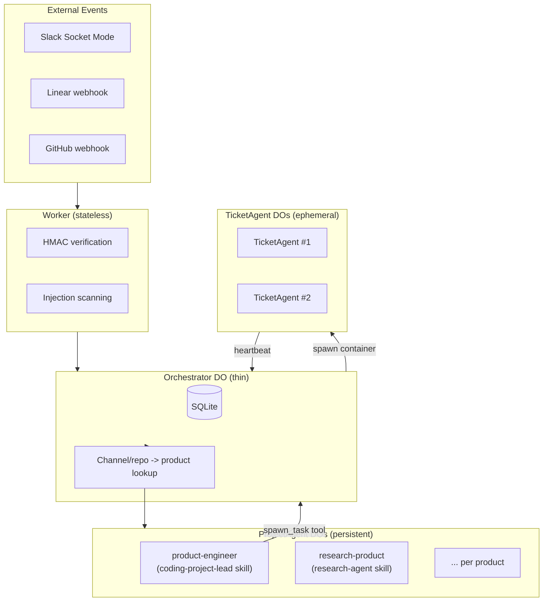

# Project Agent Sessions — Design Refinement

> Refinement of the v3 persistent project agent sessions design. Parent doc: `docs/product/plans/2026-03-20-orchestrator-v3-design.md`.

**Scope:** This document details the implementation design for persistent per-product Agent SDK sessions (v3 Phase 2). It resolves the key architectural questions and specifies concrete implementation components.

---

## Key Design Decisions

### Q1: Where do project agent sessions run?

**Answer: Separate ProjectAgent Container DO per product** (Option B from v3 plan).

Same pattern as TicketAgent but:
- Keyed by product slug (not ticket UUID)
- No `sleepAfter` — persistent (like Orchestrator)
- `alarm()` restarts container if it dies
- One per registered product

This keeps the orchestrator thin and gives each product agent its own resource allocation.

### Q2: How are skills injected?

**Answer: Via `settingSources: ["project"]` + `cwd` option on the Agent SDK.**

The Agent SDK's `query()` function accepts:
- `cwd?: string` — sets the working directory (where `settingSources` looks for `.claude/skills/`, `CLAUDE.md`, `.claude/rules/`)
- `additionalDirectories?: string[]` — additional directories the agent can access

For project agents:
- Clone product-engineer repo to `/workspace/product-engineer/`
- Clone target product repo(s) to `/workspace/<repo>/`
- Pass `cwd: "/workspace/product-engineer"` to `query()`
- Pass `additionalDirectories: ["/workspace/<target-repo>"]`
- `settingSources: ["project"]` loads from PE repo's `.claude/skills/`:
  - `coding-project-lead/SKILL.md` — for coding products
  - `assistant/SKILL.md` — for the assistant session
  - `research-agent/SKILL.md` — for research products
- Skills are loaded ON-DEMAND by the SDK (not injected into system prompt)
- They only consume context when the agent invokes them

For ticket agents (unchanged):
- `cwd = "/workspace/<target-repo>"` (current behavior)
- Skills loaded from target repo

### Q3: What happens on container restart?

**Answer: Same as ticket agents — JSONL synced to R2, restored on restart.**

The agent server already implements:
- `uploadTranscripts()` every 60s
- Signal handlers for graceful shutdown
- The SDK supports `resume: sessionId`

Project agents use the same mechanism. On restart:
1. `alarm()` fires, detects container is dead, restarts it
2. Agent server starts, checks R2 for existing JSONL
3. If found: download, then resume with `resume: sessionId`
4. If not found: fresh session

### Q4: How does the project agent spawn ticket agents?

**Answer: Via MCP tools that call the orchestrator's internal API.**

The project agent has tools:
- `spawn_task(description, repos, ...)` — POST to orchestrator internal endpoint
- `list_tasks(filter?)` — GET from orchestrator
- `get_task_detail(uuid)` — GET from orchestrator
- `send_message_to_task(uuid, message)` — POST to orchestrator
- `stop_task(uuid, reason)` — POST to orchestrator
- `post_slack(channel, thread_ts, message)` — Slack API
- `get_slack_thread(channel, thread_ts)` — Slack API

The orchestrator exposes new internal endpoints for these, protected by API key auth.

### Q5: How does event routing change?

**Current flow (v2):**
```
Slack mention -> Orchestrator -> create Linear ticket -> Linear webhook -> Orchestrator -> spawn TicketAgent
```

**New flow (v3):**
```
Slack mention -> Orchestrator -> route to ProductAgent session
Linear ticket -> Orchestrator -> route to ProductAgent session
ProductAgent decides -> spawn_task tool -> Orchestrator -> spawn TicketAgent
```

The orchestrator becomes a thin event router:
1. Receive event
2. Look up product from channel/repo
3. Forward to ProductAgent DO
4. ProductAgent (with coding-project-lead SKILL.md) decides what to do

---

## Architecture Diagram



---

## Implementation Components

### 1. ProjectAgent Container DO (`orchestrator/src/project-agent.ts`)

Similar structure to TicketAgent but persistent:
- `defaultPort = 3000` (same agent server)
- No `sleepAfter` (persistent)
- `alarm()` restarts container if dead (same pattern as Orchestrator)
- `fetch()` handles `/initialize`, `/event`, `/status`, `/drain-events`
- Event buffer for events that arrive while container is starting
- Config stored in SQLite (survives deploys)

Key differences from TicketAgent:

| Aspect | TicketAgent | ProjectAgent |
|--------|------------|--------------|
| Keyed by | ticket UUID | product slug |
| Lifetime | ephemeral (1-4h) | persistent |
| `sleepAfter` | `"1h"` / `"4h"` | none |
| Restart behavior | orchestrator re-spawns | `alarm()` self-heals |
| `cwd` | target repo | product-engineer repo |
| Skills source | target repo `.claude/skills/` | PE repo `.claude/skills/` |
| Session resume | R2 JSONL | R2 JSONL (same mechanism) |
| Env vars | ticket-specific | product-specific |

#### Container DO skeleton

```typescript
export class ProjectAgent extends Container {
  defaultPort = 3000;

  private product: string;
  private eventBuffer: NormalizedEvent[] = [];
  private containerReady = false;

  constructor(ctx: DurableObjectState, env: Bindings) {
    super(ctx, env);
    // Restore product config from SQLite
    this.product = ctx.storage.get("product") as string;
  }

  override async alarm(props: { isRetry: boolean; retryCount: number }) {
    // Check if container is alive, restart if dead
    // Same pattern as Orchestrator DO alarm
    const healthy = await this.probeHealth();
    if (!healthy) {
      await this.startContainer();
    }
  }

  async fetch(request: Request): Promise<Response> {
    const url = new URL(request.url);
    switch (url.pathname) {
      case "/initialize":
        return this.handleInitialize(request);
      case "/event":
        return this.handleEvent(request);
      case "/status":
        return this.handleStatus();
      case "/drain-events":
        return this.handleDrainEvents();
      default:
        return new Response("Not found", { status: 404 });
    }
  }
}
```

### 2. Agent Server Changes (`agent/src/server.ts`)

Detect `AGENT_ROLE` env var:
- `AGENT_ROLE=project-lead` — set `cwd` to PE repo, use `additionalDirectories` for target repos
- `AGENT_ROLE` absent/empty — current behavior (ticket agent)

For project leads:
- Clone PE repo (always) + target repos
- Pass `cwd: "/workspace/product-engineer"` to SDK
- No timeout watchdog (persistent session)
- No idle timeout
- Heartbeat continues indefinitely

#### Env var differences

```typescript
// ProjectAgent-specific env vars
const PROJECT_AGENT_VARS = {
  AGENT_ROLE: "project-lead",           // triggers project-lead mode
  PRODUCT: "<product-slug>",            // which product this agent manages
  REPOS: '["owner/product-engineer"]',  // always includes PE repo
  TARGET_REPOS: '["owner/target"]',     // product's repos (additionalDirectories)
  // No TICKET_UUID, TICKET_TITLE, etc.
};
```

#### SDK query configuration

```typescript
// In server.ts, when AGENT_ROLE === "project-lead"
const result = await query({
  prompt: initialMessage,
  options: {
    cwd: "/workspace/product-engineer",
    additionalDirectories: targetRepoPaths,
    model: process.env.MODEL || "sonnet",
    maxTurns: Infinity,  // persistent session
    allowedTools: [...projectAgentTools],
    settingSources: ["project"],
    resume: existingSessionId,  // from R2 if restarting
  },
});
```

### 3. Orchestrator Routing Changes (`orchestrator/src/orchestrator.ts`)

New `handleSlackEvent` flow:
1. Add `👀` reaction (unchanged)
2. Injection scan (new — Phase 1 task)
3. Thread reply to existing ticket agent (unchanged)
4. New mention: route to ProductAgent DO (**new** — replaces Linear ticket creation)

New `handleEvent` flow for `ticket_created`:
1. Route to ProductAgent DO (**new** — replaces direct spawn)
2. ProductAgent decides whether to spawn a ticket agent

Keep existing paths for:
- `pr_merged`, `pr_closed` (terminal state handling in orchestrator)
- `checks_passed` (merge gate in orchestrator — moves to ticket agent in Phase 3)
- Heartbeats (ticket tracking in orchestrator)

#### Routing implementation

```typescript
// In orchestrator.ts
async routeToProjectAgent(product: string, event: NormalizedEvent) {
  const id = this.env.PROJECT_AGENT.idFromName(product);
  const stub = this.env.PROJECT_AGENT.get(id);
  return stub.fetch(new Request("http://internal/event", {
    method: "POST",
    headers: { "Content-Type": "application/json" },
    body: JSON.stringify(event),
  }));
}
```

### 4. New Orchestrator Internal Endpoints

For project agent tools to call back into the orchestrator:

| Endpoint | Method | Purpose |
|----------|--------|---------|
| `/internal/spawn-task` | POST | Creates ticket record + spawns TicketAgent |
| `/internal/tasks` | GET | List tasks with filters (status, product) |
| `/internal/task/:uuid` | GET | Task detail (status, PR URL, heartbeat history) |
| `/internal/task/:uuid/event` | POST | Inject event into running ticket agent |
| `/internal/task/:uuid/stop` | POST | Stop ticket agent gracefully |

All protected by `X-Internal-Key` header matching `API_KEY` env var.

#### spawn-task payload

```typescript
interface SpawnTaskRequest {
  product: string;
  description: string;
  repos?: string[];           // override product default repos
  slack_channel: string;
  slack_thread_ts?: string;   // reply in existing thread
  mode?: "coding" | "research";
  model?: string;             // override default model
  context?: string;           // project agent passes accumulated context
}
```

The `context` field is important: the project agent can pass relevant accumulated context (recent decisions, related tasks, codebase insights) to the ticket agent's initial prompt. This partially addresses the cold-start problem even for subagents.

### 5. Wrangler Configuration Changes

```toml
# wrangler.toml additions

[[durable_objects.bindings]]
name = "PROJECT_AGENT"
class_name = "ProjectAgent"

[[migrations]]
tag = "v3"
new_classes = ["ProjectAgent"]
```

The `Bindings` type in `orchestrator/src/types.ts` needs:
```typescript
PROJECT_AGENT: DurableObjectNamespace;
```

---

## Edge Cases

| Boundary | Handling |
|----------|---------|
| Orchestrator deploys while project agent running | `alarm()` detects dead container, restarts, session resumes from R2 |
| Project agent container crashes | `alarm()` restarts, session resumes from R2, events buffered in DO |
| User mentions while project agent starting | Event buffer in DO, flushed when container reports ready |
| Project agent spawns ticket agent, then crashes | Ticket agent runs independently, heartbeats to orchestrator DO (not project agent) |
| Two events arrive simultaneously | `messageYielder` serializes into session (one at a time) |
| Project agent context fills up | SDK auto-compaction; `SessionStart` compact hook re-injects active tasks and product config |
| Product deleted while project agent running | Supervisor checks product exists, stops orphaned project agents |
| Project agent receives event for unknown channel | Forward to assistant session as fallback |
| Ticket agent heartbeat while project agent is down | Heartbeat goes to orchestrator DO (direct), not through project agent |

### Heartbeat routing (critical detail)

Ticket agent heartbeats go directly to the orchestrator DO, NOT through the project agent. This is intentional:
- Heartbeats are high-frequency (every 30-60s)
- They must be reliable even when the project agent is restarting
- The orchestrator needs heartbeats for its own staleness detection
- The project agent queries task status on-demand via `get_task_detail`

The project agent learns about task completion through:
1. Orchestrator notifies project agent when a ticket transitions to terminal state
2. Project agent polls via `list_tasks` when it needs current status
3. `needs_attention: true` in heartbeat triggers orchestrator to notify project agent

---

## Migration Strategy

Phased rollout within Phase 2 of the v3 plan:

### Step 1: Add ProjectAgent DO class (no behavior change)
- Create `orchestrator/src/project-agent.ts` with Container subclass
- Add to wrangler.toml bindings
- Add migration for new DO class
- No routing changes yet

### Step 2: Add internal endpoints (no behavior change)
- Add `/internal/spawn-task`, `/internal/tasks`, `/internal/task/:uuid`, etc.
- These are callable but nothing calls them yet
- Test with curl / integration tests

### Step 3: Add agent server project-lead mode (no behavior change)
- Add `AGENT_ROLE` detection to `agent/src/server.ts`
- Create skill files in `.claude/skills/` (coding-project-lead, assistant, research-agent)
- Test locally with `AGENT_ROLE=project-lead`

### Step 4: Wire Slack mentions through ProjectAgent (behavior change)
- New Slack mentions route to ProjectAgent DO
- ProjectAgent session runs with coding-project-lead skill
- ProjectAgent uses `spawn_task` to create ticket agents
- Keep Linear webhook path as fallback (dual-write period)

### Step 5: Remove direct ticket creation from orchestrator (cleanup)
- Delete old `handleSlackEvent` ticket creation path
- Linear webhooks route through ProjectAgent
- Remove fallback path

---

## Testing Strategy

### Unit tests
- `project-agent.test.ts`: DO lifecycle (initialize, event buffering, alarm restart)
- `routing.test.ts`: channel-to-product lookup, fallback to assistant
- Internal endpoint validation (spawn-task payload, auth)

### Integration tests
- Event flow: Slack mention -> orchestrator -> ProjectAgent DO -> event delivered
- Spawn flow: ProjectAgent calls `/internal/spawn-task` -> TicketAgent created
- Restart flow: ProjectAgent container dies -> alarm fires -> session resumes from R2
- Buffer flow: events arrive while container starting -> flushed on ready

### What NOT to test
- Agent SDK internals (session resume, compaction)
- Skill file content (tested by agent behavior, not unit tests)
- Slack API calls (mocked at HTTP boundary)
