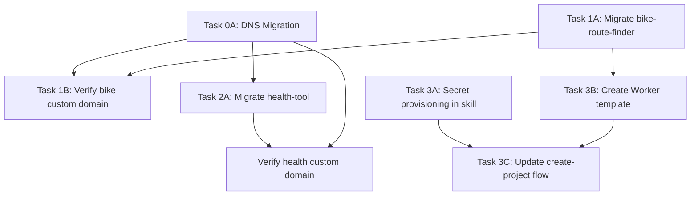

# Automated Prototype Deployment Implementation Plan

> **For Claude:** REQUIRED SUB-SKILL: Use superpowers:executing-plans to implement this plan task-by-task.

**Goal:** Zero-touch deployment for agent-created prototypes — unified Cloudflare Worker with static assets, auto-provisioned secrets, custom subdomains under fryanpan.com.

**Architecture:** Replace Surge.sh + separate Worker with unified Cloudflare Workers using `[assets]` for static files. Move DNS from Route 53 to Cloudflare. Auto-provision per-project scoped secrets via PE's `/create-project` skill using `gh secret set` and Cloudflare API.

**Tech Stack:** Cloudflare Workers (`[assets]`), Wrangler CLI, GitHub CLI (`gh secret set`), Cloudflare DNS, Route 53 (registrar only)

---

## Phase 0: DNS Migration (Route 53 → Cloudflare)

### Task 0A: Add fryanpan.com to Cloudflare

**Files:** None (infrastructure only)

**Step 1: Add domain to Cloudflare**
- Log into Cloudflare dashboard
- Click "Add a Site" → enter `fryanpan.com` → select Free plan
- Cloudflare will scan and import existing Route 53 DNS records

**Step 2: Verify imported records**
- Check all A, AAAA, CNAME, MX, TXT records match Route 53
- Pay special attention to MX records (email) and any existing CNAME records

**Step 3: Note the assigned nameservers**
- Cloudflare will assign 2 nameservers (e.g., `ada.ns.cloudflare.com`, `bob.ns.cloudflare.com`)

**Step 4: Update nameservers in Route 53**
- Go to Route 53 console → **Registered Domains** (NOT Hosted Zones) → click `fryanpan.com`
- Click "Add or edit nameservers" → replace 4 AWS NS records with 2 Cloudflare NS records → Update
- Verify propagation at whatsmydns.net (15 min to 24 hours)

**Step 5: Delete Route 53 Hosted Zone**
- Once propagation confirmed, delete the hosted zone (saves $0.50/month)
- Domain registration stays in Route 53

> **Note:** This task is manual (browser-based). The rest of the plan can proceed in parallel while DNS propagates.

---

## Phase 1: Migrate bike-route-finder to Unified Worker

### Task 1A: Restructure bike-route-finder to unified Worker with [assets]

**Context:** Currently has separate `worker/` directory (Cloudflare Worker for API proxy) and Vite frontend deployed to Surge.sh. Goal: combine into single deployment.

**Files:**
- Create: `wrangler.toml` (root level, replaces `worker/wrangler.toml`)
- Create: `src/worker.ts` (unified Worker entry — API routes + asset serving)
- Modify: `vite.config.ts` — remove proxy config, update build output
- Modify: `package.json` — add wrangler scripts, remove surge
- Delete: `worker/` directory (absorbed into root)
- Delete: `.github/workflows/deploy.yml` (rewrite)
- Create: `.github/workflows/deploy.yml` (single wrangler deploy)
- Modify: frontend code — change API calls from `VITE_WORKER_URL/api/...` to relative `/api/...`

**Step 1: Create unified wrangler.toml at repo root**

```toml
name = "bike-route-finder"
main = "src/worker.ts"
compatibility_date = "2025-01-01"
compatibility_flags = ["nodejs_compat"]

[assets]
directory = "./dist"
binding = "ASSETS"
not_found_handling = "single-page-application"

[[routes]]
pattern = "bike.fryanpan.com"
custom_domain = true

[observability]
enabled = true
```

**Step 2: Create unified worker entry**

Move `worker/src/index.ts` logic into `src/worker.ts`. The Worker handles `/api/*` routes (Valhalla proxy, Nominatim proxy, feedback → Linear). Static assets are served automatically by the `[assets]` binding for all other paths.

Key change: No CORS needed — frontend and API share the same origin.

**Step 3: Update vite.config.ts**

Remove the dev proxy config for `/api/valhalla` and `/api/nominatim`. In dev mode, use Wrangler's dev server (`wrangler dev`) which serves both assets and API routes locally.

Update `build.outDir` to `./dist` if not already.

**Step 4: Update frontend API calls**

Search for any `VITE_WORKER_URL` references and replace with relative paths:
- `${import.meta.env.VITE_WORKER_URL}/api/...` → `/api/...`
- Remove all `VITE_WORKER_URL` env var usage

**Step 5: Update package.json scripts**

```json
{
  "scripts": {
    "dev": "wrangler dev",
    "build": "vite build",
    "deploy": "vite build && wrangler deploy",
    "test": "vitest run"
  }
}
```

**Step 6: Rewrite deploy workflow**

```yaml
name: Deploy
on:
  push:
    branches: [main]
jobs:
  deploy:
    runs-on: ubuntu-latest
    steps:
      - uses: actions/checkout@v4
      - uses: oven-sh/setup-bun@v2
      - run: bun install
      - run: bun run build
      - name: Deploy to Cloudflare
        uses: cloudflare/wrangler-action@v3
        with:
          apiToken: ${{ secrets.CLOUDFLARE_API_TOKEN }}
          accountId: ${{ secrets.CLOUDFLARE_ACCOUNT_ID }}
```

**Step 7: Set GitHub secrets**

```bash
# Use PE's Cloudflare credentials (or create scoped token for this project)
gh secret set CLOUDFLARE_API_TOKEN --body "$CF_TOKEN" --repo fryanpan/bike-route-finder
gh secret set CLOUDFLARE_ACCOUNT_ID --body "$CF_ACCOUNT_ID" --repo fryanpan/bike-route-finder
```

**Step 8: Set Worker secrets for Linear feedback**

```bash
# These can be set via Cloudflare API or wrangler CLI
echo "$LINEAR_API_KEY" | wrangler secret put LINEAR_API_KEY
echo "$LINEAR_TEAM_ID" | wrangler secret put LINEAR_TEAM_ID
echo "$LINEAR_PROJECT_ID" | wrangler secret put LINEAR_PROJECT_ID
```

**Step 9: Remove old Surge deployment**

- Delete `worker/` directory
- Remove SURGE_TOKEN from GitHub secrets
- Remove VITE_WORKER_URL from GitHub secrets

**Step 10: Deploy and verify**

```bash
bun run deploy
# Verify at bike.fryanpan.com (after DNS propagation)
# Also accessible at bike-route-finder.<subdomain>.workers.dev immediately
```

**Step 11: Run tests, commit**

```bash
bun test
git add -A
git commit -m "feat: migrate to unified Cloudflare Worker with [assets] and custom domain"
```

---

### Task 1B: Verify bike-route-finder deployment

**Step 1:** Open `bike-route-finder.<subdomain>.workers.dev` and verify:
- Map loads
- Route planning works (Valhalla proxy)
- Search works (Nominatim proxy)
- Bike overlay toggles
- Feedback submission works (Linear ticket created)

**Step 2:** After DNS propagation, verify `bike.fryanpan.com` serves the same app.

---

## Phase 2: Migrate health-tool to Unified Worker with [assets]

### Task 2A: Add [assets] to health-tool Worker

**Context:** Health-tool already has a Cloudflare Worker (`worker/wrangler.toml`) with Durable Objects, Containers, and Turso DB. The PWA is vanilla JS deployed separately to Surge.sh (`health-coach.surge.sh`). We just need to add `[assets]` to the existing Worker to serve the PWA, then remove Surge.

**Files:**
- Modify: `worker/wrangler.toml` — add `[assets]` section and custom domain route
- Modify: `.github/workflows/deploy.yml` — remove Surge deploy job, build PWA into dist/
- Create: build script to copy PWA files to `worker/dist/` before `wrangler deploy`
- Modify: PWA API calls — change from absolute Worker URL to relative `/api/...`

**Step 1: Update worker/wrangler.toml**

Add to existing config:

```toml
[assets]
directory = "./dist"
binding = "ASSETS"
not_found_handling = "single-page-application"

[[routes]]
pattern = "health.fryanpan.com"
custom_domain = true
```

**Step 2: Create PWA build step**

The PWA is vanilla JS (no Vite), so the "build" is just copying files:

```bash
# In worker/ directory, before wrangler deploy:
rm -rf dist
cp -r ../src/tracking/pwa dist
# Inject build hash into service worker
sed -i "s/__BUILD_HASH__/$(git rev-parse --short HEAD)/g" dist/sw.js
```

Add to `worker/package.json`:

```json
{
  "scripts": {
    "build-pwa": "rm -rf dist && cp -r ../src/tracking/pwa dist && sed -i '' \"s/__BUILD_HASH__/$(git rev-parse --short HEAD)/g\" dist/sw.js",
    "deploy": "bun run build-pwa && wrangler deploy"
  }
}
```

**Step 3: Update deploy workflow**

Remove the `deploy-pwa` job. Update `deploy-worker` to build PWA first:

```yaml
deploy-worker:
  needs: [migrate]
  runs-on: ubuntu-latest
  steps:
    - uses: actions/checkout@v4
    - uses: oven-sh/setup-bun@v2
    - run: cd worker && bun install
    - name: Build PWA
      run: |
        cd worker
        rm -rf dist
        cp -r ../src/tracking/pwa dist
        sed -i "s/__BUILD_HASH__/${GITHUB_SHA::8}/g" dist/sw.js
    - name: Deploy Worker + PWA
      env:
        CLOUDFLARE_API_TOKEN: ${{ secrets.CLOUDFLARE_API_TOKEN }}
      run: cd worker && bun run deploy
```

**Step 4: Update PWA API calls**

Check if the PWA uses absolute URLs to the Worker. If `app.js`, `chat.js`, etc. use a hardcoded Worker URL or env var, change to relative paths:
- `https://ht-api.<subdomain>.workers.dev/api/...` → `/api/...`

Since the PWA and Worker will share the same origin, relative paths work.

**Step 5: Remove Surge deployment**

- Remove `deploy-pwa` job from deploy.yml
- Remove SURGE_TOKEN from GitHub secrets
- Remove surge-related scripts from `src/tracking/pwa/package.json`

**Step 6: Set GitHub secrets (if not already set)**

```bash
gh secret set CLOUDFLARE_ACCOUNT_ID --body "$CF_ACCOUNT_ID" --repo fryanpan/health-tool
# CLOUDFLARE_API_TOKEN should already exist
```

**Step 7: Deploy and verify**

```bash
cd worker && bun run deploy
# Verify at health.fryanpan.com (after DNS) or ht-api.<subdomain>.workers.dev
```

**Step 8: Run tests, commit**

```bash
cd worker && bun test
git add -A
git commit -m "feat: serve PWA via Worker [assets], add health.fryanpan.com custom domain"
```

---

## Phase 3: Update /create-project Skill for Auto-Provisioning

### Task 3A: Add secret provisioning to /create-project skill

**Files:**
- Modify: `.claude/skills/create-project/SKILL.md`

**Changes to the skill:**

After Step 5 (Initial Commit) and Step 6 (Add to PE Registry), add:

**New Step 6.5: Provision deployment secrets**

Using PE's existing credentials, automatically set:

```bash
# GitHub Actions secrets (for CI/CD)
eval $(./scripts/load-secrets.sh prod)
gh secret set CLOUDFLARE_API_TOKEN --body "$CLOUDFLARE_API_TOKEN" --repo <org>/<project>
gh secret set CLOUDFLARE_ACCOUNT_ID --body "$CLOUDFLARE_ACCOUNT_ID" --repo <org>/<project>

# Worker secrets (for runtime — Linear feedback, etc.)
# These use the shared Linear credentials from PE registry
echo "$LINEAR_API_KEY" | npx wrangler secret put LINEAR_API_KEY --name <project-name>
echo "$LINEAR_TEAM_ID" | npx wrangler secret put LINEAR_TEAM_ID --name <project-name>
```

**Key principle (defense in depth):**
- GitHub tokens: already per-product in registry
- Cloudflare API tokens: create per-project scoped tokens via Cloudflare API when feasible; shared token as interim
- Linear API key: shared (same workspace), acceptable risk since it only creates issues

### Task 3B: Create unified Worker project template

**Files:**
- Create: `templates/worker-template/wrangler.toml.tmpl`
- Create: `templates/worker-template/src/worker.ts.tmpl`
- Create: `templates/worker-template/.github/workflows/deploy.yml.tmpl`
- Create: `templates/worker-template/.github/workflows/ci.yml.tmpl`

**wrangler.toml.tmpl:**

```toml
name = "{{project_name}}"
main = "src/worker.ts"
compatibility_date = "2025-01-01"
compatibility_flags = ["nodejs_compat"]

[assets]
directory = "./dist"
binding = "ASSETS"
not_found_handling = "single-page-application"

[[routes]]
pattern = "{{subdomain}}.fryanpan.com"
custom_domain = true

[observability]
enabled = true
```

**deploy.yml.tmpl:**

```yaml
name: Deploy
on:
  push:
    branches: [main]
jobs:
  deploy:
    runs-on: ubuntu-latest
    steps:
      - uses: actions/checkout@v4
      - uses: oven-sh/setup-bun@v2
      - run: bun install
      - run: bun run build
      - name: Deploy to Cloudflare
        uses: cloudflare/wrangler-action@v3
        with:
          apiToken: ${{ secrets.CLOUDFLARE_API_TOKEN }}
          accountId: ${{ secrets.CLOUDFLARE_ACCOUNT_ID }}
```

### Task 3C: Update /create-project skill flow

**Modify:** `.claude/skills/create-project/SKILL.md`

Updated flow:

1. Gather requirements (existing)
2. Create GitHub repo (existing)
3. Scaffold with unified Worker template (NEW — use templates from 3B)
4. Initial commit + push (existing)
5. Add to PE registry (existing)
6. **Auto-provision secrets** (NEW — Task 3A)
7. **Initial wrangler deploy** (NEW — creates Worker, gets live URL)
8. Set up Linear + Slack (existing)
9. Test end-to-end (existing, now includes verifying live URL)

**End state:** `/create-project` returns a live URL. No manual steps.

---

## Task Dependency Graph



**Parallelism:**
- Task 0A (DNS) can run immediately — it's manual and takes time to propagate
- Tasks 1A and 2A can run in parallel (different repos)
- Tasks 3A and 3B can run in parallel
- Task 3C depends on 3A + 3B

---

## Measurable Outcomes

1. `bike.fryanpan.com` serves the bike route finder app (single deployment)
2. `health.fryanpan.com` serves the health tool PWA + API (single deployment)
3. Neither project uses Surge.sh
4. `/create-project` auto-provisions all secrets and returns a live URL
5. New projects require zero manual secret configuration
6. Each project has its own GitHub token (already true) and scoped Cloudflare access
7. CI/CD deploys on push to main with no manual intervention

---

## Risk Notes

- **DNS propagation delay**: Custom domains won't work until nameservers propagate (up to 24hrs). Workers.dev URLs work immediately as fallback.
- **Health-tool complexity**: Has Durable Objects + Containers — verify `[assets]` doesn't conflict with container bindings.
- **Surge.sh cutover**: Keep Surge deployed until custom domain is verified working. Don't delete SURGE_TOKEN until confirmed.
- **Shared Cloudflare token**: Interim approach until per-project scoped tokens are set up. Acceptable for side projects; revisit for production.
